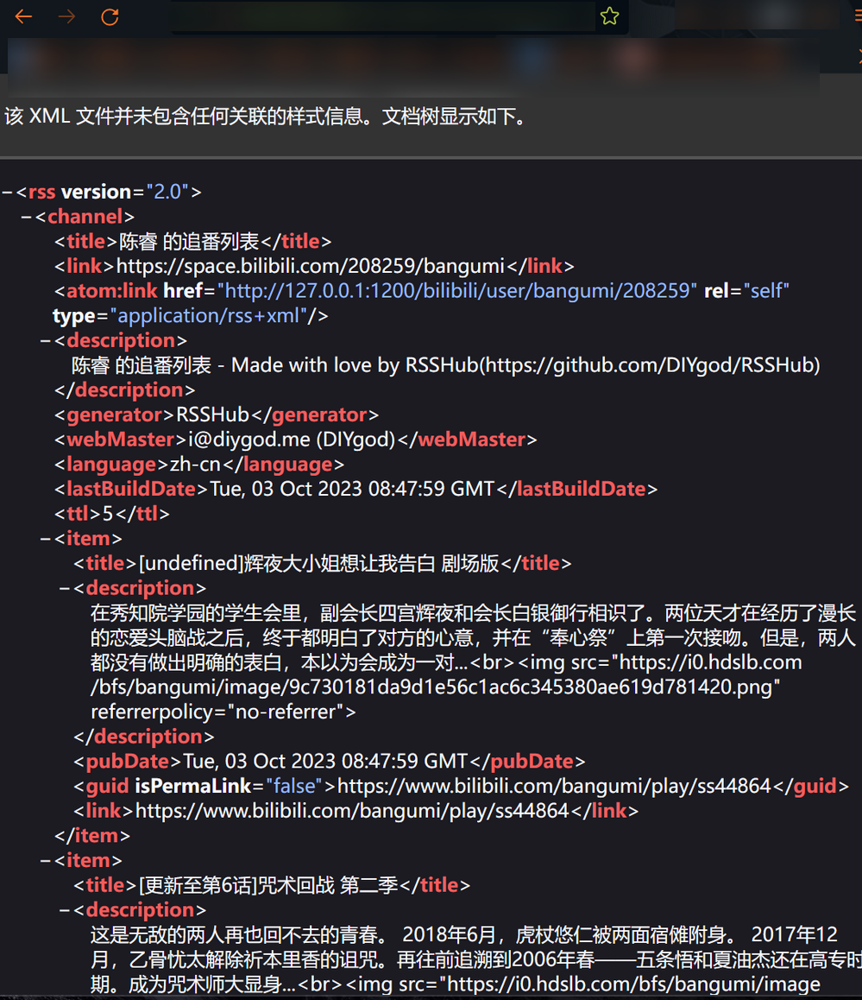
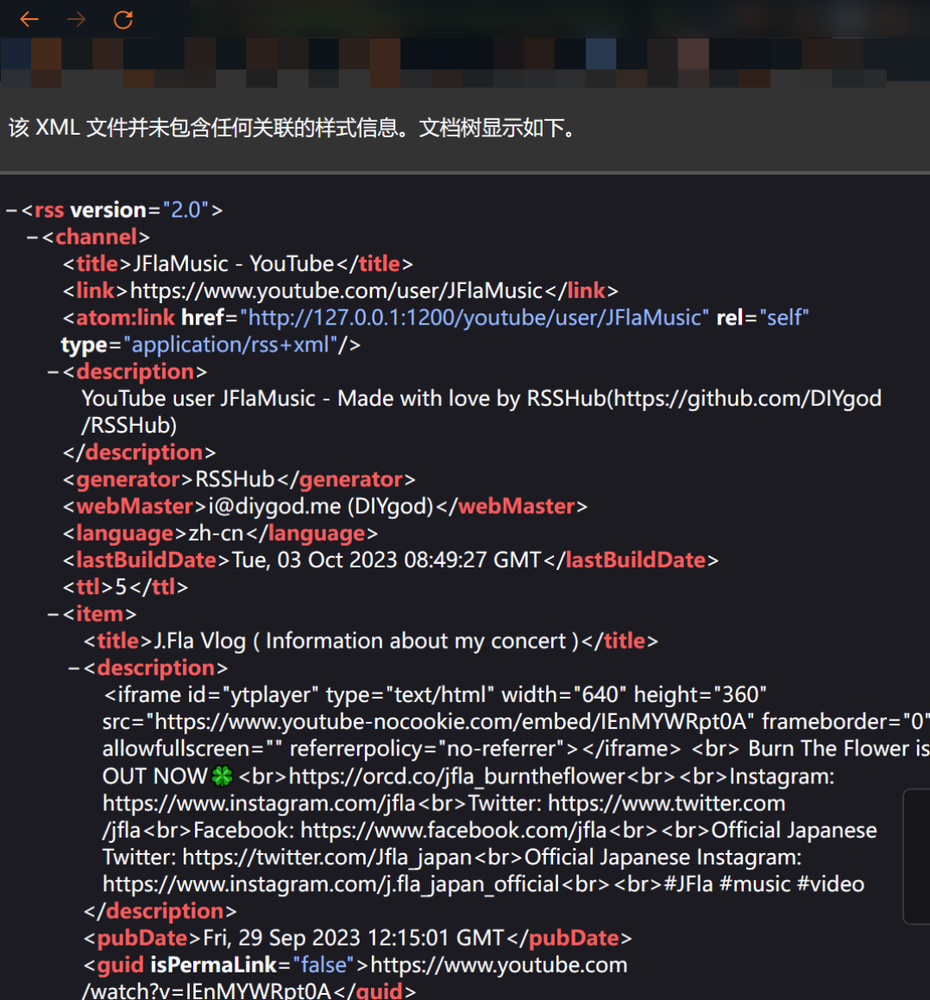
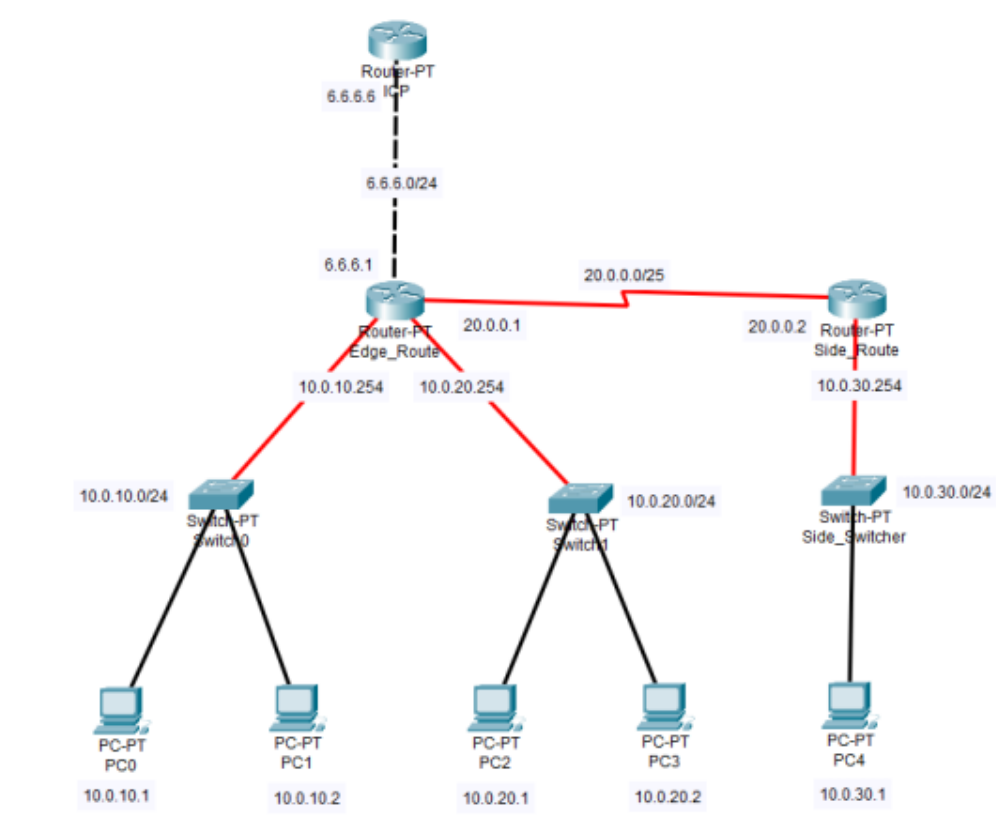

孩子不会SA，随便打着玩的。

唉，总是在错误的时间遇到正确的事情。

<!-- truncate -->

## Little Docker

### 基本要求

> 1. 安装docker
> 2. 利用docker部署一个nginx服务，实现当宿主机请求自身的5000端口时能获取到nginx的欢迎界面
> 3. 请你实现当不进入容器的情况下，将nginx的欢迎界面更改成下载链接中的页面(禁用文件复制)
> 4. 现使用 centos:latest 镜像创建另一个容器，确保centos容器能以 container:port 的形式访问到点2中的页面
> 5. 这两个容器能相互ping通

### 过程

本题在centos环境中完成。

安装docker部分：按照[官方文档](https://docs.docker.com/engine/install/centos/)操作即可。

docker部署nginx：采用docker compose完成。

配置文件结构如下：

```shell
.
├── conf.d
│   ├── fastcgi.conf
│   ├── fastcgi.conf.default
│   ├── fastcgi_params
│   ├── fastcgi_params.default
│   ├── koi-utf
│   ├── koi-win
│   ├── mime.types
│   ├── mime.types.default
│   ├── nginx.conf.default
│   ├── scgi_params
│   ├── scgi_params.default
│   ├── uwsgi_params
│   ├── uwsgi_params.default
│   └── win-utf
├── docker-compose.yml
├── html
│   └── index.html
├── logs
│   └── access.log
└── nginx.conf
```

```nginx title="nginx.conf"
worker_processes  auto;

events {
    worker_connections  1024;
}

http {
    include       mime.types;
    default_type  application/octet-stream;

    log_format  main  '$remote_addr - $remote_user [$time_local] "$request" '
                      '$status $body_bytes_sent "$http_referer" '
                      '"$http_user_agent" "$http_x_forwarded_for"';

    sendfile        on;
    #tcp_nopush     on;
    server_tokens off;
    #keepalive_timeout  0;
    keepalive_timeout  65;

    gzip on;
    gzip_types text/plain application/x-javascript text/css application/xml text/javascript application/javascript image/jpeg image/gif image/png;
    gzip_vary on;  
    
    server {
        listen       80;

        location / {
            root   /usr/share/nginx/html;
            try_files /index.html /index.htm;
        }
    }
}
```

```yaml title="docker-compose.yaml"
version: '3.9'

services:
    nginx:
        image: nginx
        restart: always
        ports:
            - '5000:80'
        volumes:
            - ./html:/usr/share/nginx/html
            - ./nginx.conf:/etc/nginx/nginx.conf
            - ./conf.d:/etc/nginx/conf.d
            - ./logs:/var/log/nginx
        networks:
            - test

networks:
    test:
        driver: bridge
```

`curl 127.0.0.1:5000`，如下所示：


创建centos容器：

```shell
sudo docker run --network nginx_test --network-alias centos --name centos -itd centos:latest
# 进入centos容器
sudo docker exec -it <centos id> bash
```

`curl` 一下，发现docker网络里暴露的不是绑定的端口，而是自身的端口（


nginx容器测试时，由于容器过分精简导致没有`ping`，所以在容器中输入以下命令（默认root用户）：

```shell
apt update
apt install inetutils-ping
```

结果如下：


## RSS Service

### 题目描述

> 1. 使用 Docker 部署 RSSHub，并开放到公网以供查房。
> 2. 使用 Docker 部署梯子，并作为 RSSHub 的代理，以访问源站位于墙外的路由（例如 Twitter）
> 3. 在同一个 docker-compose 中部署上述两服务

### 过程

其实应该更早做出来这道题的，但我debug找了半天，问了ganqiu才知道是我clash配置文件的问题，改一下`allow-lan`,将clash从只允许本地环回地址改成允许局域网访问就行。令人感叹。

本题采用clash作为代理，国内访问以bilibili（无需appkey）为例，国外访问以youtube（需要google key）为例，访问地址：已删, 经nginx反向代理至rsshub的端口（后面才发现其实根本没必要这样，懒了）

```yaml title="docker-compose.yaml"
version: '3.9'

services:
    rsshub:
        # two ways to enable puppeteer:
        # * comment out marked lines, then use this image instead: diygod/rsshub:chromium-bundled
        # * (consumes more disk space and memory) leave everything unchanged
        image: diygod/rsshub
        restart: always
        ports:
            - '1200:1200'
        environment:
            NODE_ENV: production
            CACHE_TYPE: redis
            REDIS_URL: 'redis://redis:6379/'
            PUPPETEER_WS_ENDPOINT: 'ws://browserless:3000'  # marked
            PROXY_URI: 'http://clash:7890'
            YOUTUBE_KEY: 'xxxxxxxxxxxxxxxxxxxxxxxx' # 略
        depends_on:
            - clash
            - redis
            - browserless  # marked

    browserless:  # marked
        image: browserless/chrome  # marked
        restart: always  # marked
        ulimits:  # marked
          core:  # marked
            hard: 0  # marked
            soft: 0  # marked
        environment:
          DEFAULT_LAUNCH_ARGS: '["--window-size=375,820","--proxy-server=http://clash:7890"]' # 代理服务 
        depends_on:
          - clash
    redis:
        image: redis:alpine
        restart: always
        volumes:
            - redis-data:/data 
    clash:
        image: dreamacro/clash
        restart: always
        ports:
          - "7890:7890"
          - "7891:7891"
          - "9090:9090"
        volumes:
          - /etc/clash:/root/.config/clash

volumes:
    redis-data:
```

命令部分：

```shell
# 创建redis需要的data volume
sudo docker create volume redis-data
# RSSHub 启动！
sudo docker compose up -d
```

访问示例：





## 基础环境建设

### 题目要求

> 1. 搭建基础环境，包括以下部分：
>    -  git
>    -  docker
>    -  python 3
>    -  pip3
>    -  curl
>    -  ssh 禁用密码登录
> 2. 加分项
>    -  一键脚本（见下）
>    -  一些奇怪的功能

### 过程

本题基于夏令营的脚本基础上进行重构，除了基本要求，新增以下部分：

1. 多个发行版支持，有：
    - Ubuntu (只要源里有就算支持)
    - CentOS 7 8（同上）
    - Arch Linux~~（这就是滚动更新给我的自信）~~
2. 支持切换安装源
    目前支持阿里云、清华、中科大、网易源，并有交互可以修改。
3. 一些个人配置
    夏令营的存货，例如vim安装配置，安装zsh切换为默认shell，以及nodejs等等。

脚本在WSL Ubuntu20.04和CentOS 7测试了一下，~~不保证正确性~~

### Code

```shell
#!/bin/bash
# 重构了下原有的代码，看了下别人代码风格试着模仿了（
# 只用过Ubuntu CentOS和Arch，就挑这三个发行版了

function identify_the_linux_distribution(){
    if [[ "$(uname)" == "Linux" ]]; then
        if [[ "$(type -P apt)" ]]; then
            PACKAGE_MANAGEMENT_INSTALL='sudo apt-get -y --no-install-recommends install'
            PACKAGE_MANAGEMENT_UPDATE='sudo apt-get update && sudo apt-get upgrade -y'
            PACKAGE_MANAGEMENT_REMOVE='sudo apt-get purge'
            LINUX_DISTRIBUTION='ubuntu'
        elif [[ "$(type -P yum)" ]]; then
            PACKAGE_MANAGEMENT_INSTALL='sudo yum -y install'
            PACKAGE_MANAGEMENT_UPDATE='sudo yum makecache && sudo yum -y upgrade'
            PACKAGE_MANAGEMENT_REMOVE='sudo yum remove'
            LINUX_DISTRIBUTION='centos'
        elif [[ "$(type -P pacman)" ]]; then
            PACKAGE_MANAGEMENT_INSTALL='sudo pacman -Syu --noconfirm'
            PACKAGE_MANAGEMENT_UPDATE='sudo pacman -Syyu --noconfirm'
            PACKAGE_MANAGEMENT_REMOVE='sudo pacman -Rsn'
            LINUX_DISTRIBUTION='arch'
        else  
            echo "error: The script does not support the package manager in this operating system." 
            exit 1
        fi
    else
        echo "error: This OS is not supported."
        exit 1
    fi
}

function is_ip_cn(){
    COUNTRY=$(curl ipinfo.io | grep "country" | awk '{print $2}')
    if [ $COUNTRY == '"CN",' ]; then
        LOCAL_COUNTRY="OTHER"
    else
        LOCAL_COUNTRY="CN"
    fi
}

function update_software(){
    $PACKAGE_MANAGEMENT_UPDATE
    if [[ $PACKAGE_MANAGEMENT_UPDATE ]]; then
        echo "info: update success."
    else
        echo "error: update failed!"
        exit 1
    fi
}

function install_software(){
    package_name="$1"
    file_to_detect="$2"
    type -p "$file_to_detect" > /dev/null 2>&1 && return
    if ${PACKAGE_MANAGEMENT_INSTALL} "$package_name"; then
        echo "info: $package_name is installed."
    else
        echo "error: Installation of $package_name failed!"
        exit 1
    fi
}

function change_source() {
    if [[ $LOCAL_COUNTRY == "CN" ]]; then
        echo "WARNING: your linux is in CN so that change your source is recommended."
    fi
    echo "please choose a mirror:
    1. aliyun
    2. tsinghua
    3. 163
    4. ustc
    "
    
    read MIRROR_CHOOSE
    
    if [ $MIRROR_CHOOSE -ne 1 ] && [ $MIRROR_CHOOSE -ne 2 ] && [ $MIRROR_CHOOSE -ne 3 ] && [ $MIRROR_CHOOSE -ne 4 ]; then
        echo 'error: input error.'
        exit 1
    fi

    if [[ $LINUX_DISTRIBUTION == "ubuntu" ]]; then
        echo "=========================================="
        UBUNTU_VERSION=$(cat /etc/os-release | grep VERSION_CODENAME | awk -F "=" '{print $2}')
        case $MIRROR_CHOOSE in
            1)
                UBUNTU_MIRROR_URL='http://mirrors.aliyun.com/ubuntu/'
            ;;
            2)
                UBUNTU_MIRROR_URL='https://mirrors.tuna.tsinghua.edu.cn/ubuntu/'
            ;;
            3)
                UBUNTU_MIRROR_URL='http://mirrors.163.com/ubuntu/'
            ;;
            4)
                UBUNTU_MIRROR_URL='https://mirrors.ustc.edu.cn/ubuntu/'
            ;;
        esac
        echo "==== Ubuntu version: $UBUNTU_VERSION ===="
        echo "begin change your source($UBUNTU_MIRROR_URL)..."

        sudo cp /etc/apt/sources.list /etc/apt/sources.list.bak
        echo "origin source.list is stored in /etc/apt/sources.list.bak"

        
        echo "# 默认注释了源码镜像以提高 apt update 速度，如有需要可自行取消注释
deb $UBUNTU_MIRROR_URL $UBUNTU_VERSION main restricted universe multiverse
# deb-src $UBUNTU_MIRROR_URL $UBUNTU_VERSION main restricted universe multiverse
deb $UBUNTU_MIRROR_URL $UBUNTU_VERSION-updates main restricted universe multiverse
# deb-src $UBUNTU_MIRROR_URL $UBUNTU_VERSION-updates main restricted universe multiverse
deb $UBUNTU_MIRROR_URL $UBUNTU_VERSION-backports main restricted universe multiverse
# deb-src $UBUNTU_MIRROR_URL $UBUNTU_VERSION-backports main restricted universe multiverse
# deb $UBUNTU_MIRROR_URL $UBUNTU_VERSION-security main restricted universe multiverse
# \# deb-src $UBUNTU_MIRROR_URL $UBUNTU_VERSION-security main restricted universe multiverse

deb http://security.ubuntu.com/ubuntu/ $UBUNTU_VERSION-security main restricted universe multiverse
# deb-src http://security.ubuntu.com/ubuntu/ $UBUNTU_VERSION-security main restricted universe multiverse
" | sudo tee /etc/apt/sources.list

    elif [[ $LINUX_DISTRIBUTION == "centos" ]]; then
        REDHAT_RELEASE=$(grep "CentOS" /etc/redhat-release)
        if  echo "$REDHAT_RELEASE" | grep "release 7" 
        then
			CENTOS_VERSION=7
		elif echo "$REDHAT_RELEASE" | grep "release 8"
        then
			CENTOS_VERSION=8
		else
			echo "error: only support CentOS 7 and 8"
            exit 1
		fi
        sudo cp /etc/yum.repos.d/CentOS-Base.repo /etc/yum.repos.d/CentOS-Base.repo.bak
        echo "origin CentOS-Base.repo is stored in /etc/yum.repos.d/CentOS-Base.repo.bak"

        if [ $CENTOS_VERSION -eq 7 ]
        then
            case $MIRROR_CHOOSE in
                1)
                wget -O /etc/yum.repos.d/CentOS-Base.repo http://mirrors.aliyun.com/repo/Centos-7.repo
                ;;
                2)
                sudo sed -e 's|^mirrorlist=|#mirrorlist=|g' \
         -e 's|^#baseurl=http://mirror.centos.org/centos|baseurl=https://mirrors.tuna.tsinghua.edu.cn/centos|g' \
         -i.bak \
         /etc/yum.repos.d/CentOS-*.repo
                ;;
                3)
                sudo wget -O /etc/yum.repos.d/CentOS-Base.repo https://mirrors.163.com/.help/CentOS7-Base-163.repo
                ;;
                4)
                sudo sed -e 's|^mirrorlist=|#mirrorlist=|g' \
         -e 's|^#baseurl=http://mirror.centos.org/centos|baseurl=https://mirrors.ustc.edu.cn/centos|g' \
         -i.bak \
         /etc/yum.repos.d/CentOS-Base.repo
                ;;
            esac
        else
            case $MIRROR_CHOOSE in
                1)
                sudo wget -O /etc/yum.repos.d/CentOS-Base.repo http://mirrors.aliyun.com/repo/Centos-8.repo 
                ;;
                2)
                sudo sed -e 's|^mirrorlist=|#mirrorlist=|g' \
         -e 's|^#baseurl=http://mirror.centos.org/$contentdir|baseurl=https://mirrors.tuna.tsinghua.edu.cn/centos|g' \
         -i.bak \
         /etc/yum.repos.d/CentOS-*.repo
                ;;
                3)
                sudo wget -O /etc/yum.repos.d/CentOS-Base.repo https://mirrors.163.com/.help/CentOS8-Base-163.repo
                ;;
                4)
                sudo sed -e 's|^mirrorlist=|#mirrorlist=|g' \
         -e 's|^#baseurl=http://mirror.centos.org/$contentdir|baseurl=https://mirrors.ustc.edu.cn/centos|g' \
         -i.bak \
         /etc/yum.repos.d/CentOS-Stream-AppStream.repo \
         /etc/yum.repos.d/CentOS-Stream-BaseOS.repo \
         /etc/yum.repos.d/CentOS-Stream-Extras.repo \
         /etc/yum.repos.d/CentOS-Stream-PowerTools.repo
                ;;
            esac
        fi
    elif [[ $LINUX_DISTRIBUTION == "arch" ]]; then
        #reflect 在之前安装arch的时候很不好用，直接略了，这里只安装对应的源，以及社区源、yay。
        sudo cp /etc/pacman.d/mirrorlist /etc/pacman.d/mirrorlist.bak
        echo "origin mirrorlist is stored in /etc/pacman.d/mirrorlist.bak"

        case $MIRROR_CHOOSE in
            1)
                echo 'Server = http://mirrors.aliyun.com/archlinux/$repo/os/$arch'>/etc/pacman.d/mirrorlist
            ;;
            2)
                echo 'Server = https://mirrors.tuna.tsinghua.edu.cn/archlinuxarm/$arch/$repo'>/etc/pacman.d/mirrorlist
            ;;
            3)
                echo 'Server = http://mirrors.163.com/archlinux/$repo/os/$arch'>/etc/pacman.d/mirrorlist
            ;;
            4)
                echo 'Server = https://mirrors.ustc.edu.cn/archlinux/$repo/os/$arch'>/etc/pacman.d/mirrorlist
            ;;
        esac

        echo 'choose a COMMUNITY SOURCE'
        echo "
        1. official
        2. 163
        3. tsinghua
        "
        read COMMUNITY_SOURCE
        if [ $comm -ne 1 ]&&[ $comm -ne 2 ]; then
            echo "error: input error."
            exit 1
        fi
        echo "[archlinuxcn]">>/etc/pacman.conf
        case $COMMUNITY_SOURCE in
            1)
            echo 'Server = http://repo.archlinuxcn.org/$arch'>>/etc/pacman.conf
            ;;
            2)
            echo 'Server = http://mirrors.163.com/archlinux-cn/$arch'>>/etc/pacman.conf
            ;;
            3)
            echo 'Server = https://mirrors.tuna.tsinghua.edu.cn/archlinuxcn/$arch'>>/etc/pacman.conf
            ;;
        esac
        install_software 'archlinuxcn-keyring' 'archlinuxcn-keyring'
        install_software 'yay' 'yay'
    fi
    echo "=========================================="
    echo "SUCCESS change $LINUX_DISTRIBUTION source!"
}

function install_zsh(){
    echo "=========================================="
    echo "begin install zsh..."
    install_software 'zsh' 'zsh'
    install_software 'git' 'git'
    if [ $LOCAL_COUNTRY == "OTHER" ]; then
        sh -c "$(curl -fsSL https://raw.github.com/robbyrussell/oh-my-zsh/master/tools/install.sh)"
    else
        sh -c "$(curl -fsSL https://gitee.com/shmhlsy/oh-my-zsh-install.sh/raw/master/install.sh)" #国内镜像源
    fi
    chsh -s /bin/zsh
    echo "=========================================="
    echo "SUCCESS install zsh & oh-my-zsh!"
}

function change_ssh_config(){
    echo "=========================================="
    echo "begin config ssh..."
    sed -i 's/\(^[\s#]*\)ClientAliveInterval\(.*\)/ClientAliveInterval 60/' 
    sed -i 's/\(^[\s#]*\)ClientAliveCountMax\(.*\)/ClientAliveCountMax 10/' 
    sed -i 's/\(^[\s#]*\)PasswordAuthentication\(.*\)/PasswordAuthentication no/'
    echo "=========================================="
    echo "SUCCESS config ssh: 10 minutes Alive and no password auth"
}

function install_git(){
    echo "=========================================="
    echo "begin install git..."
    install_software 'git' 'git'
    echo -n "Your git name:"
    read GIT_USERNAME
    git config --global user.name $GIT_USERNAME
    echo -n "Your git email:"
    read GIT_EMAIL
    git config --global user.email $GIT_EMAIL
    git config --list
    echo "=========================================="
    echo "SUCCESS install git!"
}

function install_docker(){
    echo "=========================================="
    echo "begin install docker..."
    if [[ "$LINUX_DISTRIBUTION" == "ubuntu" ]]; then
        for pkg in docker.io docker-doc docker-compose podman-docker containerd runc; do
            $PACKAGE_MANAGEMENT_REMOVE $pkg
        done
        install_software ca-certificates ca-certificates
        install_software curl curl
        install_software gnupg gnupg
        sudo install -m 0755 -d /etc/apt/keyrings
        curl -fsSL https://download.docker.com/linux/ubuntu/gpg | sudo gpg --dearmor -o /etc/apt/keyrings/docker.gpg
        sudo chmod a+r /etc/apt/keyrings/docker.gpg
        echo \
        "deb [arch="$(dpkg --print-architecture)" signed-by=/etc/apt/keyrings/docker.gpg] https://download.docker.com/linux/ubuntu \
        "$(. /etc/os-release && echo "$VERSION_CODENAME")" stable" | \
        sudo tee /etc/apt/sources.list.d/docker.list > /dev/null
        
        update_software
        for pkg in docker-ce docker-ce-cli containerd.io docker-buildx-plugin docker-compose-plugin; do
            install_software $pkg $pkg
        done
        sudo systemctl enable docker
        sudo systemctl start docker

    elif [[ "$LINUX_DISTRIBUTION" == "centos" ]];then
        for pkg in docker docker-client docker-client-latest docker-common docker-latest docker-latest-logrotate docker-logrotate docker-engine; do
            $PACKAGE_MANAGEMENT_REMOVE $pkg
        done
        install 'yum-utils'
        sudo yum-config-manager --add-repo https://download.docker.com/linux/centos/docker-ce.repo
        for pkg in docker-ce docker-ce-cli containerd.io docker-buildx-plugin docker-compose-plugin; do
            install_software $pkg $pkg
        done
        sudo systemctl enable docker
        sudo systemctl start docker

    elif [[ "$LINUX_DISTRIBUTION" == "arch" ]]; then
        install_software 'docker' 'docker'
    fi

    if [ $1 = "CN" ]; then
     echo "{
  \"registry-mirrors\": [\"https://docker.mirrors.ustc.edu.cn\"]
}" | sudo tee -a /etc/docker/daemon.json
    fi
    sudo service docker restart
    echo "=========================================="
    echo "SUCCESS install docker!"
}

function install_nodejs_new(){
    echo "=========================================="
    echo "begin install nodejs..."
    NOW_PWD=$(pwd)
    cd /usr/local/src/
    sudo wget https://nodejs.org/dist/v18.17.0/node-v18.17.0.tar.gz
    sudo tar -zxvf node-v18.17.0.tar.gz
    cd node-v18.17.0
    sudo ./configure
    sudo make
    sudo make install
    cd $NOW_PWD

    if [ $1 = "CN" ]; then
    npm config set registry https://registry.npm.taobao.org
    npm config get registry
    npm install -g cnpm --registry=https://registry.npm.taobao.org
    fi
    echo "=========================================="
    echo "SUCCESS install newest nodejs!"
}

function install_vim(){
    install_software 'vim' 'vim'
    echo "set laststatus=2
set number
set noeb
set ts=4
set softtabstop=4
set shiftwidth=4
set expandtab
set autoindent" | tee ~/.vimrc
}

function install_python3_pip(){
    if [[ $LINUX_DISTRIBUTION == "ubuntu" ]]; then
        install 'python3' 'python3'
    elif [[ $LINUX_DISTRIBUTION == "centos" ]]; then
        install 'python3' 'python3'
    elif [[ $LINUX_DISTRIBUTION == "arch" ]]; then
        install_software 'python' 'python'
        echo "WARNING: arch linux doesn't use pip3 to install python package, use 'sudo pacman -S python-xxx' instead."
    fi
}

function config_system_proxy(){
    if [ $LOCAL_COUNTRY == "OTHER" ]; then
        return 0
    fi
    echo "=========================================="
    echo "begin config your proxy..."
    echo "Your HTTP PROXY:"
    read HTTP_PROXY
    echo "Your HTTPS PROXY?:"
    read HTTPS_PROXY
    echo "export HTTP_PROXY=\"$HTTP_PROXY\"" | sudo tee -a /etc/profile.d/proxy.sh
    echo "export HTTPS_PROXY=\"$HTTPS_PROXY\"" | sudo tee -a /etc/profile.d/proxy.sh
    sudo chmod u+x /etc/profile.d/proxy.sh
    source /etc/profile.d/proxy.sh
    echo "=========================================="
}

function main(){
    identify_the_linux_distribution
    install_software 'curl' 'curl'
    is_ip_cn
    change_source
    # update_software

 
    install_git
    install_docker
    install_python3_pip
    install_vim
    install_zsh

    # 源码编译nodejs过慢，略了
    # install_nodejs_new 
}

main
#config_system_proxy
```

## 萌新也想搭载上……A-引擎！

### 题目要求

使用 Apache 实现以下要求：

> 1. 使用一个 Apache 实例代理 3 个页面，不同的端口号访问到不同的页面
> 2. 实现 URL 转发： 当 URI 请求为 /google 时，跳转到谷歌；当 URI 请求为 /github 时，跳转到 GitHub ；当 URI 请求为/cnss或/cnss/xxx 时，xxx 是任意字符串，跳转到 CNSS 招新官网；其余任意请求跳转到静态页面
> 3. 搭建一个简易文件下载服务器，访问 /downloads 能够显示文件目录。
> 4. 实现一个简单的负载均衡器，当访问同一个 URL 时，按照流量比 1 : 2 : 3 分别访问到 3 个不同的页面.
> 5. syrinka 的朋友圈有很多大佬，为了膜拜这些大佬教他技术，他每天都会“轮询”拜访这些大佬的博客，并制作了一个 “URL 轮询器”来达到目的，访问该 URL 时，轮询跳转到大佬们的博客，请聪明的你也实现一个吧！

完成基本部分，无加分项。

### 过程

#### 环境

> CentOS httpd(Apache服务器的CentOS版本)
> python+flask

#### 其他配置准备

静态文件部分，保存在/var/www下，目录结构如下所示：

```shell
/var/www
├── cgi-bin
├── downloads
│   ├── kknd
│   └── logo.png
└── html
    ├── h1
    │   └── index.html
    ├── h2
    │   └── index.html
    ├── h3
    │   └── index.html
    └── todo
        ├── index.html
        ├── script.js
        └── style.css
```

python部分是为了完成URL轮询器。apache不像nginx，负载均衡的默认轮询算法不基于确定顺序(emmm，查不到原因捏)，因此无法像nginx那样通过upstream直接实现，用python+flask实现如下：

```python title="app.py"
from flask import Flask, redirect

app=Flask(__name__)

i=0

url = [
        'https://www.sh1no.icu/',
        'https://yaossg.com',
        'https://www.cnblogs.com/timlzh/',
        'https://www.skyecho.fun/'
]

@app.route('/')
def index():
        global i
        true_url=url[i]
        i+=1
        i%=len(url)
        return redirect(true_url)

if __name__ == '__main__':
        app.run(port=8084)
```

另外，本机在`/etc/host` 添加 `127.0.0.1 example.org`

----

httpd是有分主配置文件`/etc/httpd/conf/httpd.conf`和其他配置文件`/etc/httpd/conf.d/*.conf`，主配置文件中，除了Listen的端口修改外，其他保持默认。

主配置文件`/etc/httpd/conf/httpd.conf`(部分)

```apache title="/etc/httpd/conf/httpd.conf"
ServerRoot "/etc/httpd"

Listen 8080
Listen 8081
Listen 8082
Listen 8083
```

其他配置文件:
`./conf.d/h1_3.conf`

完成 不同的端口号访问到不同的页面 部分。

```apache title="./conf.d/h1_3.conf"
Define htmlroot "/var/www/html"

<VirtualHost example.org:8081>
    DocumentRoot "${htmlroot}/h1"
    DirectoryIndex index.html
    ServerName example.org:8081
    <Directory "${htmlroot}/h1">
        Options Indexes FollowSymLinks
        AllowOverride None
        Require all granted
    </Directory>

</VirtualHost>

<VirtualHost example.org:8082>
    DocumentRoot "${htmlroot}/h2"
    DirectoryIndex index.html
    ServerName example.org:8082
    <Directory "${htmlroot}/h2">
        Options Indexes FollowSymLinks
        AllowOverride None
        Require all granted
    </Directory>

</VirtualHost>

<VirtualHost example.org:8083>
    DocumentRoot "${htmlroot}/h3"
    DirectoryIndex index.html
    ServerName example.org:8083
    <Directory "${htmlroot}/h3">
        Options Indexes FollowSymLinks
        AllowOverride None
        Require all granted
    </Directory>

</VirtualHost>
```

`./conf.d/url_redirect.conf`

```apache title="./conf.d/url_redirect.conf"
RewriteEngine on

<VirtualHost example.org:8080>
    ServerName example.org:8080
    DocumentRoot /var/www/html/todo
    
    RewriteRule "^/google$" "https://www.google.com" [R=301,L]
    RewriteRule "^/github$" "https://github.com" [R=301,L]
    RewriteRule "^/cnss$" "https://recruit.cnss.io" [R=301,L]
    RewriteRule "^/cnss/.*" "https://recruit.cnss.io" [R=301,L]

    # RewriteRule "^(/downloads)$" "$1/" [L]
    RewriteRule "^(/visit)$" "http://127.0.0.1:8084" [P,L]
    

    RewriteCond %{REQUEST_URI} !^/downloads 
    RewriteRule "^/.+$" "http://127.0.0.1:8080/" [R,L] 

    ProxyRequests off   
    <Proxy balancer://balance>
        BalancerMember http://example.org:8081 loadfactor=1
        BalancerMember http://example.org:8082 loadfactor=2
        BalancerMember http://example.org:8083 loadfactor=3
        ProxySet lbmethod=bytraffic
    </Proxy>
    ProxyPass /balance balancer://balance
    ProxyPassReverse /balance balancer://balance

    Alias /downloads/ /var/www/downloads/

    <Directory "/var/www/html/todo">
        Options Indexes FollowSymlinks
        AllowOverride None
        Require all granted
    </Directory>
    <Directory "/var/www/downloads">
        Options Indexes FollowSymLinks
        AllowOverride None
        Require all granted
    </Directory>

</VirtualHost>
```

## 我要成为组网高手！

### 题目要求

使用任意网络模拟器（本题选用PacketTracer）完成如下图所示的



并完成以下要求：

1. 基本要求
    -  完成 10.0.10.0/24 与 10.0.20.0/24 网段的搭建，使 PC0 至 PC3 可以互通
    -  完成 10.0.30.0/24 网段的搭建，并为 Edge_Route 与 Side_Route 配置动态路由协议，在不使用静态路由的前提下，使 PC0 至 PC4 可以互通
    -  配置 ICP，并为其配置静态路由，使 PC0 至 PC4 可以连通 ICP
    -  假设 ICP 所在的网段为外网，PC0 至 PC3 所在的网段为内网，为 Edge_Route 配置 NAT

2. 加分项
    -  15% 配置 VLAN，令 PC0 与 PC2 加入 vlan10，PC1 与 PC3 加入 vlan20
    - [ ] 25% 将 Edge_Route 替换为防火墙，并配置规则，使：
        PC0-3 能连通 PC4、Edge_Route、ICP
        PC4 能连通 Edge_Route、ICP、不能连通 PC0-3
        ICP 不能连通 PC0-4、Edge_Route
    - [ ] 10% 使用 HCL 完成本题（因为它真的要全程用命令行，这是授予明知山有虎偏向虎山行的勇士的奖励）

### 过程

#### 基本部分

网段搭建部分就不提了，这部分只要网关和ip地址对了就行。

动态路由部分，设置ospf 1和area 0. 需要注意的是ping用的ICMP是一个来回的过程，所以要配双向路由。

配置静态路由部分，也是一样要注意双向路由都要配置。

NAT部分，静态NAT无法满足需求，动态NAT也要多IP的pool，采用端口映射PAT。

#### 加分项部分

VLAN配似了，结果出错了（


路由器的子端口无法单独配置VLAN ID，因此当出现题目所示的配置时，会因为子网冲突而无法配置单臂路由的网关，到最后只能在一个子接口有对应的ip地址。
因此，VLAN间无法互通。

~~但原意似乎就是配trunk和access口就行了~~
