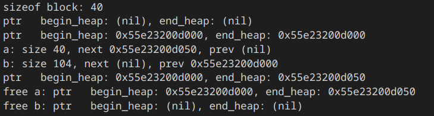
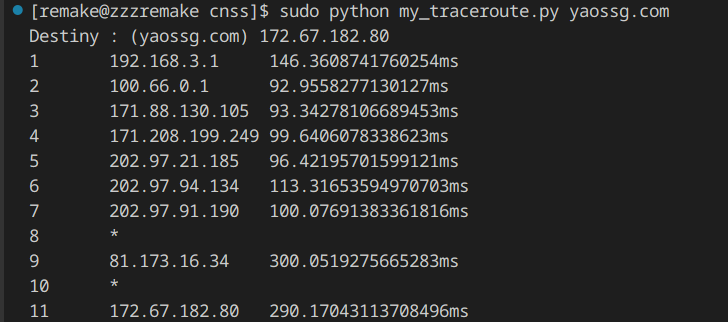
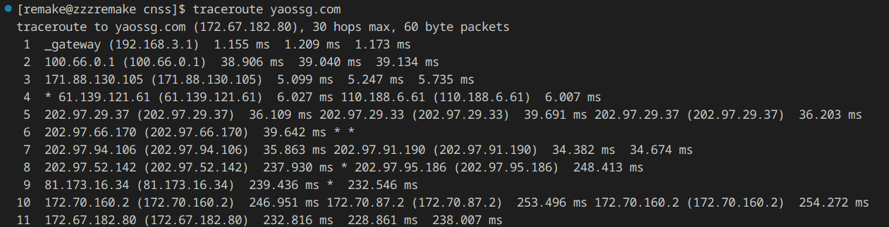

孩子不会dev，随便打着玩的。

<!-- truncate -->

## 🧐Dev is so fun... functional!

### 题目描述

写出和以下`scheme`代码等价的代码（三种语言）

```scheme
#lang scheme
(define (make-withdraw balance)
  (lambda (amount)
    (if (>= balance amount)
        (begin (set! balance (- balance amount))
               balance)
        "Insufficient funds")))

(define W1 (make-withdraw 100))
(define W2 (make-withdraw 100))

(W1 50)
; 50
(W1 30)
; 20
(W2 70)
; 30
(W2 50)
; Insufficient funds
```

### 要点

哈哈，不会函数式编程捏。
题目要求的是闭包实现，因此用class实现类似功能是不行的。

### 过程

~~Javascript根本不会，但用法都能从网上找到~~

#### C++

```cpp
#include <functional>
#include <iostream>

std::function<void(int)> make_withdraw(int balance){
    return [=] (int amount) mutable {
        if (balance >= amount){
            balance -=amount;
            std::cout<<balance<<'\n';
        } else {
            std::cout<<"Insufficient funds\n";
        }
    };
}

int main(){
    auto W1=make_withdraw(100);
    auto W2=make_withdraw(100);
    W1(50);
    W1(30);
    W2(70);
    W2(50);
}
```

#### Python

```python
def make_withdraw(balance):
    def kkndlam(amount):
        nonlocal balance
        if balance >= amount:
            balance -= amount
            print(balance)
        else:
            print("Insufficient funds")
    return kkndlam

W1 = make_withdraw(100)
W2 = make_withdraw(100)

W1(50)
W1(30)
W2(70)
W2(50)
```

#### Javascript

```javascript
function make_withdraw(balance) {
    function kkndlam(amount) {
        if(balance>=amount){
            balance -= amount;
            console.log(balance)
        } else{
            console.log("Insufficient funds");
        }
    };
    return kkndlam;
}

var W1 = make_withdraw(100);
var W2 = make_withdraw(100);

W1(50);
W1(30);
W2(70);
W2(50);
```

## ♊双人成行

### 题目描述

使用数据并行化实现多机/多卡对`CIFAR-10`进行分类的神经网络，模型自选，并回答数据并行化的方式

### 要点

CPU+GPU也是双卡😤，pytorch写一下multiprocessing就行。

### 过程

:::info 配置
    CPU 略

    GPU NVIDIA GeForce MX450
    
    机器学习环境 pytorch 2.0.1+cu117 CUDA 11.7
:::

实现：用~~东拼西凑的~~ResNet残差网络实现的、以`CIFAR-10`为数据集的图像分类

#### Code

```python
import os
import argparse

import torch
import torchvision
import torchvision.transforms as transforms
import torch.nn as nn
import torch.optim as optim
from torch.nn import functional as F

import torch.multiprocessing as mp
import torch.distributed as dist
from torch.nn.parallel import DistributedDataParallel

# some parameter
kernel_size=3
num_epochs = 3
lr = 0.01

# device: cpu, gpu
device = [torch.device('cpu'), torch.device('cuda')]

# transform origin data： 数据增强等。
transform = transforms.Compose([
    transforms.Pad(4), # 填充像素
    transforms.RandomHorizontalFlip(), # 倒转
    transforms.RandomCrop(32), # 切片
    transforms.ToTensor()
])

# Res block
class Residual(nn.Module):
    def __init__(self, input_channels, num_channels,
                 kernel_size, strides=1, use1x1=False):
        super().__init__()
        self.conv1 = nn.Conv2d(input_channels, num_channels,
                               kernel_size=kernel_size, padding=(kernel_size-1)//2, stride=strides)
        self.conv2 = nn.Conv2d(num_channels, num_channels,
                               kernel_size=kernel_size, padding=(kernel_size-1)//2)
        if use1x1:
            self.conv3 = nn.Conv2d(input_channels, num_channels, kernel_size=1, stride=strides)
        else:
            self.conv3 = None
        self.bn1 = nn.BatchNorm2d(num_channels)
        self.bn2 = nn.BatchNorm2d(num_channels)

    def forward(self, X):
        Y = self.conv1(X)
        Y = self.bn1(Y)
        Y = F.relu(Y)
        Y = self.bn2(self.conv2(Y))
        if self.conv3:
            X = self.conv3(X)
        Y += X
        return F.relu(Y)

# 总模型
class ResNet(nn.Module):
    def _resnet_block(self, input_channels, num_channels, num_residuals, first_block=False):
        blist=[]
        for i in range(num_residuals):
            if i == 0 and not first_block:
                blist.append(Residual(input_channels, num_channels,kernel_size=kernel_size, use1x1=True))
            else:
                blist.append(Residual(num_channels, num_channels, kernel_size=kernel_size))
        return nn.Sequential(*blist)

    def __init__(self, layers:list, num_classes=10):
        super().__init__()
        self.conv1 = nn.Conv2d(3, 16, kernel_size=kernel_size, bias=False)
        self.bn1 = nn.BatchNorm2d(16)
        self.relu = nn.ReLU(inplace=True)
        self.resblk1 = self._resnet_block(16, 16, layers[0], first_block=True)
        self.resblk2 = self._resnet_block(16,32, layers[1])
        self.resblk3 = self._resnet_block(32, 64, layers[2])
        self.avgPool = nn.AdaptiveAvgPool2d((1,1))
        self.flatten = nn.Flatten()
        self.fullconn = nn.Linear(64, num_classes)

    def forward(self, x):
        Y = self.conv1(x)
        Y = self.bn1(Y)
        Y = self.relu(Y)
        Y = self.resblk1(Y)
        Y = self.resblk2(Y)
        Y = self.resblk3(Y)
        Y = self.avgPool(Y)
        Y = self.flatten(Y)
        Y = self.fullconn(Y)
        return Y

def train(rank, args):
    # 初始化 使用内置的gloo
    dist.init_process_group("gloo", rank=rank, world_size=args.nodes*args.gpus)

    # 当前进程所用device
    local_device = device[rank]
    # print(rank, local_device)

    # 初始化进程
    model = ResNet([2,2,2]).to(local_device)
    # 分布！
    model = DistributedDataParallel(model)
    #
    if rank == 0: # 主进程download
        train_dataset = torchvision.datasets.CIFAR10(root='data/', train=True, transform=transform, download=True)
    else:
        dist.barrier()
        train_dataset = torchvision.datasets.CIFAR10(root='data/', train=True, transform=transform)
    train_loader = torch.utils.data.DataLoader(dataset=train_dataset, batch_size=300, shuffle=True)

    # 等待状态以使进程达到同步。
    dist.barrier()

    # 交叉熵损失函数， Adam优化器
    criterion = nn.CrossEntropyLoss()
    optimizer = optim.Adam(model.parameters(), lr=lr)

    for epoch in range(num_epochs):
        # print(epoch)
        for images, labels in train_loader:
            images = images.to(local_device)
            labels = labels.to(local_device)

            optimizer.zero_grad()
            out = model(images)
            loss = criterion(out, labels)
            loss.backward()
            optimizer.step()

    dist.barrier()

    # 存下参数
    if rank == 0:
        torch.save(model.state_dict(), "./resnet.pth")

    # 关闭所有进程
    dist.destroy_process_group()

if __name__ == "__main__":
    os.environ["MASTER_ADDR"] = "127.0.0.1"
    os.environ["MASTER_PORT"] = "11451"
    parser = argparse.ArgumentParser()
    parser.add_argument('-n', '--nodes', default=1, type=int)
    parser.add_argument('-g', '--gpus', default=len(device), type=int)
    args = parser.parse_args()
    mp.spawn(train, nprocs=args.gpus, args=(args,))
```

#### 数据并行化

code中为多进程Ring ALLReduce方式，通过环式的通信提升了通信效率。

另外，诸如torch的dataparallel就类似于google 的 MapReduce，将任务分派给各个子任务进行reduce，最后在主节点进行整合。

## 🆕malloc 怎么是个函数啊

### 题目描述

> 推荐linux环境完成

使用C语言造出malloc和free的轮子，并回答相应问题。

### 要点

~~windows很好实现，但会被毙~~
~~没试过这样干，可以看看yao的博客~~

malloc会在分配的内存块前存放信息，从而方便free等操作。

### 过程

#### Code

```c
#include <sys/types.h>
#include <unistd.h>
#include <stdio.h>

#define align8(x) (((((x)+7)>>3)<<3))

typedef struct block block;
typedef struct block* p_block;

// 全局
p_block begin_heap = NULL, end_heap = NULL;

struct block{
    p_block next; //下一块地址。
    p_block prev;// 前一块地址，用于merge。
    size_t size;// 该块分配了多少字节
    int free; //该块是否free.
    char *ptr;// 相当于验证作用？
    char data[]; //用于实际操作中按字节寻址。
};

p_block find_block(size_t size){
    p_block now = begin_heap;
    while(now && !(now->free && now->size >= size)){
        now = now->next;
    }
    return now;
}

p_block extend(size_t size){
    p_block now = sbrk(0);
    if(sbrk(sizeof(block)+size)==(void*)-1){
        return NULL;
    }
    now->size = size;
    now->next = NULL;
    now->free = 0;
    if(end_heap){
        end_heap->next = now;
    } else {
        begin_heap = now;
    }
    now -> prev = end_heap;
    now -> ptr = now->data;
    end_heap = now;
    return now;
}

void *mymalloc(size_t size){
    p_block now;
    size_t align_size = align8(size);
    if (begin_heap) {
        //已有malloc内存后的操作
        if (now = find_block(align_size)){
            now -> free = 0;
        } else {
            now = extend(align_size);
            if(now == NULL){
                return NULL;
            }
        }
    } else {
        // 初次malloc，进行extend操作
        now = extend(align_size);
        if (now == NULL){
            return NULL;
        }
    }
    return now->data;
}

p_block get_block(void *nowptr){
    //malloc 将信息保存在使用的内存块前，这里获取该metadata地址。
    return (p_block)((char*)nowptr - sizeof(block));
}

int is_valid(void *nowptr){
    if (begin_heap){
        if ((void*)begin_heap < nowptr && nowptr < sbrk(0)){
            return nowptr == get_block(nowptr)->ptr;
        }
    }
    return 0;
}

p_block merge_block(p_block now){
    // avoid fragments(maybe?)
    if(now->next && now->next->free){
        now->size += sizeof(block) + now->next->size;
        now->next = now->next->next;
        if(now->next){
            now->next->prev = now;
        }
    }
    return now;
}

void myfree(void * nowptr){
    //merge一下碎片
    if(is_valid(nowptr)){
        //free block
        p_block now = get_block(nowptr);
        now->free = 1;

        //merge prev.
        if(now->prev&&now->prev->free){
            now = merge_block(now->prev);
        }

        if(now->next == NULL){// update begin and end heap.
            end_heap = now->prev;
            if(end_heap){
                end_heap->next = NULL;
            } else {
                begin_heap = NULL;
            }
            brk(now);
        } else { //else do merge.
           merge_block(now); 
        }
    } //else : do nothing.
}


int main(){
    //测测你的
    printf("sizeof block: %d\n",sizeof(block));
    printf("ptr   begin_heap: %p, end_heap: %p\n", begin_heap, end_heap);
    int *a = (int*)mymalloc(sizeof(int)*10);
    printf("ptr   begin_heap: %p, end_heap: %p\n", begin_heap, end_heap);
    char *b = (char*)mymalloc(sizeof(char)*100);
    p_block ta = get_block(a), tb = get_block(b);
    printf("a: size %d, next %p, prev %p\n",ta->size, ta->next, ta->prev);
    printf("b: size %d, next %p, prev %p\n",tb->size, tb->next, tb->prev);
    printf("ptr   begin_heap: %p, end_heap: %p\n", begin_heap, end_heap);
    myfree(a);
    printf("free a: ptr   begin_heap: %p, end_heap: %p\n", begin_heap, end_heap);
    myfree(b);
    printf("free b: ptr   begin_heap: %p, end_heap: %p\n", begin_heap, end_heap);
}
```

测试截图:


#### 为什么 malloc(size_t size) 需要申请的内存长度，但是 free(void* ptr) 不需要已申请的内存长度？

malloc的实现中，会在分配的内存块前储存一小块数据，用于存储关于该次malloc的信息，例如分配的内存字节大小，以及其他信息。free的时候只需要传入指针，程序会在约定好的位置读取信息，便可以进行free操作而不用传入需要释放的内存大小，方便操作。

#### OS如何管理内存？

操作系统如何管理内存捏？

1. 操作系统向进程隐藏了具体的物理内存地址，取而代之的是虚拟的地址空间假象（使用MMU等硬件进行虚拟地址转换）。
2. 操作系统给每一个进程分配一个页表，用相对较大的页这一单元来储存具体的代码和数据，并使用TLB、多级页表等机制进行速度优化。
3. 操作系统会将不常用的页从内存储存进磁盘，当需要访问该页时，硬件抛出缺页异常，由软件（操作系统）来调度页。

需要说明的是，以上的操作系统过程都是透明的，进程无从感知这一切，操作系统用复杂的机制向进程隐藏了这一切。

## 🔀Trace it!

再造次轮子！

### 题目描述

自选语言，实现linux下的traceroute。打印出本机到目的主机之间设备的 IP 地址和 TTL 时间。由于有些中间设备关闭了某些网络服务，所以不能被 trace 到，你只需要给出相应提示即可。

### 要点

虽说traceroute使用的ICMP包已经确定好了类型和代码，但错误的类型和代码仍能得到回应
~~和出题人battle后发现出题人写错了类型和代码照样能得到回应~~

于是只要构造ICMP包就行了。

### 过程
环境

> Linux
> Python 3.11.3 + Scapy

#### 原理

traceroute 主要通过IP协议和ICMP协议两者共同完成（负载上也有TCP和UDP两种实现，这里只讲UDP实现）

IP协议中的TTL字段每经一个路由器都会-1， 若-1后为0，路由器将其丢弃，并将向源ip地址（发起方）回复一个ICMP的超时报文，从超时数据报的源IP地址中， 发起方便可获取该路由器的IP地址、

利用以上原理，traceroute可以在第一次发送`TTL=1`的UDP（or TCP?）报文，收到超时的回复时再发送`TTL=2`的报文，如此反复，直到发送到目的IP地址，或达到设定的最高hop数（Linux 中的 `traceroute` 默认为30 hops），便可得出数据包途经的IP地址。

需要注意的是，现在的许多路由器开启了防火墙等功能，被配置为了不返回ICMP报文，因此traceroute命令无法获得该路由器的IP地址，在原命令中显示为`*`。traceroute不会因为遇到该种情况停止，而是继续增加TTL，发出数据包，直到遇到以上所述的情况而停止。

----

那么，如何根据ICMP来得出路由器返回的不同情况呢？

ICMP 提供了type字段以及细分的code字段以区分不同的类型，其中有两个在traceroute中尤其重要：

| Type | Code | description |
| ---- | ---- | ----------- |
| 11   |  0   | TTL expired in transit |
|3|3|Destination port unreachable |

Destination port unreachable(目的端口不可达)： traceroute 的目的端口设为>30000(Linux 默认值为33434), 大多数的服务器处理该数据报时会将其视为端口不可达，因此返回特定报文。

:::info 为什么目的端口设定为大于30000
    UDP的实现中保证了0~65535的端口号可用，在RFC文档中并没有限制端口使用。

    man文档中的解释为：探测包需要使用 `udp datagrams with so-called "unlikely" destination ports`，于是就选择了默认值33434，也许设计者认为33434大伙儿都不会用吧，文档中也说明不保证33434如果有应用用了，traceroute的行为如何。
    
    至于端口设置为大于30000的说法，也许只是网上的人云亦云？
:::

TTL expired in transit(TTL 超时)：TTL为0时路由器返回的ICMP报文，用于获取该路由器的源IP地址。

----

综合来看， traceroute的设计足够巧妙，利用了两个协议的组合使用来达成功能。
~~也足够严谨，说明了自己选择目的端口33434会导致未定义行为~~

#### Code

```python
import sys
import socket
import time

from scapy.all import *

def my_trace_one(dest_ip:str, dest_port:str, ttl:int):
    begin_time = time.time()
    # verbose 会输出多余信息，timeout为设定单次请求超时时间1s。
    # IP段设置目的IP， ttl生存周期， UDP设置源port(这感觉无所谓的)， 目的端口设为不可达(>30000)
    reply = sr1(IP(dst=dest_ip, ttl=ttl)/UDP(sport=6600, dport=dest_port), timeout=1, verbose=False)
    end_time = time.time()
    period=end_time-begin_time
    try:
        if reply.getlayer(ICMP).type==11 and reply.getlayer(ICMP).code==0:
            now_ip = reply.getlayer(IP).src
            return "TTL expired in transit", now_ip, period
        elif reply.getlayer(ICMP).type == 3 and reply.getlayer(ICMP).code == 3:
            now_ip = reply.getlayer(IP).src
            return "Destination port unreachable", now_ip, period
    except Exception as e:
        return None
    

def my_traceroute(domain:str,ip:str, hops:int=30):
    print("Destiny : "+f"({domain}) "+ip)
    hop = 0
    flag = True
    # traceroute default port: 33434
    dest_port=33434
    while flag and hop<hops:
        hop += 1
        dest_port +=1
        message = str(hop)+" "
        result = my_trace_one(dest_ip=ip, dest_port=dest_port, ttl=hop)
        if result is None:
            message +="\t*"
        elif result[0]=="TTL expired in transit":
            message += f"\t{result[1]}\t{result[2]*1000}ms"
        elif result[0]=="Destination port unreachable":
            message += f"\t{result[1]}\t{result[2]*1000}ms\nOver!"
            flag=False
        print(message)


if __name__ == "__main__":
    domain = sys.argv[1]
    if len(sys.argv)>2:
        hops = int(sys.argv[2])
    else:
        hops=30
    ip = socket.gethostbyname(domain)
    my_traceroute(domain, ip, hops)
```

#### Picture

演示：


看看Linux的

