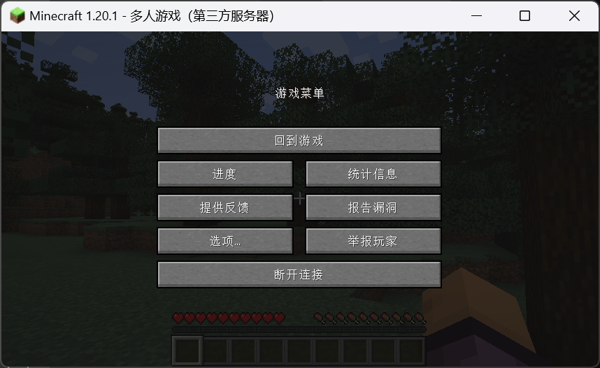
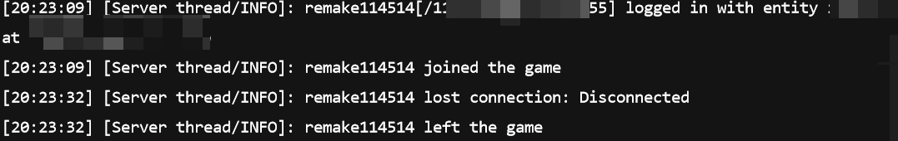
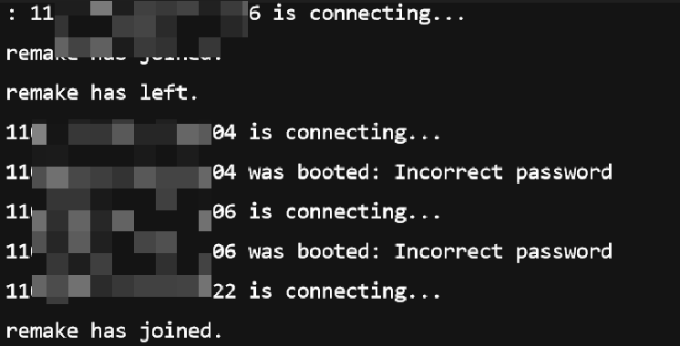
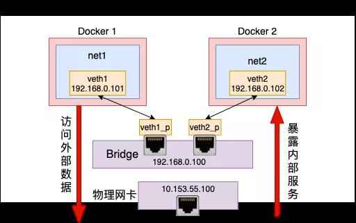

早知道，还得是SA。

<!-- truncate -->

以下做题过程中，环境包括：

1. Windows
2. Ubuntu 20.04
3. CentOS 7
4. Arch... 当时最新版本。

Linux太多了。

另外部分做过的题目由于过于冗长，或与SA Recruit重合度过高，将删除这些题目的writeup。

## 🐋上个题(Docker, Xinetd)

### 题目描述

部署一道`Pwn`题。要求全自动部署。

### 过程

这题可以直接从github上找[轮子](https://github.com/Eadom/ctf_xinetd/tree/master)
但做题过程中稍微绕了一下，原本想自己写着试试的，但最后还是按以上[轮子](https://github.com/Eadom/ctf_xinetd/tree/master)的思路写了。

### Code

```yaml title="docker-compose.yml"
services:
  pwn:
    image: ubuntu:16.04
    build: .
    container_name: hello_pwn_deploy
    ports:
      - 0.0.0.0:10000:10000
```

剩下的部分同以上的轮子部分。

pwn 启动：`sudo docker compose up --build -d`

做题时pwn题采用2023 CNSS夏令营里头的`👀[easy]你的名字`。

## 🎮Play Game With Friends(配环境)

### 题目描述

1. 完成 【我的世界 Minecraft 】、【泰拉瑞亚 Terraria 】、【饥荒 Don't Starve】、【原神 Genshin Impact】 中任意两款游戏的服务器搭建。
2. 搭建在公网不间断运行的服务器上。

### 要点

官方wiki都有搭建服务器教程，对着自己linux版本调一下就行了。

### 过程

由于CentOS内存过小配置太低，仅能同时在线一个游戏的服务器。

开启对应游戏具体端口xxxx（MC），xxxx+114514（Terraria）。

#### 我的世界部分

我的世界最新的服务器需要jdk17，CentOS自带java为1.8（Java 8）卸载自带的jdk1.8，去Oracle官网安装了[jdk-17](https://download.oracle.com/java/17/latest/jdk-17_linux-x64_bin.tar.gz)

具体命令如下：

```bash
wget https://download.oracle.com/java/17/latest/jdk-17_linux-x64_bin.tar.gz
tar zxf jdk-17_linux-x64_bin.tar.gz
# jdk 17.0.8 版本
mv jdk-17.0.8.* jdk-17
mv jdk-17 /usr/local/
# 增加环境变量
vim /etc/profile
# 增加以下语句
export JAVA_HOME=/usr/local/jdk-17
export PATH=/usr/local/jdk-17/bin:$PATH

# 保存后加载配置文件
source /etc/profile

# 看看java版本
java -version
```

之后就是我的世界服务器搭建：

去官网找到[服务器下载网址](https://piston-data.mojang.com/v1/objects/84194a2f286ef7c14ed7ce0090dba59902951553/server.jar)，在minecraft文件夹下使用命令：
```bash
wget https://piston-data.mojang.com/v1/objects/84194a2f286ef7c14ed7ce0090dba59902951553/server.jar
```

之后先运行一次服务器：

```bash
java -Xmx1024M -Xms1024M -jar server.jar --nogui 
```

修改生成的eula.txt,修改为：
```bash
eula=true
```

最后就是修改配置部分，配置文件为`server.properties`,配置如下：

```bash title="server.properties"
#Minecraft server properties
enable-jmx-monitoring=false
rcon.port=?
level-seed=
gamemode=survival
enable-command-block=false
enable-query=false
generator-settings={}
enforce-secure-profile=true
level-name=world
motd=A Minecraft Server
query.port=?
pvp=true
generate-structures=true
max-chained-neighbor-updates=1000000
difficulty=easy
network-compression-threshold=256
max-tick-time=-1
require-resource-pack=false
use-native-transport=true
max-players=4
online-mode=false
enable-status=true
allow-flight=false
initial-disabled-packs=
broadcast-rcon-to-ops=true
view-distance=10
server-ip=
resource-pack-prompt=
allow-nether=true
server-port=??????????????
enable-rcon=false
sync-chunk-writes=true
op-permission-level=4
prevent-proxy-connections=false
hide-online-players=false
resource-pack=
entity-broadcast-range-percentage=100
simulation-distance=10
rcon.password=
player-idle-timeout=0
force-gamemode=false
rate-limit=0
hardcore=false
white-list=false
broadcast-console-to-ops=true
spawn-npcs=true
spawn-animals=true
function-permission-level=2
initial-enabled-packs=vanilla
level-type=minecraft\:normal
text-filtering-config=
spawn-monsters=true
enforce-whitelist=false
spawn-protection=16
resource-pack-sha1=
max-world-size=29999984
```

由于我自己是用PCL启动器而非官方的，所以online-mode 改成false了。

好嘞，**MC 启动**！





最后让服务器24小时运行，使用命令：

```bash
sudo yum install screen

screen -S minecraft
```
进行以上启动部分的命令，然后Ctrl+A+D退出screen，可以发现仍然能够远程访问MC。

#### 泰拉瑞亚部分

没玩过泰拉瑞亚，瞎写了。

首先steam购买泰拉瑞亚（36￥😭），查看版本1.4.4.9

然后新建Terraria文件夹，从官网上下载最新版本：

```bash
wget https://www.terraria.org/api/download/pc-dedicated-server/terraria-server-1449.zip
```

下载来的文件有Windows， linux和MacOS三个版本，把linux中文件全部复制到Terraria文件夹下。

给文件加权限：

```bash
chmod a+x ./TerrariaServer.bin.x86_64
```

点击运行并生成世界。但有些麻烦了，直接写个config.txt:

```bash title="config.txt"
#Load a world and automatically start the server. 
Create
world=....../Terraria/worlds/helloTerraria.wld
worldpath=....../Terraria/worlds
worldname=helloTerraria


port=?????
password=??????????????????????????
upnp=1

motd=Test your terraria!
autocreate=1
difficulty=0
secure=1
language=zh/Hans
```

输入以下命令，**泰拉瑞亚 启动！**

```bash
./TerrariaServer.bin.x86_64 -config config.txt
```



24小时运行方式同MC的方式。

## 🖥️GUI Undoubtedly Indispensable(VNC,xrdp,nohup)

### 题目描述

1. 完成任意 Linux 云服务器 上的图形化环境搭建（如 gnome, xfce, kde ）
2. 连接到桌面环境下打开 GVIM 和对应环境的终端（运行 neofetch/screenfetch） 并截图

### 过程

云服务器为腾讯云 CentOS 7.

系统必要的配置略过不提，直接到图形化界面部分。

```bash
sudo yum grouplist # 检查可安装的group
# 发现可安装GNOME Desktop
sudo yum groupinstall "GNOME Desktop"

# 安装vnc server
sudo yum install vnc-server

# 安装xrdp
sudo yum install epel*
sudo yum install xrdp

# 启动xrdp
sudo systemctl start xrdp
# 查看xrdp启动状态
sudo systemctl status xrdp
# 设置开机自启
sudo systemctl enable xrdp
```

之后到腾讯云控制台开放3389端口：

Windows通过远程桌面连接程序指定ip进行连接，输入用户名密码即可进入桌面；安装gvim，neofetch，结束。

----

使用以下命令后台执行firefox：

```bash
nohup firefox &
```

## 🚀萌新也想搭载上X-引擎(Nginx)

### 题目描述

1. 在 Linux 系统上安装 Nginx 免费开源版（编译安装/包管理器安装），安装后在浏览器访问 Nginx 初始欢迎页面。
2. 了解 Nginx 常见使用命令，寻找你的 Nginx 配置文件路径。
3. Nginx 的欢迎页面太丑了。修改配置文件，让浏览器访问显示该静态页面页面
4. 使用一个 Nginx 代理3个页面，不同的端口号访问到不同的页面.
5. 实现 URL 转发： 当 URI 请求为 /google 时，跳转到谷歌；当 URI 请求为 /github 时，跳转到 GitHub ；当 URI 请求为/cnss或/cnss/xxx 时，xxx 是任意字符串，跳转到 CNSS 招新官网；其余任意请求跳转到该静态页面。
6. 搭建一个简易文件下载服务器，访问 /downloads 能够显示文件目录。
7. 实现一个简单的负载均衡器，当访问同一个 URL 时，按照流量比 1 : 2 : 3 分别访问到 3 个不同的页面。
    > Tip：Nginx upstream 可以将请求转发给多个后端 server，该怎样模拟多个 server 呢？
8. 实现 “URL 轮询器”，访问该 URL 时，轮询跳转到大佬们的博客。

### 要点

最花时间的一集
其他SA一下午便可完成，这题做了三四天，令人感叹。

nginx实现重定向的时候不需要太复杂，不要往proxy想就行。

### 过程

CentOS 7 配置nginx：

yum源里头没有nginx availbale，选择编译安装nginx：

必要的环境已预装（实际上也就yum里头的几个软件）

```bash
# stable nginx
wget http://nginx.org/download/nginx-1.24.0.zip

tar -zxvf nginx-1.24.0.zip
cd nginx-1.24.0

mkdir /var/temp/nginx -p
# 编译配置
./configure     
    --prefix=/usr/local/nginx \
    --pid-path=/usr/local/nginx/nginx.pid \
    --lock-path=/var/lock/nginx.lock     \
    --error-log-path=/var/log/nginx/error.log \     
    --http-log-path=/var/log/nginx/access.log   \
    --with-http_gzip_static_module     \
    --http-client-body-temp-path=/var/temp/nginx/client  \
    --http-proxy-temp-path=/var/temp/nginx/proxy \
    --http-fastcgi-temp-path=/var/temp/nginx/fastcgi \
    --http-uwsgi-temp-path=/var/temp/nginx/uwsgi   \
    --http-scgi-temp-path=/var/temp/nginx/scgi \
    --with-pcre \
    --with-http_ssl_module \
    --with-http_v2_module \
    --with-http_realip_module \
    --with-http_addition_module \ 
    --with-http_sub_module \
    --with-http_dav_module \
    --with-http_flv_module \
    --with-http_mp4_module \
    --with-http_gunzip_module \
    --with-http_gzip_static_module \
    --with-http_random_index_module \
    --with-http_secure_link_module \
    --with-http_stub_status_module \
    --with-http_auth_request_module \
    --with-http_image_filter_module \
    --with-http_slice_module \
    --with-mail \
    --with-threads \ 
    --with-file-aio \
    --with-stream \
    --with-mail_ssl_module \
    --with-stream_ssl_module \
sudo make && sudo make install

# 测试一下
cd /usr/local/nginx/sbin
sudo ./nginx # nginx 启动！
sudo ./nginx -t # 看看配置文件
sudo ./nginx -s reload # 重启
sudo ./nginx -s stop  # 关闭
sudo ./nginx -v        # 看看版本

# 添加服务
sudo vim /usr/lib/systemd/system/nginx.service
# 文件如下：
# [Unit]
# Description=nginx - high performance web server
# Documentation=http://nginx.org/en/docs/
# After=network.target remote-fs.target nss-lookup.target
# 
# [Service]
# Type=forking
# PIDFile=/var/run/nginx/nginx.pid
# ExecStartPre=/usr/local/nginx/sbin/nginx -t -c /usr/local/nginx/conf/nginx.conf
# ExecStart=/usr/local/nginx/sbin/nginx -c /usr/local/nginx/conf/nginx.conf
# ExecReload= /usr/local/nginx/sbin/nginx -s reload
# ExecStop= /usr/local/nginx/sbin/nginx -s stop
# PrivateTmp=true

# [Install]
# WantedBy=multi-user.target

sudo chmod +x /usr/lib/systemd/nginx.service
sudo systemctl daemon-reload
sudo systemctl start nginx.service
sudo systemctl enable nginx.service

# 常用指令
## 平滑重启
sudo nginx -s reload
## 停止nginx
sudo nginx -s stop
## 检测下语法错误
sudo nginx -t
## 启动nginx
sudo nginx
```

nginx代理的静态页面文件布局如下：

```shell
nginx/
├── bg.jpg
├── downloads
│   ├── kknd
│   └── nishi?
├── index.html
├── port
│   ├── h1.html
│   ├── h2.html
│   └── h3.html
└── todo
    ├── index.html
    ├── script.js
    └── style.css
```

nginx配置文件：

```nginx
user  ?本机user;
worker_processes  auto;

error_log  logs/error.log;
error_log  logs/error.log  notice;
error_log  logs/error.log  info;


pid  /usr/local/nginx/nginx.pid;

events {
    # ulimits -n是100001,这里就稍微小一点
    worker_connections  1024;
}


http {
    include       /usr/local/nginx/conf/mime.types;
    default_type  application/octet-stream;

    log_format  main  '$remote_addr - $remote_user [$time_local] "$request" '
                      '$status $body_bytes_sent "$http_referer" '
                      '"$http_user_agent" "$http_x_forwarded_for"';

    #access_log  logs/access.log  main;

    sendfile        on;
    #tcp_nopush     on;

    #keepalive_timeout  0;
    keepalive_timeout  65;

    gzip on;
    gzip_types text/plain application/x-javascript text/css application/xml text/javascript application/javascript image/jpeg image/gif image/png;
    gzip_vary on;  
    
    upstream balance {
        server 本地配置域名:8081 weight=1 max_fails=5 fail_timeout=5;
        server 本地配置域名:8082 weight=2 max_fails=5 fail_timeout=5;
        server 本地配置域名:8083 weight=3 max_fails=5 fail_timeout=5;
    }
    upstream visit {
        # 轮询实现url轮询器
        server 本地配置域名:8084 max_fails=5 fail_timeout=5;
        server 本地配置域名:8085 max_fails=5 fail_timeout=5;
        server 本地配置域名:8086 max_fails=5 fail_timeout=5;
    }
 
    server {
        listen       80;
        server_name  本地配置域名;

        #charset koi8-r;
        access_log  logs/welcome.log main;

        rewrite ^/google$ https://www.google.com permanent;
        rewrite ^/github$ https://github.com permanent;
        rewrite ^/cnss$ https://summer.cnss.io permanent;
        rewrite ^/cnss/.*$ https://summer.cnss.io permanent;

        location = / {
            root   /???/nginx;
            try_files /index.html /index.htm;
        }

        location / {
            rewrite ^/.*$ /todo/ redirect;
        }

        location = /balance {
            proxy_pass http://balance/;
        }

        location = /visit {         
           proxy_pass http://visit/;
        }

        location /todo/ {
            access_log logs/todo.log main;
            alias /???/nginx/todo;
            try_files /index.html /style.css;
        }

        location ^~ /downloads/ {
            autoindex on;# 显示目录
            autoindex_exact_size on;# 显示文件大小
            autoindex_localtime on;# 显示文件时间
            alias /???/nginx/downloads/;
        }

        error_page   500 502 503 504  /50x.html;
    }
    server {
        listen        8081;    
        server_name   本地配置域名;
        access_log    logs/h1.log      main;

        location / {
            root    /???/nginx/port;
            index   h1.html h1.htm;
        } 
    }
    
    server {
        listen        8082;    
        server_name   本地配置域名;
        access_log    logs/h2.log      main;

        location / {
            root    /???/nginx/port;
            index   h2.html h2.htm;
        } 
    }
    server {
        listen        8083;    
        server_name   本地配置域名;
        access_log    logs/h3.log      main;

        location / {
            root    /???/nginx/port;
            index   h3.html h3.htm;
        } 
    }
    server {
        listen 8084;
        server_name 本地配置域名;
        access_log   logs/visit1.log main;
        location / {
           rewrite ^.*$ https://yaossg.com redirect;
        }
    }
    server {
        listen 8085;
        server_name 本地配置域名;
        access_log   logs/visit2.log main;
        location / {
            return 302 https://www.cnblogs.com/timlzh;
        }
    }
    server {
        listen 8086;
        server_name 本地配置域名;
        access_log logs/visit2.log main;
        location / {
            return 302 https://sh1no.icu;
        }
    }
    # 关注yaossg timlzh shino谢谢喵
}
```

若要继续改进，可有：

1. keep-alived等增加可用性
2. docker一键部署
3. https域名+证书

## 🐋造个集装箱

### 题目描述

手动模拟一个Docker容器网络。

### 要点

来张picture：



### 过程

为了表示访问外网，写个flask先。

```python title="app.py"
from flask import Flask, render_template
import requests

app = Flask(__name__)


@app.route('/')
def moyu():
    """
    获取摸鱼人日历
    """
    url = "https://moyu.qqsuu.cn/?type=json"
    img_url = ""
    response = requests.get(url=url).json()
    # 数据格式示例：（可以看到根本没必要用url来获取固定格式的图片url，但这里只是为了稍微展示一下能访问外网）
    # {"code":200,"msg":"success","data":"https://moyu.qqsuu.cn/moyu/20230818.png"}
    if response.get("code") == 200:
        moyu_url=response["data"]
        response = requests.get(moyu_url)
        img_url = response.url
    return render_template('index.html', img_url=img_url)


if __name__ == '__main__':
    app.run(host="0.0.0.0",port=80)
```

Flask 渲染的html模版文件`./template/index.html`：

```html
<!DOCTYPE html>
<html lang="en">
<head>
    <meta charset="UTF-8">
    <title>🖐️🐟</title>
</head>
<body>
    
</body>
```

脚本文件（默认已装有必要工具）：

```shell
# 创建网络namespace
sudo ip netns add flask_test
# 创建veth（Virtual Ethernet Pair），作为桥梁链接不同虚拟网络设备。
sudo ip link add veth_ns type veth peer name veth_br
# 将veth其中一端连入namespace中
sudo ip link set veth_ns netns flask_test

# 配置namespace端的veth ip
sudo ip netns exec flask_test ip addr add 192.168.0.2/24 dev veth_ns
# veth_ns 启动！
sudo ip netns exec flask_test ip link set veth_ns up

# 创建虚拟网桥
sudo brctl addbr flask_br 
# 配置网桥ip
sudo ip addr add 192.168.0.1/24 dev flask_br

# 配置veth的另一端到网桥上
#网桥flask_br和网络namespace flask_test相连
sudo ip link set dev veth_br master flask_br

# 两个都启动
sudo ip link set veth_br up
sudo ip link set flask_br up


# 把 veth_ns设为默认网关
# 此时内网部分便可以ping通
sudo ip netns exec flask_test route add default gw 192.168.0.1 veth_ns


sudo sysctl -w net.ipv4.conf.all.forwarding=1

# 本机路由转发配置（FORWARD规则），设置flask_br可以通过eth0（本地通网网卡）来进行与外网的通信。
sudo iptables -A FORWARD --out-interface eth0 --in-interface flask_br -j ACCEPT
sudo iptables -A FORWARD --in-interface eth0 --out-interface flask_br -j ACCEPT

# SNAT 与MASQUERADE不同，MASQUERADE自动从网卡获取ip地址进行转换，SNAT需要指定ip进行转换
# 进入路由判断前的规则添加，将源ip地址转换为本机ip地址。
sudo iptables -t nat -A POSTROUTING -s 192.168.0.0/24 -j MASQUERADE

# DNAT（目标网络地址转换），类似docker 端口绑定，将外网42062的访问绑定至192.168.0.2：80（本地服务端）
sudo iptables -t nat -A PREROUTING -p tcp --dport 42062 -j DNAT --to 192.168.0.2:80

# 一键安装flask环境（centos）
# 由于执行部分需要root权限，需要再在root下安装依赖包。
# 这部分和具体的自定义网络没什么关系，以注释方式呈现
# sudo pip3 install flask
# sudo pip3 uninstall urllib3
# sudo pip3 install urllib3==1.26.6
# sudo pip3 install requests

# 在网络 namespace下运行
nohup sudo ip netns exec flask_test python3 /xxx/app.py --port 80 > test.log 2>&1 &
```

运行截图：


