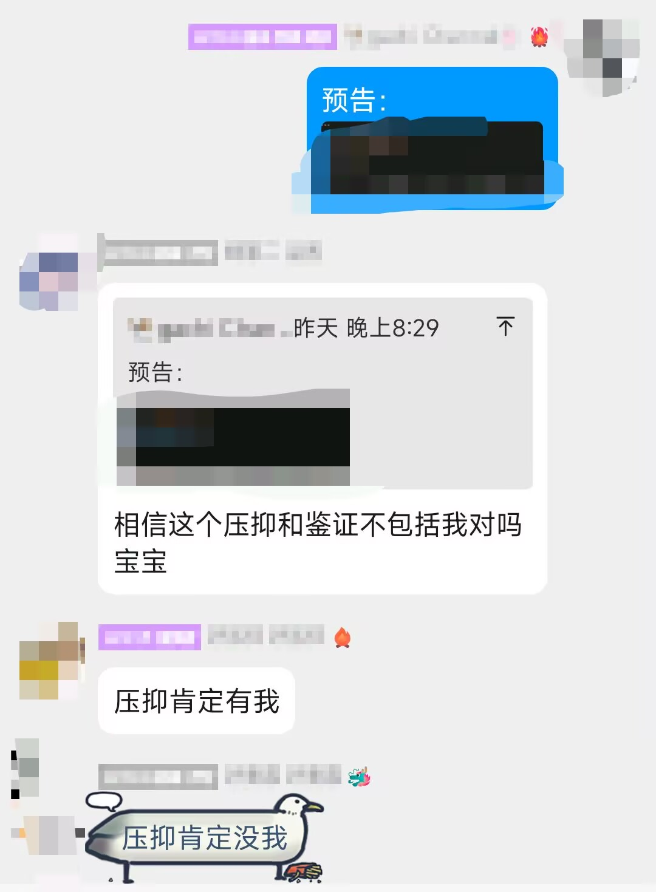
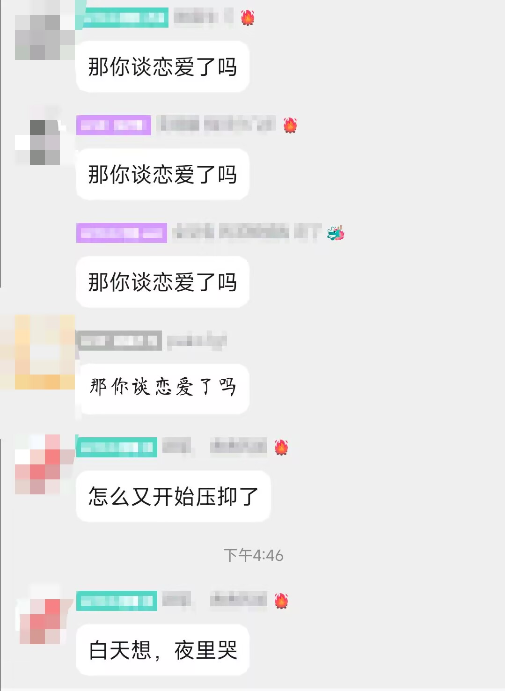

写下这段时，我正在研究生马原课上百无聊赖，打开QQ看到本科小团体还在x压抑和见证，令人感叹，感叹着感叹着就想分享一下自己的本科四年。

平心而论，成电生活不是一帆风顺，总是有让人不快甚至厌恶的地方。但对成电的回忆也足够美好，美好到我这个懒狗想到写下这篇文章去纪念。

<!-- truncate -->

## 大一

我们常说⏰的一生都是关键的：小学是关键的因为要打基础、初中是关键的因为要考好高中，高中是关键的因为要考好大学...但从马后炮的角度来说，大学最关键的确实是大一这一年，但高中的我还对此浑然不知。

高中时第一次听说成电的名字，还是在八省联考的时候，某不知名学长/学姐给我们学校发宣传材料。但我当时压根没考虑你电，还在想着读物理为国家做贡献的阶段。然后就是经典高考失利，当时我看着分数没啥感觉，只知道自己心仪的学校读不了了该换方向了，突然想起来还有个电子科技大学，四舍五入也是物理（鬼知道我当时怎么想的），然后在巨厚的报考参考书里遍历你电专业，发现满足感兴趣且分数够的只有计算机，那就选罢，整个过程不超过五分钟。

从上述心路历程来看，我的大学选择是非常草率的，想着报物理结果选了和物理没半毛钱关系的计算机。当时我甚至不知道计算机年薪多少，只知道低调的黑客有多Cool。不幸的是我没有计算机基础，导致大一的选择接连出错；幸运的是我选对了，**计算机就是我最喜欢的方向**。

----

你电大一上的课程安排几乎全是通识课，搭配辅导员/导员千叮万嘱卷保研，以及祖宗之法早晚自习，这不就是高中吗？可想而知刚高考完的我会选择随大流开卷了。现在看来，这个选择除了浪费了我大一乃至大二的大好时光外，确确实实影响了我未来的出路。

> 大一时候的说说，典型的做题家思维

当然除了卷之外总得做点别的。当时啥都不懂，面了社联，一面过了二面没去（幸好没去）；面了两个支教队，全部失败（也幸好没去成）；做X工作室招新，发现招新早就开始了，自己连个基本HTML网页都搓了个半天，比不过有基础的。最后终于找到自己感兴趣的且据说~~零基础友好~~的，结果是ACM......被学长的传单忽悠去打了趣味赛，拿了个二等奖，虽然注意到自己很多题都不会，但拿奖这件事还是让我有些飘飘然，于是我就定下明年去参加暑假集训，尝试进ACM队的计划。计划自然是没成功，这是后话。

所以大一上除了均分还算过得去之外，称得上好事的就是我交了一堆朋友，其中就有上面提到的小团体，有打数模认识的，有做微积分认识的（？），还有打ACM认识的，甚至有看Asoul认识的（？）。人总是社会性的，总是需要有人跟你聊天，一起做东西的。有这些朋友是我的荣幸，有了他们才让我逐渐找到自己该走的路。

----

大一下的我一心扑在ACM上，3月份打了校赛拿了三等奖，想着勤能补拙总能挤进集训队，事实上也确实完成了一半，暑假前集训肯花功夫就能完成，我也顺利的进了暑假集训。然后就是为期一个月的噩梦，这一个月每天打一个上午题，讲一个下午题，晚上有Codeforce比赛的话还要熬夜打，越打心越凉。40人里我的排名在35左右徘徊，根本没有入队希望，每天就是盯着看不懂的题干着急，听着听不懂的题气笑了，打着打不过的题上床睡觉，人与人的差距终究还是太大。最后当然是进不了队，而暑假已经过去了一半，事已至此，就呆学校摆烂吧。

学期末时同学说她报名了学院的科研育人计划，里面罗列了一堆网安相关培养，而我觉得网安课程好玩，科研也是锦上添花就选了。最后我一个计科的进了网安的科研育人，而那位网安同学反而被刷了，而当时的我还不知道，参加科研育人是我大一做过最正确的决定（~~虽然是以另一种意想不到的方式实现~~）。

## 大二

到了大二，这个时候我终于明白了，学校教的就是依托思，我自己也是依托思，该想办法让自己不那么像史。因此我又去参加工作室招新了，但我心里清楚，大二是很难进这些学生组织的，能做的只有将这些招新题当作学习列表，对着学恶补基础。结果自然是[都没进](/blog/DevOps初探--一次不成功的招新经历.md)，还闹过不知道IP地址多少位的笑话，进了一个又一个人才库，但我终于对计算机有了一个粗浅的认识。于是趁热打铁继续打别的招新打基础，就有了几篇[Write up](/blog/CNSS_Recruit_SA/index.md)，后面发现学不到新的东西的时候就去翻[CSdiy](https://csdiy.wiki/)，边学边做lab。

此时学校的课程终于给了我[惊喜](/docs/Modern%20Cryptography/intro)。科研育人的课程终究还是比普通班的好一些。另外，我还加了URP（本科生科研计划），加了本校的一位老师做AI相关科研，看上去一切走上了正轨，这也是我大学生活中最美好的时候，很忙但自己能感到提升。

接下来就是但是了。CSdiy中的课程对科班的知识扩充是足够的，但不涉及工作所需知识。即使是15445这种数据库lab也需要继续深入去学才有用，而我当时也只是浅尝辄止。另外科研是做AI横向，做着还没有正反馈，调参调了一个暑假没成果，可想而知当时我的挫败感多大，压垮骆驼的最后一根稻草是组会上学长读论文读到我做的方向，当我看到SOTA的正确率只有30%左右的时候，我终于觉得这个方向没有意义了，正好项目来了一位新的硕士学长，于是我向老师申请退出了科研。这一经历让我对AI搭积木的过程深恶痛绝，也影响了我后续保研取向的选择。

## 大三及之后

虽然大二学了一年，但大家应该都能看得出来上述内容对就业没有丝毫帮助。学校教的与实际严重脱钩，而自己的兴趣终究只是兴趣，经不起面试官的随便一问。认识的同学有大二准备一年就业大三圆梦大厂的，有开发十年经验猛刷实习的，而我一没准备二不敢投实习（懒散加社恐的性格导致的），考公也没兴趣，也没钱出国，那么出路便只剩下保研延迟就业三年，大一种的因终究结出了果。

保研过程就不详细讲了，详见我[之前的帖子](https://bbs.uestc.edu.cn/thread/2185261)。从结果来看，科研育人的1.1加分系数，以及做的课程lab在国内高校的评价体系里确实不错，我也依靠着这两项拿到了不错的去向。找到的老师原本以为是做传统网络的，结果开新方向做AI通信优化去了，兜来兜去又回到了AI。还是刷刷力扣吧家人们。

而小团体的故事也在继续。相信不少pu都用过[复习文档](https://iuestc.com)，而该文档就是大三时小团体的某位同学发起的。从零星的几篇学院专业课文档，到最终几十篇包含各学院专业课、通识课的复习文档，其中马原文档最高900人在线复习，这让参与其中的我终于对自己的做过的事有了自豪感。

最后，我到大三才开始水河畔，不能不说是一种遗憾。水水的快乐少享受了两年，呜呜。

## 总结

如果按你电以成绩论、以结果论、以升学论的导向来看，我的本科生活无疑是“成功”且“幸运”的，四年自始自终维持较高的排名，最终也去了外校读研；可我们是活生生的人，成绩论掩盖不了就业的脱钩，结果论不能去除这四年走过的弯路，升学论不能忽视35岁危机。我在保研帖子里曾抱怨自己失去了很多东西，事实上我能走的路也确实收窄到了唯一的路上。这当然不只是你电的问题，我的问题明显更大：没有勇气放弃大一的努力去准备就业，没有足够的自制力去专注某件事情，也可能是自己不够聪明找不到最优解......这些问题我当然都明白，人总会美化自己未走过的路，但走过的路无法回头，能做的只能是不忘来时路，努力将未来的事做好。

毕业后，我们怀念的并非学校，而是学校里遇到的人。有了遇到的同学和老师，才有如今的我，感谢他们。

~~写完又去小团体那里看了一下，还在见证，令人感叹。~~

## 彩蛋

我们的小团体...究竟会变成什么样子...（哽咽）

----

写完总结后问同学有什么可以改的：

对啊，我甜甜的恋爱呢？该骂你电还是得骂😡😡😡
