# [翻译] Overwatch Gameplay Architecture and Netcode

2017年暴雪在GDC的关于守望先锋游戏架构和网络设计的[演讲](https://www.youtube.com/watch?v=Ks98kE3cs30)摘要。

<!-- truncate -->

本篇博客所处的2025年，虽然OW2不断更新，社区也能感到OW2越来越好，但提起OW1，总是带有着美好的滤镜，OW1的一系列创举，如回放、地图工坊以及社区普遍好评的代码水平（即影响游戏体验的bug较少、优化较好。但bug不是没有，比如著名的小锤黄甲bug），让我这个OW2入坑的玩家十分有兴趣。

国内虽然也有[搬运](https://gwb.tencent.com/community/detail/114516)，但图片缺失且缺乏维护，且翻译太过冗长。该从故纸堆中拾起来了。

本文主要参考：

1. [腾讯GWB社区翻译](https://gwb.tencent.com/community/detail/114516)
2. [Youtube原视频](https://www.youtube.com/watch?v=Ks98kE3cs30)

## ECS

守望先锋采用了ECS（Entity-Component-System）架构，不同于其他引擎中流行的Component model和Actor model。选择ECS本身的原因可能带着团队的感情因素，但从事后诸葛亮的角度而言，ECS能够很好的管理代码增长带来的复杂性。

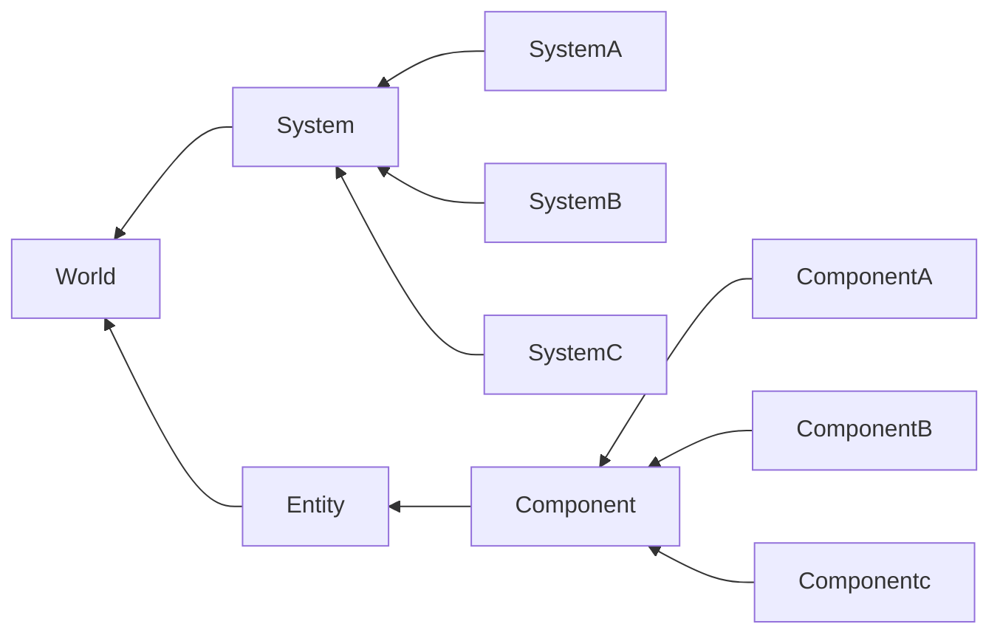

上图中，World仅为System和Entity的集合，Entity仅为一个对应Component 集合的ID，Component存储游戏的状态(state)而不包含行为(behavior)，而System反过来。

所以，**Component没有Behavior(function)，System没有State(field)。**

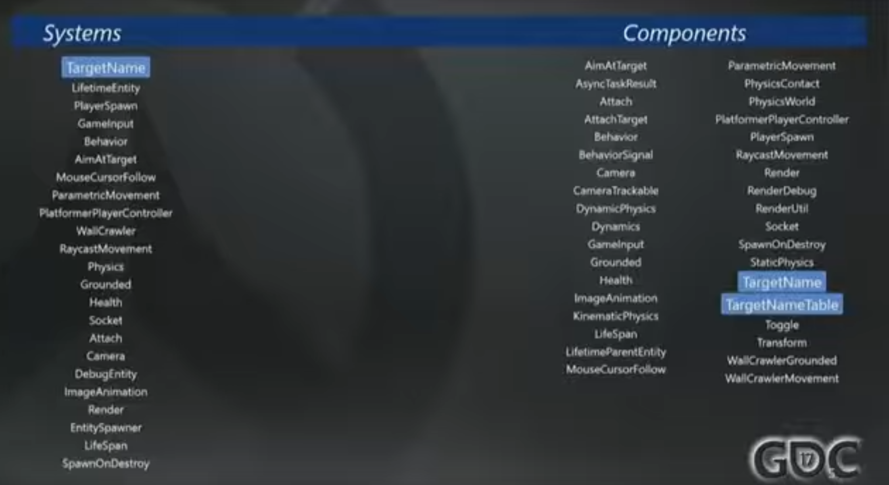

> 2017 年的视频，没有高清捏

左边轮询遍历System，单个System绑定多个Component(tuple of Components)，在Component上进行操作（即Behavior）。

### Example: Physics system prototype

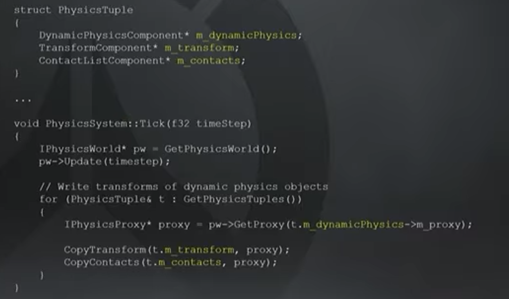

上图即ECS中一个tick轮询的例子：

其执行内部物理引擎的更新。物理引擎可以是Box2D（2D物理引擎）或者Domino（暴雪自研）。执行完模拟后，遍历tuple，用DynamicPhysicsComponent中的proxy提取里面的物理表示，复制给Transform Component和Contact Component（碰撞Component）。

System对单个Component是无关心的，其对tuple中的slice进行一组操作（Behavior）。

### Overwatch ECS

把上面的ECS图搬来给守望先锋，便有以下架构：

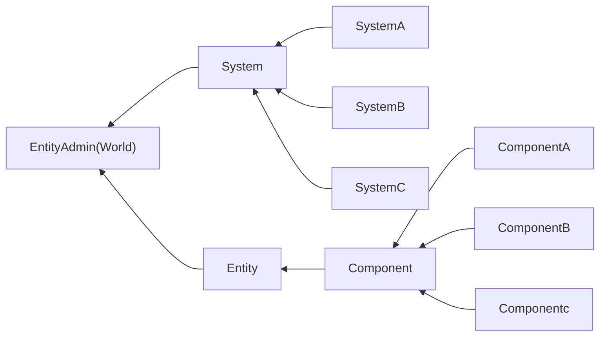

其中`EntityAdmin`包含一个`Array<System>`、一个`Entity hashmap<Entity ID, Entity>`，其中`Entity`存储`Entity ID`及可选的resource handler，指向Entity实际的Asset资源。

Component为基类，派生出数百个sub-Component。在这里，多态性唯一的用处在于生命周期的管理（如Create Destroy），因为Component没有Behavior，无需关注具体的操作函数。

实际的守望先锋中，有的System需要单个Component，有的需要将近一半的Component。理想情况下，团队希望每个System都依赖很多Component执行，并将System看作纯函数而不改变Component state。但实际中，仍然有System需要改变state，这需要System自己管理复杂性。

### Example: Connection(AFK)

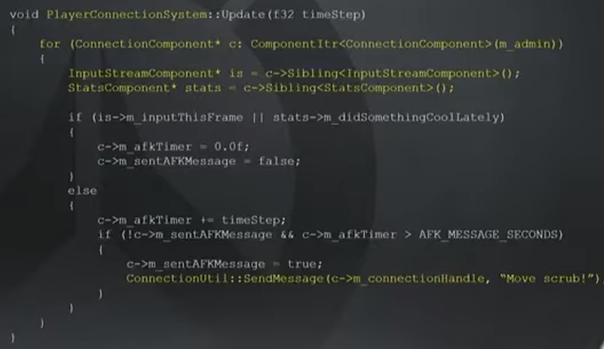

代码中的System将会遍历所有`Connection Component`，检测玩家是否AFK（即俗称的挂机）。`Connection Component`对应玩家与服务器之间的连接，挂在代表玩家的Entity上。这里的Entity可以是游戏玩家，可以是旁观者，可以是房主，该System不关注这些细节，只关注AFK这件事本身。

每个`Connection Component`包含了`InputStream`和`Stats Component`（应该是玩家的局内评分）。当玩家输入了某些按键，或者对团队做了某些贡献（例如卢西奥站着不动奶到别人都算有贡献），即清空AFK，否则不断计时直到AFK触发。

~~所以要是想解决长期挂机被踢的问题是不是只要搞个假玩家在旁边奶他就行了~~

System上运行的entity都需要有完整的Component tuple。例如，游戏中的机器人有`Stat Component`，但是没有`InputStream`和`Connection Component`，因此他不会进行该Behavior。

## Why not OOP?

上面的AFK例子，为什么不能用OOP的思想管理呢？比如重载Connection的update函数，在里面进行AFK检测？

回到ECS中的Component定义上来。`Connection Component`只保存状态，这意味着其可以被多个Behavior复用：AFK检测、能接受网络广播的玩家列表、解析玩家状态（如玩家名字、玩家成就）。如果用OOP的方式来做，那么`Connection Component`的update函数将过于繁杂，包含太多的Behavior。

在OOP中，类既代表State又代表Behavior。**但Component在不同的System、不同的时间点下意味着完全不同的事，它只保存状态State**。

----

当然，上面的解释还是过于先射箭再画靶，让我们把视角切换一下吧。

Tim Ford（即演讲者，守望先锋团队leader）举了一个例子：不同人、不同身份去观察同一棵樱花树，会看见不同的Behavior。树在这里是是被不同观察者区别对待的Subject。

再回到上面的`Connection Component`，其在管理玩家连接的System中被看作AFK踢出游戏的Subject、在`ConnectUtility`中被看作广播玩家网络信息的Subject、客户端Client上被看作计分板上带有玩家名字的UI Subject。

暴雪认为：**根据Subject的视角来区分所有Behavior，从而描述游戏对象（比如例子中的树）的全部Behavior方式，相比OOP会更简单。**

## Problem

接下来的描述更像是按时间线，从最开始的OW原型开始。

ECS的原则（System没有State，Component没有Behavior）看上去很朴素，但在实际编写代码的过程中，我们很容易想让System有状态，比如成员变量。比如，对于`InputSystem`，我们很容易想到将用户输入信息保存在System中，其他System向`InputSystem`获取输入信息。

另外，由于开发一个新的Component很容易希望其有多个实例（这也切合代码中通过模板迭代访问Component的方式），在Component内保存全局变量会导致其有多个副本，这显然是不太对劲的。

出于以上原因，暴雪在开发最初版本时在System中保存了一次性（one-off）的状态，并提供了全局访问函数，其他System可以访问System，从而获取这些状态。如下图中，`CommandSystem`获取`InputSystem`指针，并通过指针访问State。

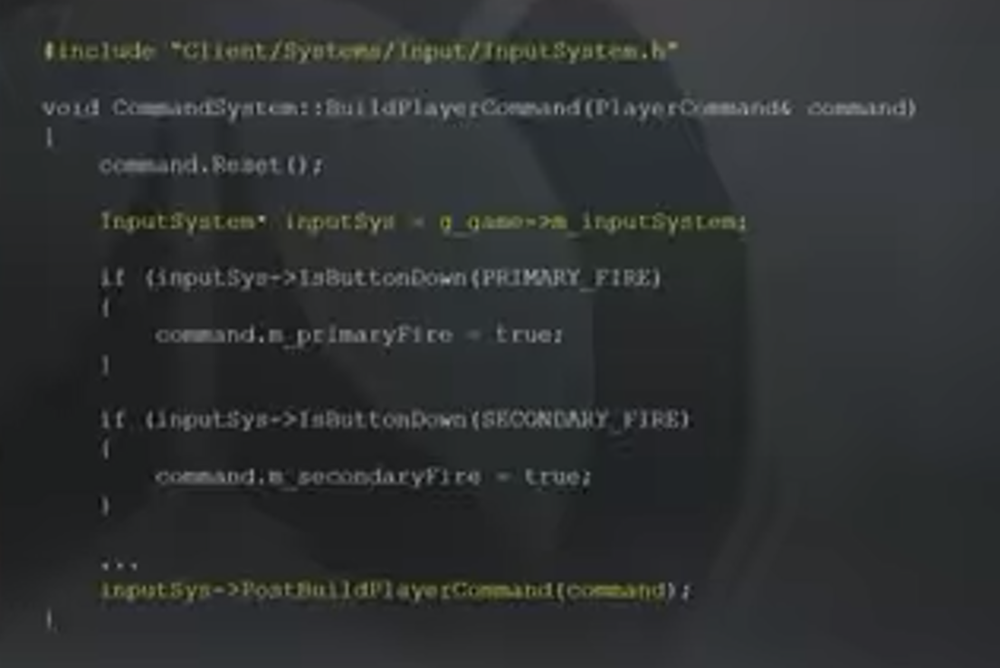

从实际工程的角度而言，这种方式会增加编译时间（即引用了其他System的头文件），并让System之间产生了耦合，System之间互相暴露了内部行为的实现，如果有新的需求来，选择在System1还是System2添加代码（假设两个耦合）变得难以抉择。

当然，代码还是能写下去的，直到新的问题出现。

### Killcam（死亡回放）

玩过OW的都很清楚这是什么，即玩家玩的角色死亡（比如安娜被铁拳曹飞），客户端会提供对方视角的一部分回放，从而让你知道你是怎么被曹飞的。

（被不知道哪来的铁拳曹飞真是恐怖片吧）

但让我们从工程角度来考虑。为了实现回放功能，游戏内必然需要有两个并行的环境（environment），一个为实时游戏，一个专门用于Killcam。实现方式也很自然：**加一个全新的ECS World**。于是现在我们有了两个World：一个liveGame，一个replayGame。服务器下发8~12秒游戏数据，客户切换至replayAdmin World，并将数据当作从正常网络来的来进行渲染。这样，所有的System、Component都不知道数据来自replay过程（原文为be predicted，即其他演讲所述的同步），以为数据来自于正常游戏进程。

引入第二个World导致游戏代码中，所有访问全局System的代码都会出错（因为两个World具有两个System，），如上图黄色第二行不能通过`g_game-m_inputSystem`访问，只能通过共享的`EntityAdmin`访问。

----

Killcam引入后，奇怪的通过System访问State方式、编译周期太长，内部系统的耦合终于让暴雪开始反思哪里出了问题，结论便是：**开发单独一个实例的Component是对的**。相信知道设计模式的读者反应过来了：**单例（Singleton）Component**。

团队将原本System中保存的State全部转变为单例Component（大约40%的Component是单例的），这些匿名的Entity，可以通过`EntityAdmin`直接访问。在后续的开发中，团队发现只被单个System访问的State是很少见的，通过单例Component存储这些状态，可以解决不同System之间原先因为访问State导致的耦合。如例子中的Input State，其他System无需再去找`InputSystem`，而是直接从所属的Admin直接找到对应的Input Component访问。

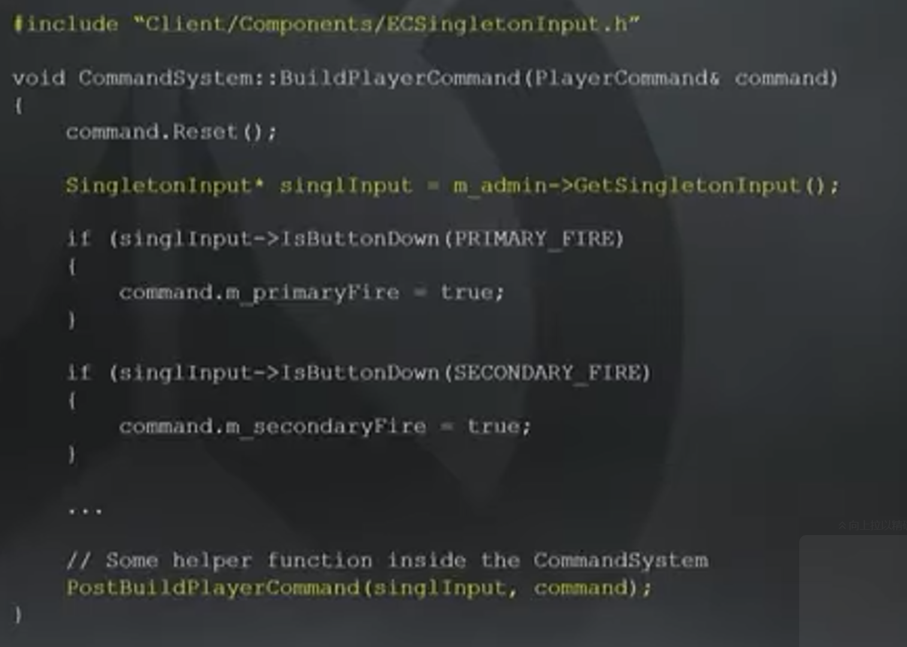

当然，这种依赖admin的utility函数访问单例Component的方式还是有一些耦合，这件事后面再提。

在调整后的架构中，`InputSystem`仅完成读取操作系统的输入，填充单例Input Component的过程。单例中可以保存按键绑定等信息，这样`InputSystem`便和其他System如`CommandSystem`解耦。新增加的需求，如`PostBuildPlayerCommand`函数便可以很清晰地放在`CommandSystem`中，用于处理所有对玩家命令的修改。这些玩家命令将用于网络同步，模拟游戏进程。

这种修改增加了代码的可读性，因为每一次Update对`Command`的修改只会在`CommandSystem`的`BuildPlayerCommand`函数出现，如果需要修改对玩家命令的编辑操作，只要在这里修改即可，而不用到其他System文件如`InputSystem`中修改。

### Sharing Behavior

有的时候，同个Subject的两个observer会对同一个Behavior感兴趣，在代码中呈现为同一个Behavior被多个System所用。

比如，许多代码都会关注敌对关系（Hostility），这是由三个可选的Component决定的：`Filter bits`（保存Entity的队伍编号），`Pet master`（保存拥有的所有pet的`Unique key`）和`Pet`（如托比昂的炮台）。在游戏中，若两个Entity都没有`Filter bits`，那自然不是敌对的（比如车和开关门）；若两个Entity都在同一个队伍，那也肯定不是敌对的。若两个Entity是敌对的，那么将会同时检查自己和对方的`Pet master` Component，确保每个`Pet`和对方都是敌对的。

敌对关系的具体实现为`CombatUtilityHostile`函数，其接受两个Entity，返回True/False表示它们是否敌对。可以想到很多System都会用这个函数，但这个函数仅用了三个Component，还都是只读的方式访问，因此没有产生副作用。

对于这类共享的Utility函数，若这些函数很常用，就应该让函数依赖较少的Component，且不应该产生或者很少产生副作用。倘若Utility函数真的需要依赖很多Component，那就应该限制这些函数的调用点的数量。

----

上述用共享的Utility函数替换System间的系统调用的方式，看上去消除了System之间的耦合，但实际上只是把耦合移动到了共享的Utility函数中。如果我们在好几处都需要调用Utility函数，那么可能会造成相当严重的副作用（side-effort）。

暴雪希望：**如果只有一个调用点，那么Behavior的复杂性就会降低**，这样任何副作用都会被限制在调用点处。

那么如何减少这类耦合呢？

### Deferment（推迟）

好的Singleton Component可以通过推迟（Deferment）来解决System间的耦合：推迟了存储Behavior所需的State。将其延后至tick中更好的地方执行。

比如，代码中许多调用点都需要生成碰撞特效（Impact effects）。这包括即时弹道子弹（比如76和猎空的子弹）、带飞行时间的子弹（如法鸡的炮弹）、激光（如毛妹粒子光束）和喷漆。创建碰撞特效的副作用是很大的，因为这需要在屏幕上生成一个新的Entity，这可能会影响很多东西，比如生命周期（lifetime）、线程、场景管理（scene management）等。碰撞特效的生命周期需要在场景渲染前开始，因此它们不需要再游戏模拟的中途中呈现。

可以想到的是，碰撞特效所需的代码量是非常大的，它需要基于图形学的Transform（位移、旋转和缩放），碰撞类型、材质结构数据做碰撞计算，还需要调用LOD（即Levels of Detail，简化可见模型的几何细节来降低游戏的负载）、场景管理等等。这些代码让弹孔、焦痕等特效不会奇怪的叠在一起，比如猎空的子弹会在墙上留下一系列蓝点，法鸡开炮后的特效将会覆盖掉这些蓝点，而不是出现Z-Fighting（z轴冲突）导致的奇怪闪烁。

从代码的角度而言，把碰撞特效相关的代码在一处搞定是很正常的。但由于代码过于复杂，且碰撞特效的调用点极多，修改碰撞特效意味着每个调用点都要重新测试。另外，守望先锋是会不断推出新英雄的，新英雄的出现会继续增加调用点。程序员在编写代码的时候，就需要增加心智负担去记住碰撞代码的副作用，从而增加了代码复杂度。

于是便有了`Singleton Contact Component`。其包含了尚未渲染的碰撞记录数组。现在若想创建新的碰撞特效，仅需要在Component中添加记录，在tick中的较后阶段（scene update），将统一生成特效。这样，即使碰撞特效具有副作用，也仅有一处调用点。

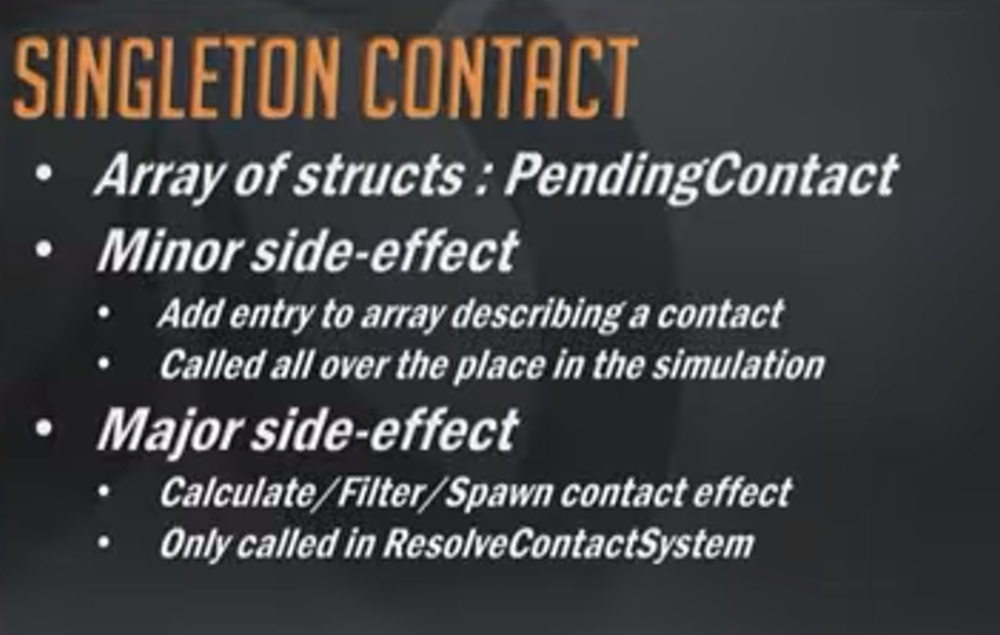

除了降低副作用外，“推迟”还有其他的优点。比如现在有了本地的数据和指令的记录，可以对其进行性能的perf。比如现在有12个Dva在射墙，Dva的散弹枪会造成总共数百个碰撞特效。游戏可以先渲染你的Dva的特效，再在稍后阶段分摊来渲染其他Dva的特效，从而平滑性能毛刺，另外还可以实现其他的复杂事情，这里不一一列举。

----

Singleton、Utility函数，以及推迟，这些仅是暴雪在三年的ECS实践中确立的一部分编程范式。遵循这些准则需要让开发者需要用不太普通的方式（奇淫技巧）去解决普通游戏中看上去比较简单的问题，但这让守望先锋的代码变得可持续开发、解耦合和简洁，

## Netcode（网络同步）

守望先锋是一款即时PVP的FPS游戏。因此，在游戏中必须对玩家的操作做预测（predict），因为如果玩家的每个操作都需要等待服务器回复的话，就不可能做到快速响应（responsive）。

那么有哪些操作需要快速响应？玩家的移动，玩家的技能（武器也算技能），以及命中判定（hit registration）。玩家按下按钮就应该立刻能看到响应，即使网络延迟很高也应该如此。玩家肯定不能保证游戏的低延迟和低丢包，那么守望先锋这种带预测的客户端就必然会带有严重的副作用：预测错误（misprediction），即玩家没能成功执行“你认为已经做出的”操作。

当然，服务器最后会帮你纠正你的预测错误，但我们希望这种事情发生的越少越好。暴雪通过确定性（Determinism）试图减少预测错误。需要注意的是，这部分采用的技术和算法实际上很成熟了，守望先锋之前已有许多优秀的FPS游戏。因此，这里主要介绍ECS架构如何降低这部分的复杂性。

### Determinism（确定性）

确定性模拟技术依赖于同步时钟（Synchronized Clock）、固定的更新周期和量化。服务器和客户端都需要运行时钟和量化值。时间被量化为Command Frame，每个命令帧为固定的16ms（即一秒62.5帧），比赛时为7ms（≈一秒142.86帧）。因此，游戏模拟过程的频率是固定的，游戏采用一个循环累加器来处理帧号的增长。

在ECS框架中，任何需要进行predict，或者基于玩家的输入来模拟的System，都不会使用Update，而是UpdateFixed，其在每个固定的命令帧（Single fixed command frame）被调用。

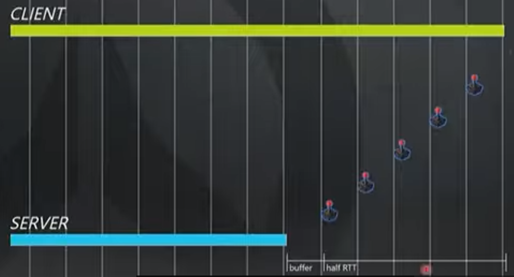

现在让我们假定玩家环境不丢包低延时，那么Client的Clock总会超前于Server，在这里大约为一半的RTT（即ping+逻辑处理时间）加上一个缓存frame的时长。图中的RTT时长为160ms，一个command frame占用16ms，即Client Clock超前96ms。客户端不断接受玩家输入，因此最贴近现在的时刻。如果我们需要等待服务器回包才能响应，那么就太慢了。因此我们希望缓冲的frame尽可能少。

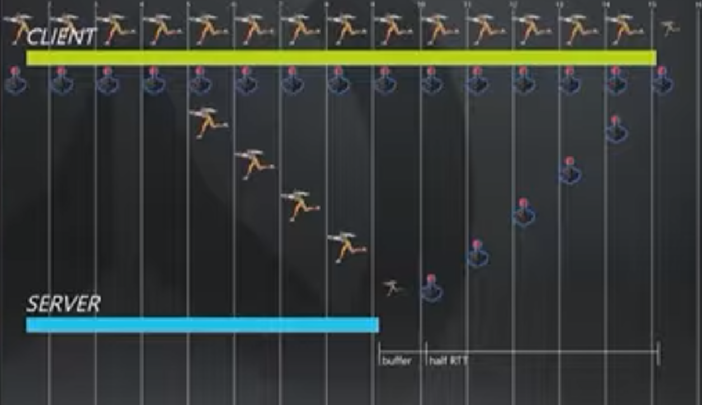

在这里，客户端的预测System将读取当前输入，然后模拟猎空的移动过程。经过完整的RTT+缓冲，服务器会将权威的结果回复给客户端。因此，这里的副作用就是需要经过RTT时间才能到达客户端。

> 原视频这里是gif，更好理解一些。

因此，客户端需要将移动（Movement）存储在缓冲区（ring buffer）中，这样才能将movement和服务器结果比较。如果不一样，那么发生了预测错误，需要进行修复（reconcile）。如果我们简单的将客户端玩家的位置修改为服务器结果，这自然是错误的，因为该位置来自于几百毫秒之前。客户端需要缓存Input信息，这样一旦从服务器回包发现预测失败，可以将玩家的全部输入都重复一遍，直至追上当前时刻。

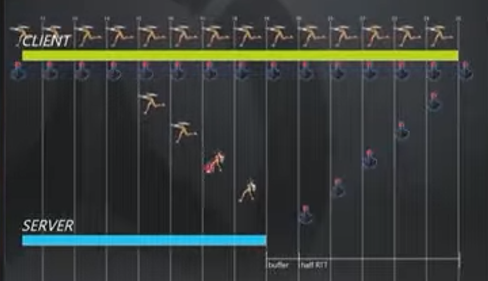

当你被OW1麦克雷的闪光弹晕到的时候，这一时刻服务器认为你被晕了，但客户端的信息还在传输，因此玩家视角中猎空还在移动。修复方式其实和上面是一样的，同样回到最近的服务器认证的时刻，然后重复所有的Input，直到当前时刻。

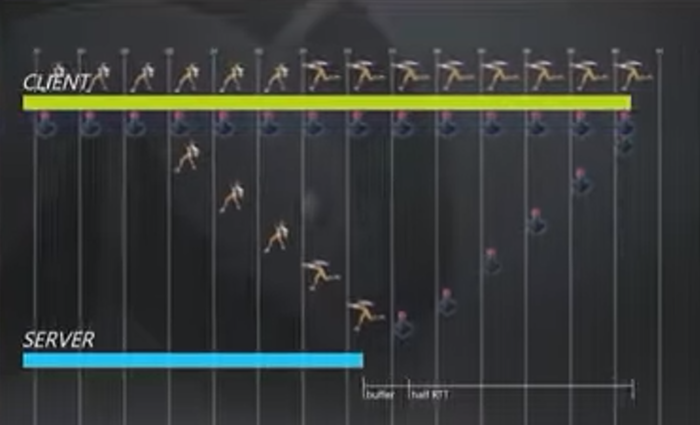

服务器和客户端都知道麦克雷的晕大约多少秒，因此可以同步的进行。

----

守望先锋是在UDP（with optional custom reliability layer）上进行的，因此客户端并不能保证不丢包。因此，服务器试图保持一个保存未模拟输入的缓冲区，并希望其尽可能的小（从而让游戏尽可能快速响应）。一旦该缓冲区为空，服务器只能能根据你的最后一次输入来猜测。当真正的用户输入到达时，其会试图确保不会弄丢玩家的任何操作，但仍然存在预测错误。

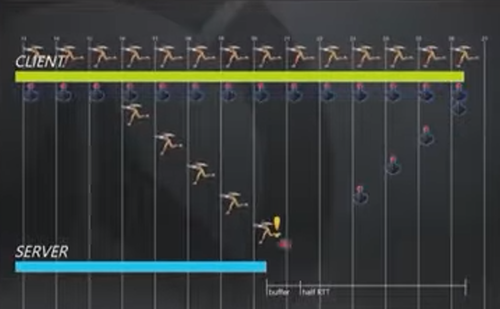

上图中，服务器意识到客户端的包发生丢失，那么就会用玩家最后一次操作进行预测（这当然是一个启发式的做法，但服务器还能做啥呢？），然后发包给客户端告知丢包。

接下来发生的事看上去就比较奇怪：客户端会进行时间膨胀（dilate time），将会比约定的帧率更快的进行模拟。比如原先约定一帧16ms，现在客户端会假装为一帧15.2ms。这样会导致输入流越来越快，服务器端缓冲区也会越来越大，从而尽可能克服丢包问题。这种技术在经常抖动的Internet环境中运行良好。

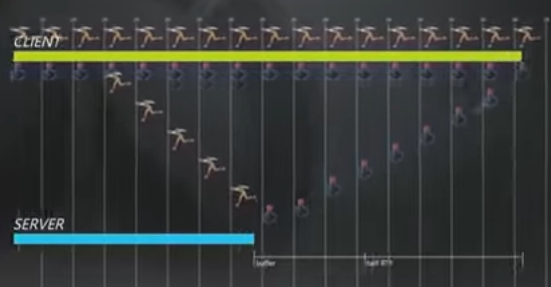

上图中，客户端的发包变得频繁（即dilate time），缓冲区也越来越大。这本质是通过增加发包来尽可能减小丢包的影响。如果服务器发现客户端的网络重新变得正常，那么就会告知客户端，客户端会更慢的发包，同时服务器也会减小缓冲区大小。

如果丢包持续发生，那我们会希望不要超过该方法的承受极限，并通过输入冗余来使预测错误最小化。解决方法便是滑动窗口，客户端将维持一个输入的滑动窗口，存储从最后一次被服务器确认的时刻到现在的全部状态，发包时将把该窗口打包发送。由于玩家的操作不大可能像帧率一样一秒60次，因此压缩后数据量并不大。这样，即使偶发的发生丢包，下一次数据包到达时依然有全部的输入操作，从而填补服务器上的缓冲区空洞（可以自然的想到，多余的操作和之前的增加发包机制是很契合的）。

----

英雄的所有能力都是通过暴雪自有的指令式脚本语言StateScript开发的，其也能契合客户端和服务端之间的验证过程，即根据服务器快照回滚，然后再前滚。这和之前的猎空移动例子是很像的，这里提了一嘴只是为了说明英雄的能力、武器等等实质和移动是一样的，客户端都需要根据服务器的回复判断是否需要倒退再重放，或者继续游戏过程。

### Hit Registration

ECS处理这部分是比较容易的。回顾之前所提到的敌对关系（Hostility），Subject如果拥有Behavior所需的Component tuple，那么Behavior就会在其上执行。若玩家的角色（Subject）是敌对的，且有一个`ModifyHealthQueue Component`，那么玩家便可以被其他玩家击中，执行Hit Registration。

> `ModifyHealthQueue Component`记录了玩家的全部伤害和治疗。可以想到的是它和之前的`Singleton Contact`一样，具有多个调用点且具有副作用，因此和Contact一样推迟（Deferment）计算。

需要注意的是，伤害不会在客户端进行预测（因为外挂），但命中判定是需要在客户端处理的。所以当Subject有一个`MovementState Component`，且不是被本地玩家所操纵的对象，那么就会根据最后收到的两次`MovementState`通过`Movementstate System`的插值（Interpolate）运算来重新定位。`MovementState Component`中还需要维护一个环形缓冲区（就像之前的猎空例子一样）。

服务器在计算命中之前，会将玩家回滚到攻击者上报攻击时你所在的帧（通过缓冲的`MovementState Component`实现），该过程被称为`向后缓和（backwards reconcilation）`。这和`ModifyHealthQueue`时正交的，所以命中不代表一定受到伤害，比如集中门、平台和车，这仍然需要倒回（rewind）状态，但不会产生伤害。如果玩家是敌对的，且有`MovementState Component`，才会因为向后缓和收到命中判定，从而受伤。

被倒回（Rewind）是一组被Utility函数操纵的Behavior，而受伤是`MovementState`被延迟处理的另一个Behavior，这两种Behavior是不同的。

----

游戏中每个角色都有边界集合（Bounding volumes），其代表了角色实时快照的并集，比如半秒内该角色的全部`MovementState`的最大范围。当玩家射击其他角色，比如安娜时，子弹会首先和安娜的边界集合相交（即基于ping值，安娜可能在边界集合的任何一处）。如果玩家角色和安娜没有之间没有任何障碍物（如盾、车、墙），那么只需要倒回安娜状态即可。

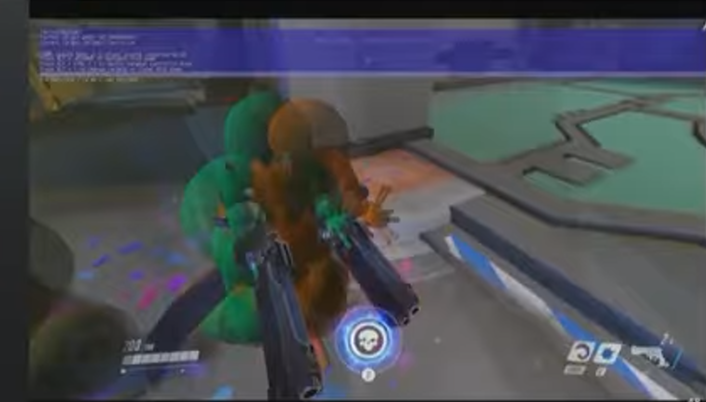

上图中绿色为死神（真是死神吗？）的客户端视角，黄色为服务器视角。绿色的小点为客户端认为其子弹击中的位置，但蓝紫色的小球才是服务器认为真正的集中位置。需要注意的是，这个例子是完全人造的例子。确定性是很可靠的，为了确认命中判定的问题，团队将丢包率设到60%，用了20分钟才成功复现。

因此，当ping足够高的时候，命中判定就不再那么有用。因此，暴雪将阈值设为220ms，一旦超出，客户端将会延后一些命中效果，且不再预测，而是等待服务器回包确认。这是为了让采用外插值（extrapolate）方案的客户端不去做一些以外的事情，比如玩家都回到掩体后了，结果还在因为之前的射击而不断掉血。

> 接下来的部分比较适合结合视频观看，原视频约39：38处开始。
> 但视频也挺糊的。

当ping=0时，客户端将会对弹道碰撞进行预测，但击中点和血条没有预测，需要等待服务器回包。

当ping=300ms时，碰撞不会预测，此时射击的目标是通过外插值实现的，因此显然角色的显示位置（客户端处）和真实位置（服务端处）是不一样的。当死神左右来回晃动时，外插值基本没用，而暴雪也无能为力，这是玩家的网络问题。

当ping=1000ms时，延迟尤为明显（即其他角色在玩家面前“瞬移”）。当然，客户端的输入在别的玩家视角里仍然是确定的、可预测的，只是大部分的射击都没射中。所以视频里麦克雷如果想杀死神，最好的做法应该是开大，毕竟你的输入是确定的。

----

而当ping=150ms时，如果运动（Movement）预测失败，那么相应的也会错误的预测命中（Hit）。

视频中，美在黑百合开枪的一瞬间中在黑百合脚底下放了冰墙，抬高了百合的准星。黑百合的视角中，美发出了受击反馈，也飙了血，但美的血条没有显示，所以客户端的Hit Registration错误，服务端拒绝了这一事件。所以，关于这部分预测错误的解决方法，仍然是以服务端的版本为唯一准则。

----

ECS简化了网络同步（Netcode）问题。其所用到的System只需要关注具有`Connection Component`的Entity即可，即玩家自己。System也需要知道哪些Entity需要被倒回（rewind）到进攻者射击的那一帧，这是由`MovementState Component`决定的。`MovementState`可以在时间线上被取消（scrub）（大约意思是客户端被服务端纠正？）

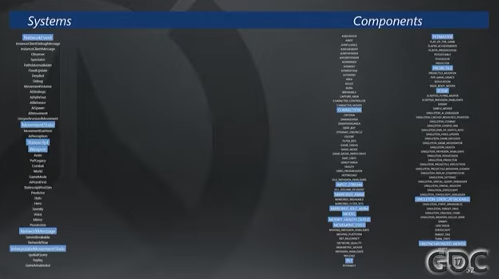

在ECS中，用于网络同步的System实际是很少的，但其已经算是守望先锋中最为复杂的问题之一了。`NetworkEvent System`和`NetworkMessage System`是网络同步的核心，进行接受输入和发送输出这些典型网络行为。而和游戏玩法（gameplay）相关的仅有3个System：`MovementState`，`Weapons`，`Statescript`，而相关的Component为图中右边所显示，绝大部分都是只读Componnent，除了一小部分，如`ModifyHealthQueue`。

## Lessons from ECS

### Tuple of Component

ECS的`Component Tuple`实际上能够提醒很多事情。比如，如果一个System的Tuple过长，那么System的复杂性可能就过高，这意味着我们需要对其进行拆分或简化。

另外，Tuple的限制让程序员能够提前知道System应该能访问哪些State，System的Component集合可能是不一样的，并且Component的读写性也是已知的，这意味着整个ECS架构可以很自然的多线程化。比如`Transform Component`被许多System调用，但只有少数System会修改其状态。因此，在定义只需要读其数据的System所需的Tuple时，可以将其标为只读，这样就可以并行处理。

### Entity Lifetime

这里的例子实际上是为了说明凡事都有例外。

当我们需要在游戏的一帧内创建新的Entity，这可能会带来一些问题。我们可能会想直接用推迟原则，将Entity的创建和销毁推迟；事实证明推迟销毁不会带来问题，但推迟创建却有问题。比如说我们在System A创建了一个Entity（但延迟到帧的最后才生成），但System B却需要这个Entity，那么就只能在下一帧才能用上。这就会增加程序员的心智负担，引入了新的复杂性。

因此，团队修改了实现方式，让Entity能在帧中直接创建。该改动直到游戏的1.2/1.3版本该改动才生效。

### Rules of Play

暴雪花了一年半的时间才确立了ECS的编程规则，现在让我们对上文所述的规则进行总结：

1. Component内没有函数
2. System内没有状态
3. 将共享的代码放在Utility函数
4. 复杂副作用（Complex side effect）应该通过放进Singletom Component（队列）的方式推迟执行
5. System之间不能相互调用。

在2017年的演讲中，暴雪承认仍然有大量代码不符合以上规范，而这些代码是复杂性和维护工作的主要来源。但暴雪似乎不太希望将这些复杂的遗留代码编写为新的System，他们希望让ECS内的代码尽可能地简洁。即ECS内仅保留主要的逻辑，而具体的实现交由这些复杂代码完成。

----

ECS的设计目的是将大量模块进行集成并解耦，很多System及依赖的Component是冰山状的，这些冰山型组件对其他System暴露的接口很少，但内部有大量的状态、代理（proxy）和数据结构是ECS层无法访问的。

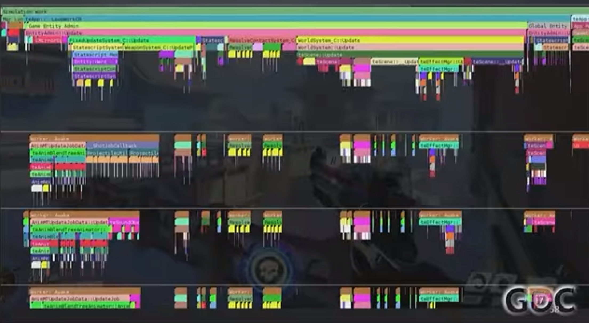

> 高糊，有个大概印象就行

在线程模型中，这些冰山相当明显。大部分System将会在游戏的主线程中完成。当然，也有许多的多线程（如fork/join），比如有角色发射了大量抛射物，Script System将会创建多个工作线程来生成抛射物，其他System可能想创建碰撞特效，同样需要多个工作线程。这些工作线程对上层ECS是不可见的。

视频中以阿努比斯神庙出生点的禅雅塔为例，说明`PathValidationSystem`的作用。该System将会验证当前时刻角色对其他场景的可达性，这一System也用于许多英雄的技能上（类比的话就像OW2雾子的灵狐，如果人能走过去那么灵狐也能走过去，因此些许的台阶是不影响灵狐翻过去的）

禅雅塔可以破坏出生点的脚手架，那么Path就会更新。类似的，当游戏正式开始时，出生点的门会降下，`PathValidationSystem Hook`只需要告诉组件“嘿，三角形变化了”，组件背后的冰山就会开始重建Path。

## Summary and Question

纵观全文，ECS实际上更像是胶水，将守望先锋各个部分通过ECS集成起来，却保留了最小的耦合性。程序员无需关注底层物理引擎、脚本引擎是怎么实现的，只需要通过ECS编写胶水代码就行了。

> Q: 是否可以让Component有副本？比如我在第n帧上维护一个Component，第n+1帧维护它的副本，这样我可以随意修改这个副本，而不修改原先第n帧的Component。

A: 这种Double buffer的方案对多线程的优化是很好的，也很容易在ECS中实现。实际上暴雪也开发过这种Double buffer的ECS 原型。这种优化在某些System是没问题的，但在有许多物体交互的System中，这会导致一帧的延迟，从而有损守望先锋的即时性（responsiveness）。

----

> Q: 为什么子弹（即前文提到的抛射物）的敌对关系是根据子弹的拥有者来判定的？比如法鸡发射了一枚火箭，在火箭飞行的时候法鸡改队了，那么这个火箭就可以击伤法鸡原先的队友。为什么不在子弹Entity内存敌对数据？

A：这当然是一种实现方式，但源氏改变了这一切。源氏的E是可以反弹别人子弹的，所以法鸡发射火箭，源氏反弹回去，在具体的代码实现中，如果我们采用你所说的方式，那么就需要在子弹Entity中修改一系列数据。但如果简单地修改子弹的拥有者，会让代码更加简单。

(注：实际上目前的实现中，玩家只要改了队伍或者改了英雄，原来英雄创建的实体就会消失，所以该问题实际上并不存在。)

----

> Q：你提到了你们花了三年去建立ECS的编程规范，那你们是如何重构之前开发的System的？

A： 我们将我们希望重构的代码封存，重写完再丢掉（笑声）。ECS的模块式开发让我们很容易能够重写整个System。我们会因为各种各样的原因去迭代重写System，而不是重构复用原来的代码。所以你看，我们实际上没做什么成熟软件工程应该做的事。（笑声）

----

> Q：你提到了创建Entity无法应用Deferment，能不能通过一些更好的方式，让entity在帧执行的过程中创建，从而避免无Deferment带来的问题？

A：这里的问题就是Deferment想要解决的问题之一。如果帧执行过程中创建Entity，一种实现方式是异步创建一小部分Entity，将这些Component接到之前我们提到的Component迭代器后面。这当然是可以的，但这将Component iterator分为了两部分，一部分是local array，存取速度极快；另一部分是正在异步生成的Component，这会带来性能的损失。

----

> Q：Server和Client都固定在60帧每秒，帧率能否改变呢？

A：帧率是不可变的。可以不按60帧渲染，但实际的游戏过程需要60帧。如果你的电脑只能支持30帧的模拟，Server是60帧，那么你在每一帧都会落后别人16ms，这是一个死亡螺旋，所以这是不可行的。当然，我们会尽力优化游戏的帧率，所以这种情况很难发生。

(注：感觉答非所问。Overwatch刚推出时的rate为24 ticks/s，之后修改为60 ticks/s，所以在实际的情况下，暴雪是能修改server/client的tick rate的。另外，据说Overwatch并没有切换到120rate的打算。)

----

> Q：你提到了hit prediction。你们也将其用在慢速的Entity，比如法鸡的火箭了吗？

A：在我们之前的FPS都没有对诸如火箭的慢速子弹进行prediction。但我们最终实现了他，这带来了一些奇怪的副作用，比如火箭的实际运行并不像玩家所看到的一样是条直线，可能会因为预测错误而消失。比如玩家操纵的法鸡发射火箭时被麦克雷闪光弹晕了，火箭就可能消失。但我们坚持认为对其进行hit prediction是正确的。

----

> Q：Spatial Quantization是怎么影响你们的物理引擎的？

A：这是一个好问题，在不同的平台上编译出来的Overwatch指令顺序有可能不同，浮点数的处理方式也可能不同，这可能会影响玩家的体验，不过这是明天主讲人所讲的内容（注：对，我还要翻译这个😭）。

> Q: 那你们是如何保证不同平台上的Determinism的？

A：我们并没有实现完全的、像RTS那样的Determinism。我们的Determinism能够做到没有错误的预测（即具有纠错能力）。如果在其他地方发生了不一致，比如由于门打开导致的NavMesh变动，不同Client会因为网络延迟的问题不一致，Server的权威副本可以将不一致的Client纠正为Server的状态。
