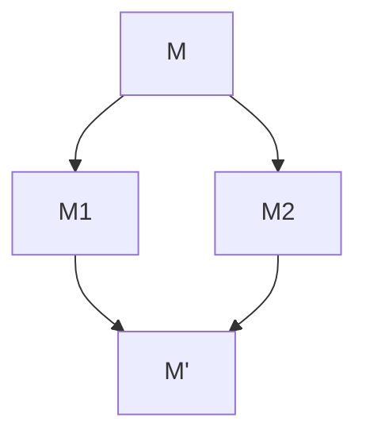

# Lambda Calculus

## Syntax

Basic:

$$
\begin{aligned}
    \lambda~~\mathrm{expression}/\mathrm{terms} & :\quad M, N::= x~|~ \lambda x.M~|~M~N \\
    \mathrm{Lambda~abstraction} & :\quad  \lambda x.M \\
    \mathrm{Lmabda~application} & :\quad  (M~N) \quad e. g. (\lambda x.M)3
\end{aligned}
$$

----

Body of $\lambda$ extends as far to the right as possible:

$$
\lambda x. M~N=\quad \lambda x.(M~N)
$$

Function applications are left-associative:

$$
M~N~P = (M~N)~P, \mathrm{not}~M~(N~P)
$$

### Higher-order Functions

Functions can be returned as return values:

$$
\lambda x.\lambda y.x-y
$$

Functions can be passed as arguments:

$$
(\lambda f.\lambda x.f~x)(\lambda x.x+1)2
$$

### Curried Functions

$\lambda$ abstraction is a function of 1 parameter, but computationally they are the same.

$$
\lambda(x, y).x-y\rightarrow_{Curry}\lambda x.\lambda y.x-y
$$

Uncurry vise versa.

## Free and Bound Variables($\alpha$-equivalence)

For $\lambda x.x+y$: $x$ is bound variable, $y$ is free variable.

Bound variable can be renamed: $\lambda z. z+y$, $(x+y)$ is the scope of binding $\lambda x$.

However, name of free variable does matter.

### Formal definitions of free variable

$$
\begin{aligned}
    fv(x): & \quad \mathrm{the~set~of~free~variables~in} \\
    fv(x): & \quad \{x\} \\
    fv(\lambda x.M): &  \quad fv(M) / \{x\} \\
    fv(M~N): &  \quad fv(M)\cup fv(N)
\end{aligned}
$$

bound variable definiation is meaningless.

### $\alpha$-equivalence

$$
\lambda x.M = \lambda y.M[y/x]
$$

## Semantics

### $\beta$-reduction

$$
(\lambda x.M) N \rightarrow M[N/x]
$$

Repeatedly apply reduction rule to any sub-term.

----

$$
\begin{aligned}
    x[N/x]: & \quad N \\
    y[N/x]: & \quad y \\
    (M~P)[N/x]: & \quad (M[N/x])(P[N/x]) \\
    (\lambda x.M)[N/x]: & \quad \lambda x.M \\
    (\lambda y.M)[N/x]: & \quad \lambda y.(M[N/x]) & \mathrm{if~y}\notin fv(N) \\
    (\lambda y.M)[N/x]: & \quad \lambda z.(M[z/y][N/x]) & \mathrm{if} y \in fv(N) \& \mathrm{z~fresh}
\end{aligned}
$$

### Reduction Rules

$$
\frac{}{(\lambda x.M)N\rightarrow M [N/x]}(\beta)
$$

$$
\frac{M\rightarrow M'}{M~N\rightarrow M'~N}
$$

$$
\frac{N\rightarrow N'}{M~N\rightarrow M~N'}
$$

$$
\frac{M\rightarrow M'}{\lambda x.M\rightarrow \lambda x.M'}
$$

### Normal form

$\beta$-redex: a term of the form $(\lambda x.M)N$(reducible expression).

$\beta$-normal form: a term containing no $\beta$-redex.

### Church-Rosser Property

Terms can be evaluated in any order, final result (if there is one) is uniquely determined.

Formalize:

$$
\begin{aligned}
    M\rightarrow^* M' & \quad \mathrm{zero-or-more~steps~of}: \\
    M\rightarrow^0 M' & \quad \mathrm{iff}\quad M = M' \\
    M\rightarrow^{k+1} M' &\quad \mathrm{iff}\quad\exists M''. M\rightarrow M'' \And M''\rightarrow^k M'\\
    M\rightarrow^* M' & \quad\mathrm{iff}\quad\exists k.M\rightarrow^k M' \\
\end{aligned}
$$

For all M, M1 and M2,
if $M\rightarrow^*M_1$ and $M\rightarrow^*M_2$, then there exists M’ such that 
$M_1\rightarrow^*M'$ and $M_2\rightarrow^*M'$

With $\alpha$-equivalence, every term has at most one normal form.

**Good news**: no matter which is picked, there is at most one normal form.

**Bad news**: some reduction strategies may fail to find a normal form(no terminating, e.g. $(\lambda x.x~x)(\lambda x.x~x)$).

Some reduction strategies may fail to find a normal form.

### Reduction strategies

**Normal-order reduction**: choose the left-most, outer-most redex first
(Normal-order reduction will find normal form if exists)

**Applicative-order reduction**: choose the left-most, inner-most redex first

Normal-order likes call-by-name: arguments are not evaluated, but directly substituted into function body.

### Evaluation strategies

Normal-order (or applicative-order) reduces under lambda, but Evaluation strategies: **Don’t reduce under lambda**.
