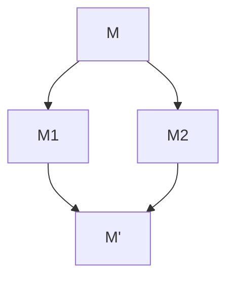
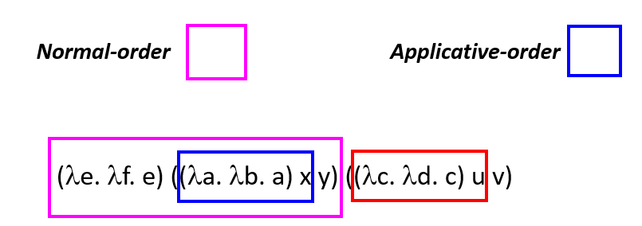
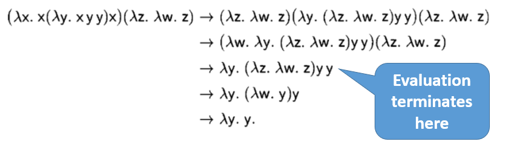
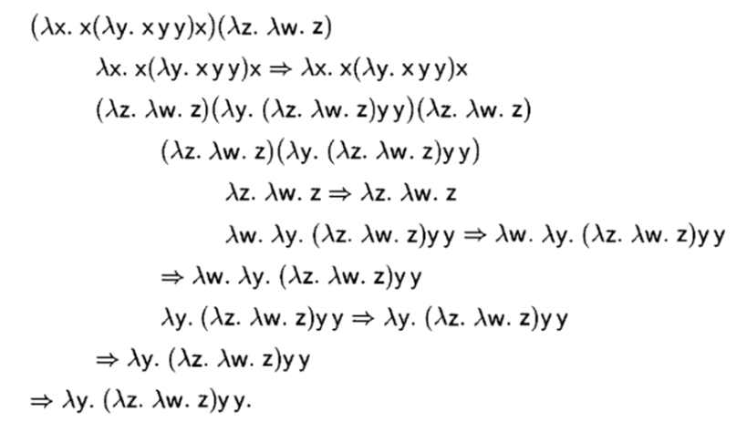

# Lambda Calculus

## Syntax

Basic(BNF范式):

$$
\begin{aligned}
    \lambda~~\mathrm{expression}/\mathrm{terms} & :\quad M, N::= x~|~ \lambda x.M~|~M~N \\
    \mathrm{Lambda~abstraction} & :\quad  \lambda x.M \\
    \mathrm{Lmabda~application} & :\quad  (M~N) \quad e. g. (\lambda x.M)3
\end{aligned}
$$

----

约定：

Body of $\lambda$ extends as far to the right as possible（左结合）:

$$
\lambda x. M~N\quad \mathrm{means}\quad \lambda x.(M~N)
$$

Function applications are left-associative（左相关）:

$$
M~N~P \quad\mathrm{means}\quad (M~N)~P, \mathrm{not}~M~(N~P)
$$

### Higher-order Functions

Functions can be returned as return values:

$$
\lambda x.\lambda y.x-y
$$

Functions can be passed as arguments:

$$
(\lambda f.\lambda x.f~x)(\lambda x.x+1)2
$$

### Curried Functions

$\lambda$ abstraction是单参数的函数（虽然计算上多参数和单参数是一样的），并且可以相互转换。

$$
\lambda(x, y).x-y\rightarrow_{Curry}\lambda x.\lambda y.x-y
$$

Uncurry：逆过程。

## Free and Bound Variables($\alpha$-equivalence)

For $\lambda x.x+y$: $x$ is bound variable, $y$ is free variable.

Bound variable can be renamed: $\lambda z. z+y$, $(x+y)$ is the scope of binding $\lambda x$，即Bound variable是一个placeholder，占位符，改名后实际上还是保持后文提及的$\alpha$-equivalence。

However, name of free variable does matter.

### Formal definitions of free variable

$$
\begin{aligned}
    fv(M): & \quad \mathrm{the~set~of~free~variables~in~M} \\
    fv(x): & \quad \{x\} \\
    fv(\lambda x.M): &  \quad fv(M) / \{x\} \\
    fv(M~N): &  \quad fv(M)\cup fv(N)
\end{aligned}
$$

bound variable definiation is meaningless.

### $\alpha$-equivalence

$$
\lambda x.M = \lambda y.M[y/x]
$$

其中 $M[y/x]$表示$y$替换$x$。

## Semantics

### $\beta$-reduction

$$
(\lambda x.M) N \rightarrow M[N/x]
$$

Repeatedly apply reduction rule to any sub-term.

----

substitution:

$$
\begin{aligned}
    x[N/x]: & \quad N \\
    y[N/x]: & \quad y \\
    (M~P)[N/x]: & \quad (M[N/x])(P[N/x]) \\
    (\lambda x.M)[N/x]: & \quad \lambda x.M \\
    (\lambda y.M)[N/x]: & \quad \lambda y.(M[N/x]) & \mathrm{if~y}\notin fv(N) \\
    (\lambda y.M)[N/x]: & \quad \lambda z.(M[z/y][N/x]) & \mathrm{if} y \in fv(N) \& \mathrm{z~fresh}
\end{aligned}
$$

### Reduction Rules

$$
\frac{}{(\lambda x.M)N\rightarrow M [N/x]}(\beta)
$$

$$
\frac{M\rightarrow M'}{M~N\rightarrow M'~N}
$$

$$
\frac{N\rightarrow N'}{M~N\rightarrow M~N'}
$$

$$
\frac{M\rightarrow M'}{\lambda x.M\rightarrow \lambda x.M'}
$$

箭头表示一种规约的relation，而非等号。

subsitution 用等号，reduction 用箭头。

### Normal form

$\beta$-redex: a term of the form $(\lambda x.M)N$(reducible expression).

$\beta$-normal form: a term containing no $\beta$-redex，即不能再$\beta$-reduction.

### Church-Rosser Property(合流性)

Terms can be evaluated in any order, final result (if there is one) is uniquely determined.

Formalize:

$$
\begin{aligned}
    M\rightarrow^* M' & \quad \mathrm{zero-or-more~steps~of}\rightarrow: \\
    M\rightarrow^0 M' & \quad \mathrm{iff}\quad M = M' \\
    M\rightarrow^{k+1} M' &\quad \mathrm{iff}\quad\exists M''. M\rightarrow M'' \And M''\rightarrow^k M'\\
    M\rightarrow^* M' & \quad\mathrm{iff}\quad\exists k.M\rightarrow^k M' \\
\end{aligned}
$$

For all M, M1 and M2,
if $M\rightarrow^*M_1$ and $M\rightarrow^*M_2$, then there exists M’ such that 
$M_1\rightarrow^*M'$ and $M_2\rightarrow^*M'$

推论：

由于$\alpha$-equivalence, every term has at most one normal form.

对一个term有多个$\beta$-redex：
**Good news**: 无论哪个备选，至多一个normal form

**Bad news**: 一些规约策略可能无法找到normal form(no terminating, e.g. $(\lambda x.x~x)(\lambda x.x~x)$).

### Reduction strategies

**Normal-order reduction**: choose the left-most, outer-most redex first
(Normal-order reduction will find normal form if exists)

**Applicative-order reduction**: choose the left-most, inner-most redex first

将reduction类比编程语言中的evaluation strategies：

1. Call-by-name (类似 normal-order)，实参不急着求值，而是代入到函数体里（ALGOL 60）
2. Call-by-need（缓存版call-by-name），即lazy evaluation（Haskell）
3. Call-by-value（类似applicative-order），即eager evaluation（C）。

----

subtle difference:

- under lambda，因此允许函数体内的优化，可能导致non-terminate（i.e. $λx. ((λy. y y) (λy. y y))$)
- Evaluation strategies：不会 reduces under lambda

### Evaluation

仅对closed terms（无free variable）求值，并不总是reduce至normal form，会停在包含canoical form（比如一个abstraction）上。

If normal-order reduction terminates, the reduction sequence must contain a first canonical form.

另外，evaluation按normal-order 进行。和reduction一样，evaluation也可能no terminate。

Normal-order evaluation rules:

$$
\frac{}{\lambda x.M \implies \lambda x.M}(Term)
$$

$$
\frac{M\implies \lambda x.M'\qquad M'[N/x]\implies P}{MN\implies P}(\beta)
$$

small-step版：

$$
\frac{}{(\lambda x.M)N \rightarrow M[N/x]} \quad (\beta)
$$

$$
\frac{M \rightarrow M^{\prime}}{M N \rightarrow M^{\prime} N}
$$

和reduction相比少了两个规则，因为evaluation不想提前化简，只需要到canoical即可。

example:

----

eager evaluation：

Postpone the substitution until the argument is a canonical form.

No need to reduce many copies of the argument separately.

$$
\frac{}{\lambda x.M\implies_E \lambda x.M}(Term)
$$

$$
\frac{M\implies_E \lambda x.M' \quad N\implies_E N' \quad M'[N'x]\implies_E P}{M N \implies_E P}(\beta)
$$

small-step版：

$$
\frac{}{(\lambda x.M)(\lambda y.N) \rightarrow M[(\lambda y.N)/x]} \quad (\beta)
$$

$$
\frac{M \rightarrow M^{\prime}}{M N \rightarrow M^{\prime} N}
$$

$$
\frac{N \rightarrow N^{\prime}}{(\lambda x.M) N \rightarrow (\lambda x.M) N^{\prime}}
$$

## Programming in $\lambda$-calculus

$$
\begin{aligned}
    \mathrm{True} = & \lambda x. \lambda y. x \\
    \mathrm{False} = & \lambda x. \lambda y. y \\
    \mathrm{not} = & \lambda b. b~\mathrm{False~True}\\
    \mathrm{and} = & \lambda b. \lambda b'. b~b'~\mathrm{False}\\
    \mathrm{or} = & \lambda b. \lambda b'. b~\mathrm{True}~b'\\
    \mathrm{if~b~then~M~else~N} = & b~M~N \\
    \mathrm{not'} = &\lambda b.\lambda x.\lambda y. b~y~x
\end{aligned}
$$

Church numerals:

$$
\begin{aligned}
0 = & \lambda f.\lambda x. x \\
1 = & \lambda f.\lambda x. f~x \\
n = & \lambda f.\lambda x. f^n~x \\
succ = & \lambda n.\lambda f.\lambda x. f(n~f~x) \\
succ' = & \lambda n.\lambda f.\lambda x. n~f(f~x) \\
iszero = & \lambda n.\lambda x.\lambda y. n (\lambda z.y) x \\
\end{aligned}
$$

Pairs/Tuple:

$$
\begin{aligned}
(M, N) = & \lambda f.f M N \\
\pi_0 = & \lambda p.p(\lambda x.\lambda y.x) \\
\pi_0 = & \lambda p.p(\lambda x.\lambda y.y) \\
(M_1, ..., M_n) = & \lambda f.f M_1~...~M_n \\
\pi_i = & \lambda p. p(\lambda x_1...\lambda x_n.~x_i) \\
\end{aligned}
$$

### Fix point

如何对类$fact(n) = if (n == 0)~then~1~else~n * fact(n-1)$的递归函数进行进行编码？

在数学上，我们对不动点的定义为$f(x) = x$，对函数而言，可以有0、有限到无限个不动点。

上面的函数我们可以转换为：$fact = (\lambda f.\lambda n. if (n == 0) then~1~else~n*f(n - 1))fact$。而对此，设：

$$
F = \lambda f.\lambda n. if (n == 0) then ~ 1~else~n*f(n - 1)
$$

那么有：$fact =_\beta F~fact$，$fact$是$F$的不动点。

Fixpoint combinator是更高层的function~h，其满足：

对所有的函数f，(h f)的都是f的不动点：$h~f =_\beta f~(h~f)$

对此，有：

Turing's fixpoint combinator $\Theta$: $A = \lambda x.\lambda y. y (x~x~y)，\Theta = A~A$

Curry's fixpoint combinator $Y$: $\lambda f.(\lambda x. f(x~x))(\lambda x. f(x~x))$
