# System F

本章是对STLC的进一步扩展。上图：

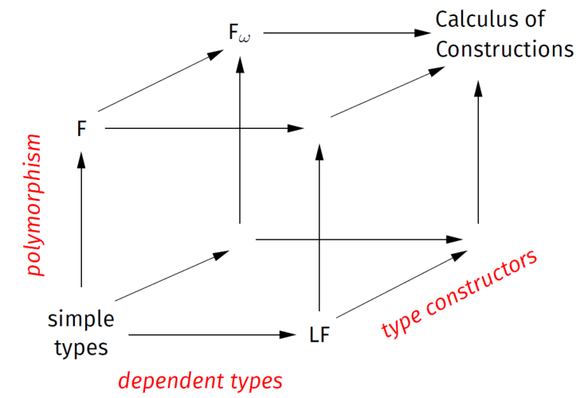

STLC还可以通过三个维度进一步扩展：多态性、构造性和依赖类型。本章将涉及多态(System $F$)和构造性(System $F_\omega$)。

## Polymorphism(System $F$)

我们在$\lambda$-Calculus里会遇到这样一种场景：很多函数的函数体是相同的，但参数的类型不同。System $F$便对参数进行“多态”，而对函数体本身保持不变。这和编程语言，如Java的多态是不一样的，这些语言可以通过不同的类型指定不同的行为。

### Syntax

$$
\begin{aligned}
    (Types)& :\quad \tau ::= \alpha~|~T~|~\tau\rightarrow\tau~|\forall\alpha.\tau\\
    (Terms)& :\quad M ::=x ~|~\lambda x:\tau.~M~|~M~M~|~|~\wedge\alpha.M~|~M\langle\tau\rangle \\
    (Values) &:\quad v ::= \lambda x:\tau.~M~|~\wedge\alpha. M
\end{aligned}
$$

$$
\begin{aligned}
    (Contexts)&: \quad \Gamma ::= \cdot ~|~\Gamma,~x:\tau \\
    (TypeVarContexts)&: \quad \Delta ::= \cdot~|~\Delta, ~\alpha
\end{aligned}
$$

### Reduction

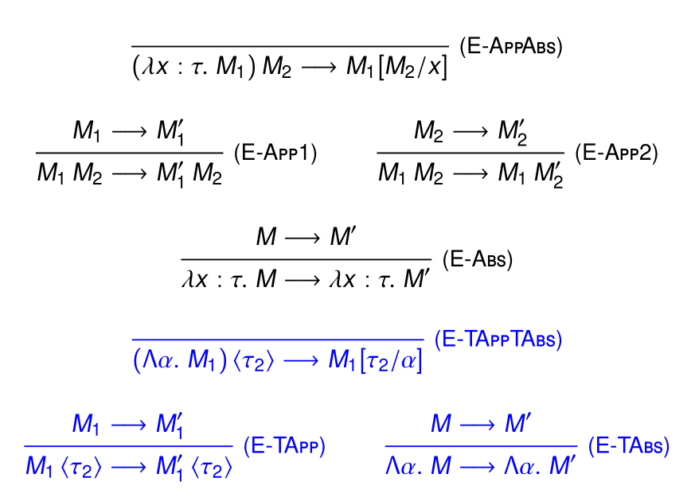

### Type Well-Formedness

$\Delta$对每一种Type的formulation：

$$
\frac{}{\Delta, \alpha\vdash\alpha}
$$

$$
\frac{}{\Delta\vdash T}
$$

$$
\frac{\Delta\vdash\tau_1\qquad\Delta\vdash\tau_2}{\Delta\vdash\tau_1\rightarrow\tau_2}
$$

$$
\frac{\Delta, \alpha\vdash\tau}{\Delta\vdash\forall\alpha.\tau}
$$

或者用Free variavle的方式定义：

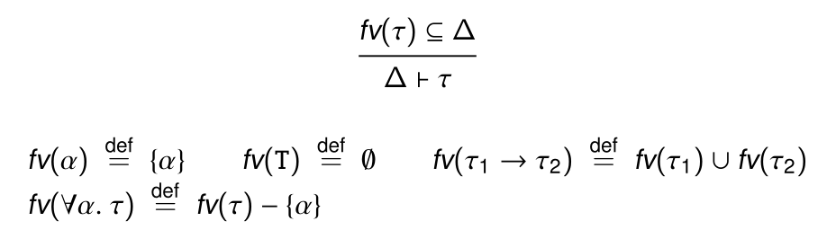

### Typing

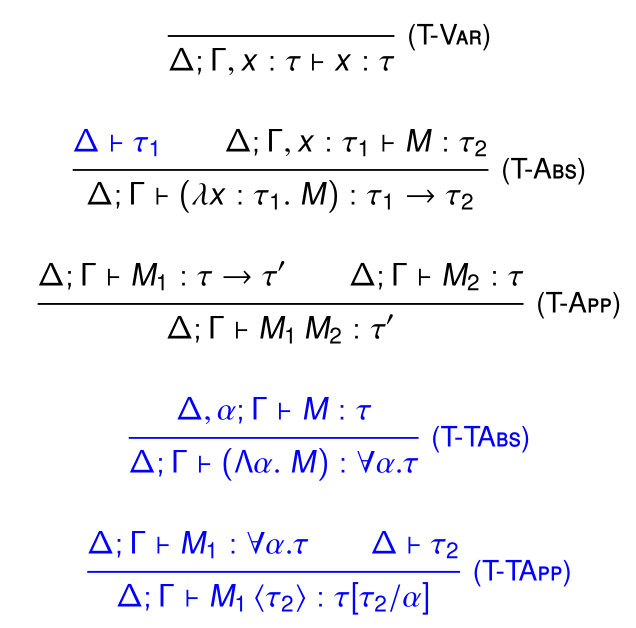

----

举个例子：

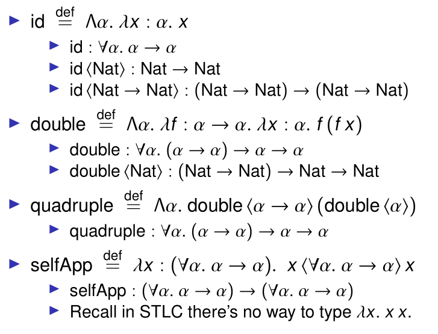

可以看到Rule的应用还是很简单的，除了相较STLC可以定义诸如(\lambda x. x x)等Term，因为其中的x可以通过多态来区分对待/

### Properties

之前的STLC的Preservation和Progress仍然保留，并且增加了Strong normalization：每一个well-typed System $F$ Term，无论通过何种reduction path，最终都会终止Reduction。

### Church Encodings

我们可以通过System $F$来Encode之前Untyped $\lambda$-calculus通过Church Encoding定义的values。例如，可以将布尔值定义为：

$$
\begin{aligned}
    True & = \wedge\alpha.\lambda x:\alpha.~\lambda y : \alpha. x \\
    False & = \wedge\alpha.\lambda x:\alpha.~\lambda y : \alpha. y \\
    not &= \lambda b : Bool.~\wedge\alpha.\lambda x :\alpha.\lambda y : \alpha.~b\langle\alpha\rangle~y~x
\end{aligned}
$$

其中，$Bool$的类型为$\forall\alpha\rightarrow\alpha\rightarrow\alpha$，$not$类型为$Bool\rightarrow Bool$。

----

相对应的，我们还可以定义Church numerals：

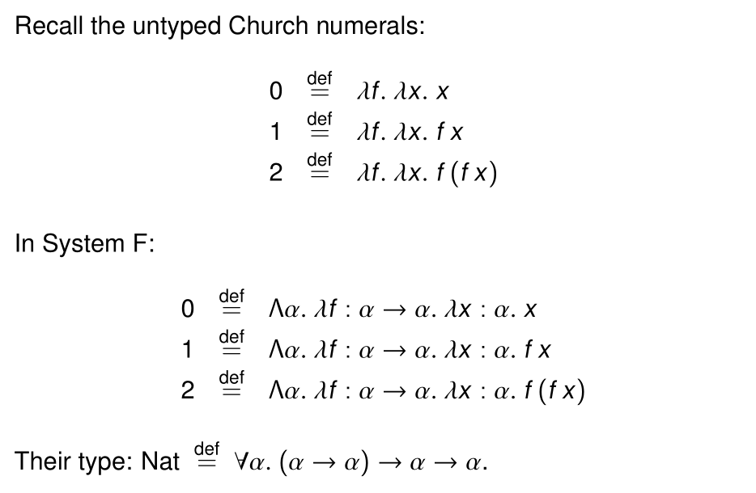

### Incompleteness?

在STLC里，我们会拒绝那些可能会出错的Term，如：

$$
(\lambda x.(x(\lambda y. y))(x 3))(\lambda z. z)
$$

在System $F$中，这是可以正常赋Type的：

$$
\lambda x :\forall \alpha. \alpha\rightarrow\alpha. (x\langle Nat\rightarrow Nat \rangle (\lambda y : Nat. y))(x\langle Nat \rangle 3)(\wedge \alpha.\lambda z : \alpha. z)
$$

当然，诸如$(\lambda x. x~x)(\lambda x. x~x)$的不可终止的Term仍然无法在System $F$定义。

### Parametricity

System $F$对参数进行多态，但在实际过程中，我们如果只知道多态化的参数，推导出来Term的类型，是很难知道这个Term具体行为的。

比如，很多函数的类型都可以是$\forall\alpha.\alpha\rightarrow\alpha$，他们的行为都可以划归成恒等函数$\wedge \alpha. \lambda x : \alpha. x$.

然而，如果类型为$\forall\alpha.\alpha\rightarrow\alpha\rightarrow\alpha$，只有两种类型即，前文提到的True和False。

因此，这部分实际上和自由度理论有关，这部分就是扩展内容了。

## Constructive(System $F_\omega$)

Type层面的抽象和应用能让我们写出毫无意义的Type Expresssion，比如Type层面的（Bool Nat）和Term层面的（True 6）一样是毫无意义的。

因此，本章在Type的上层再扩展Kind，从而对Type expression进一步进行归类。

$$
(Kinds): \quad\kappa ::= *~|~\kappa\rightarrow\kappa
$$

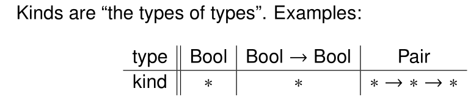

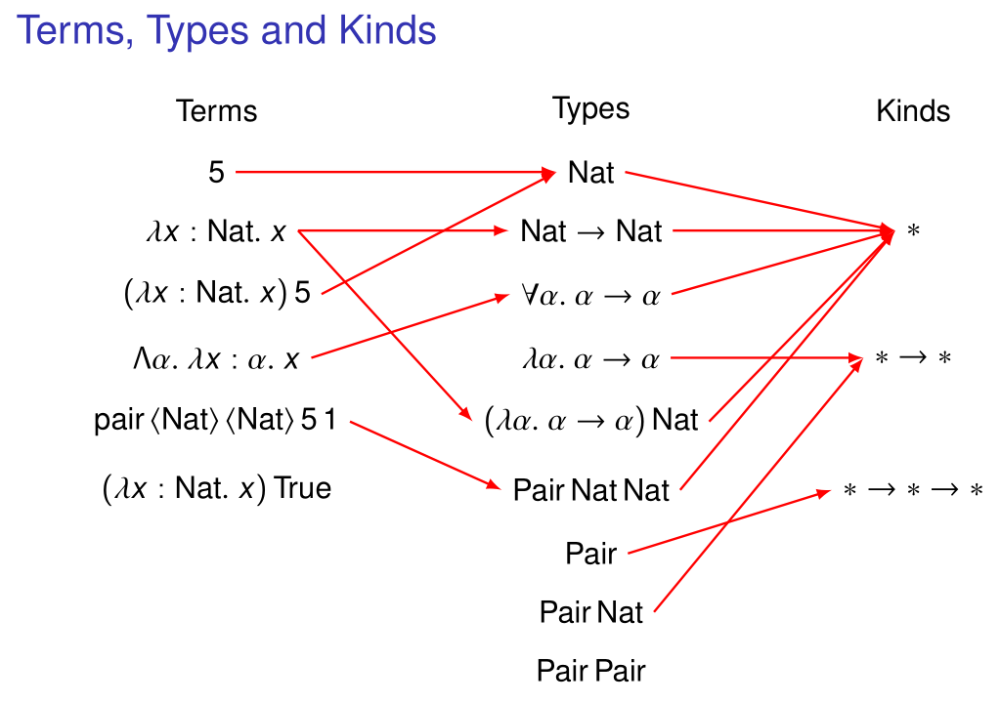

:::info 既然我们又加了一层Kind，还能给Kind再进行抽象，继续扩展吗？

当然可以，但三层已经足够我们对现有的静态类型语言进行抽象。实际上，现有的如Java的语言并没有提供过多的类型操作符。
:::

### Statics

System $F_\omega$对已有的Terms/Kinds/Types/Values进一步修改：

#### $\lambda_\omega$

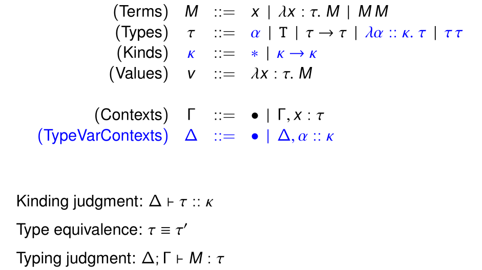

而对Kind的Kinding/Typing Rules等等，在这里就单纯截图了（因为确实不是重点，我也看不懂）

~~实际上就是我懒了😤~~

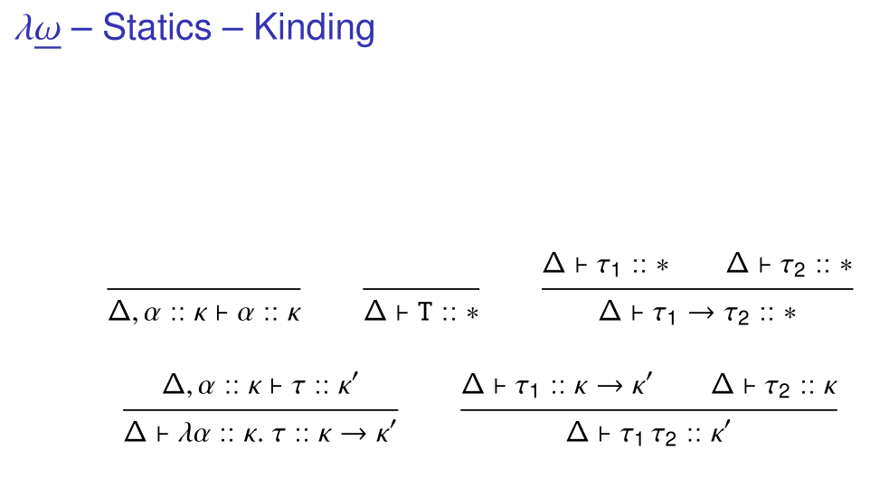

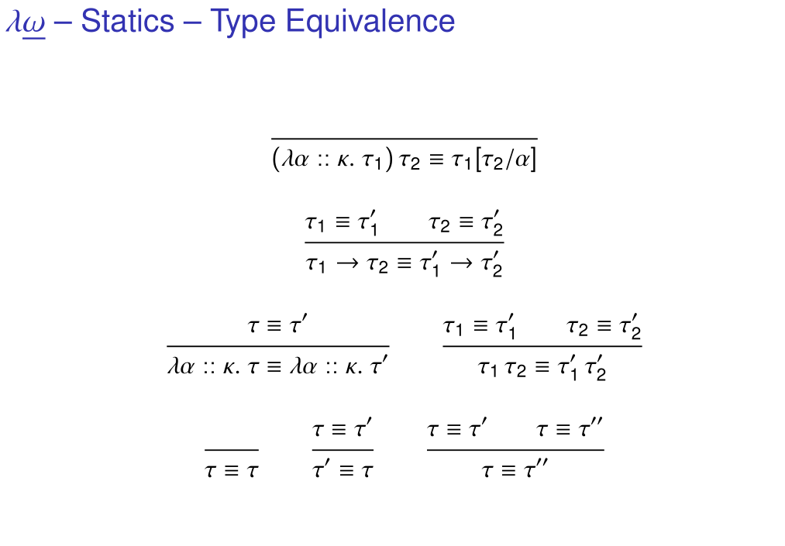

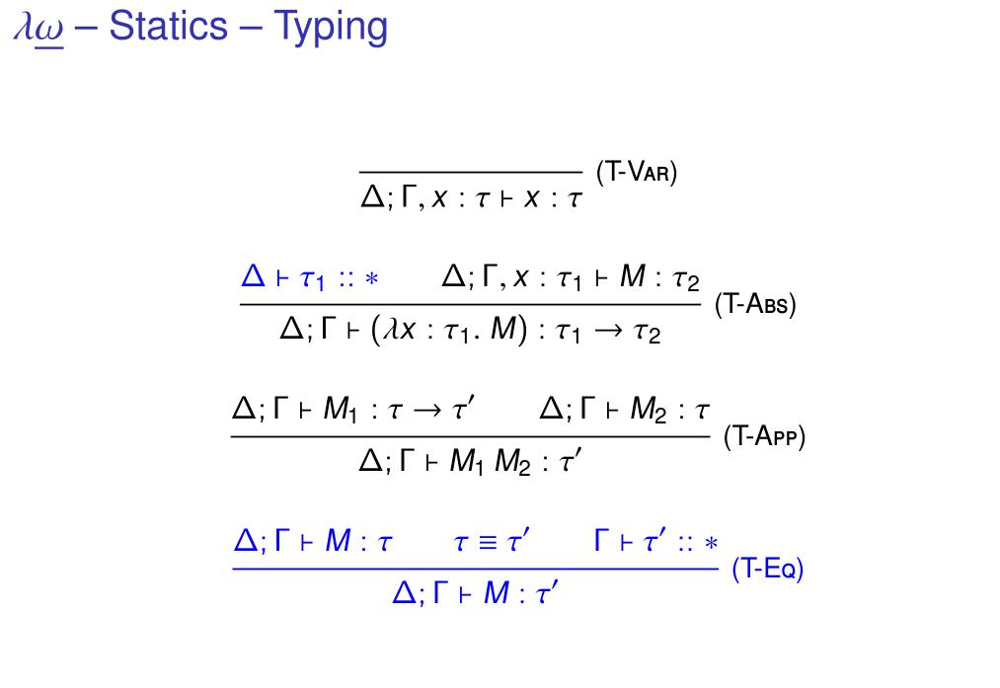

#### $F_\omega$

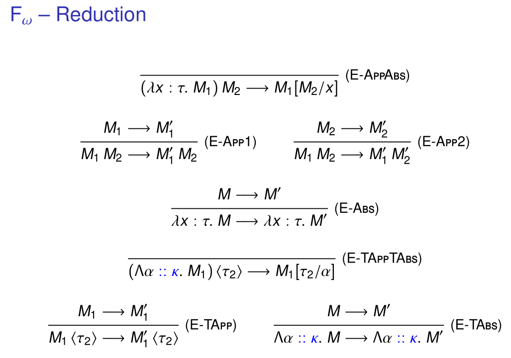

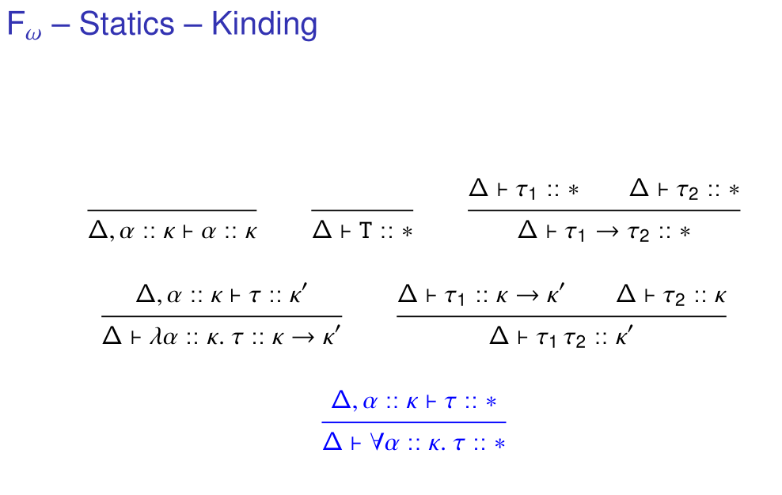

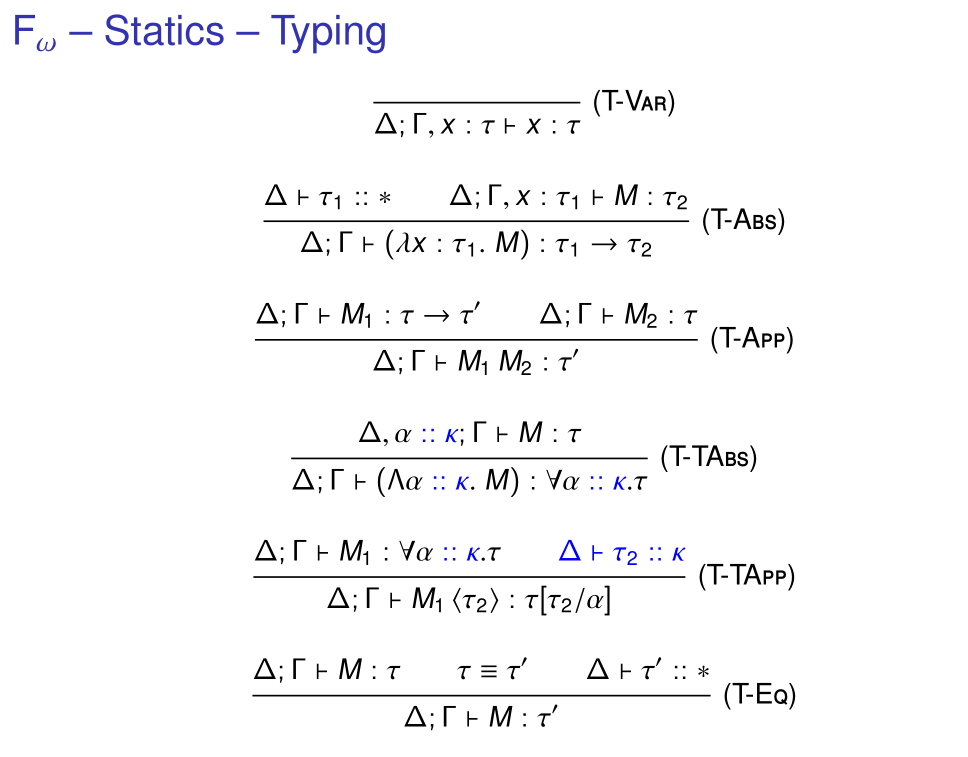

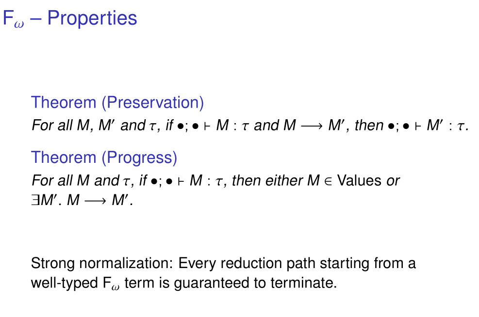
