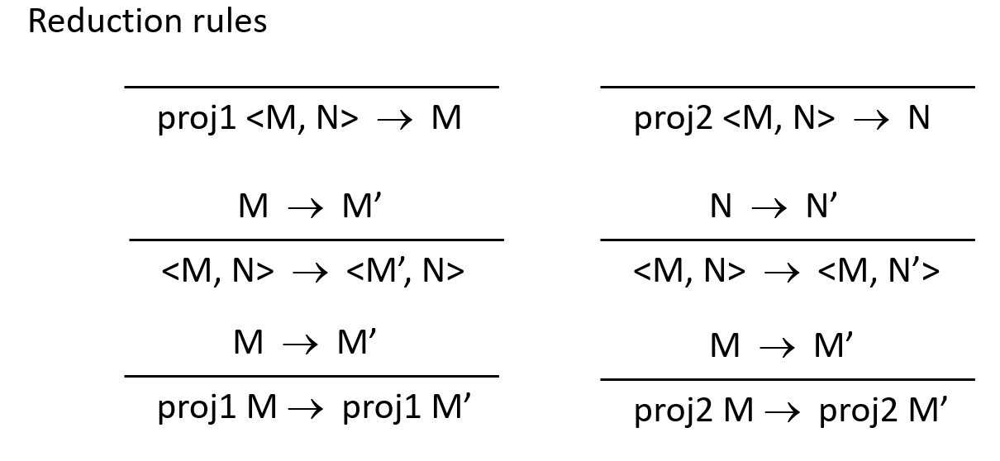
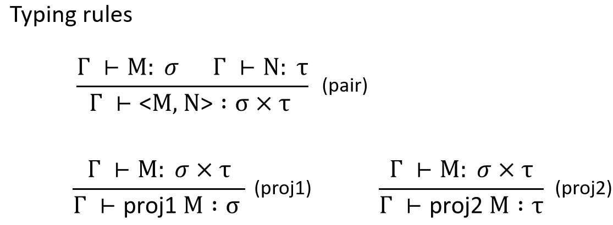
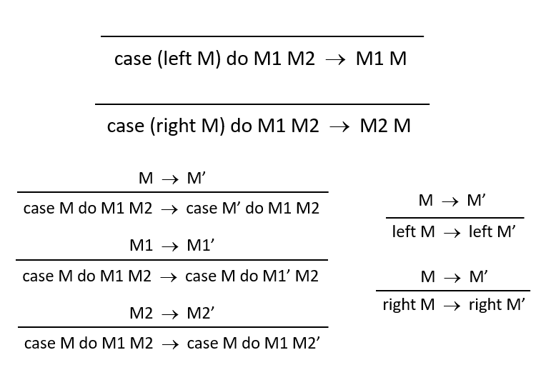
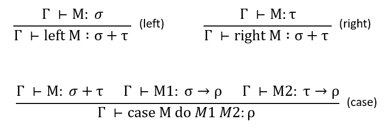
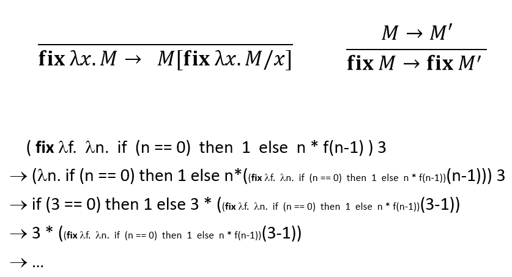
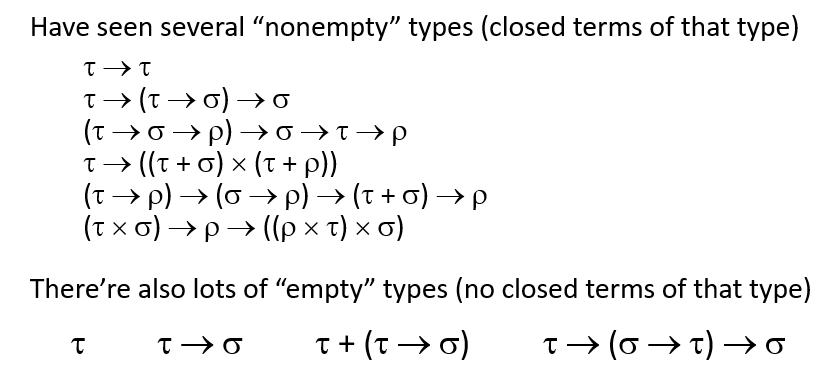
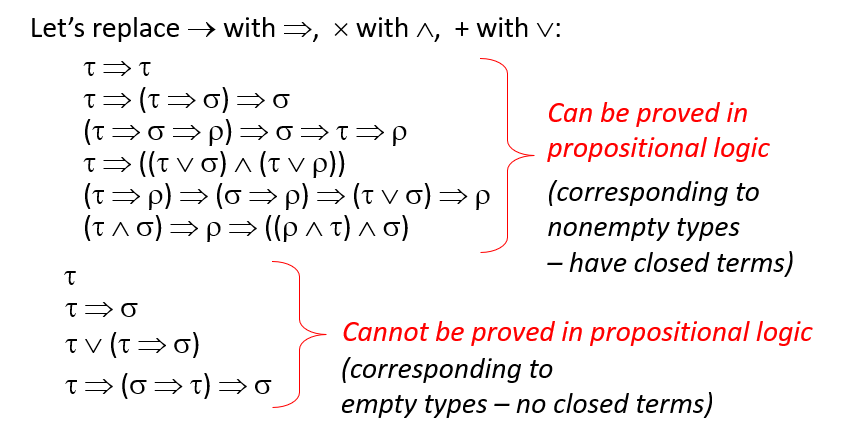
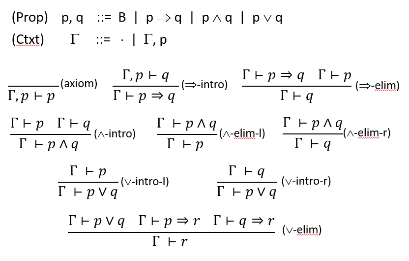
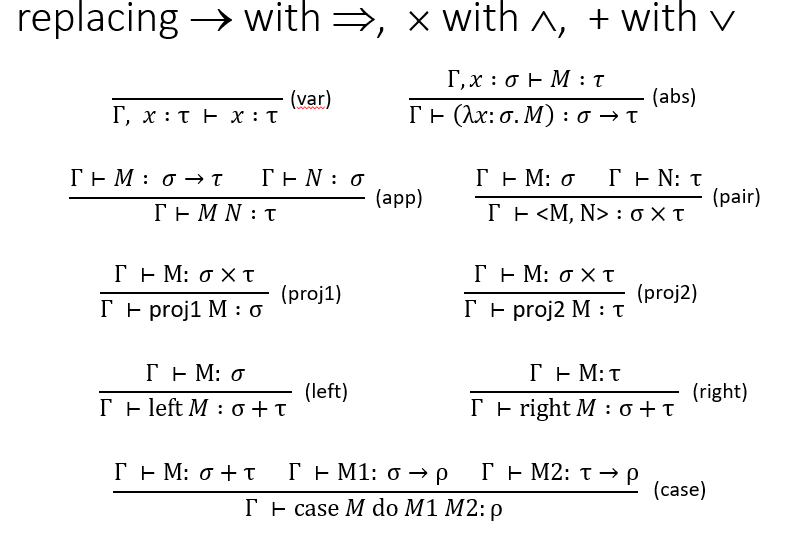

# Simply-Typed Lambda Calculus (STLC)

现在我们需要给lambda calculus加上类型，这样，诸如$(\lambda x. x~x)(\lambda x. x~x)$的term在Simply-Typed Lambda Calculus（STLC）中就是非法的。

## Why types?

1. Type checking catches “simple” mistakes early
2. (Type safety) Well-typed programs will not go wrong
3. Typed programs are easier to analyze and optimize

当然，Type也会带来缺点，即有些合法的term会被判定不符合type。

## Adding Types(Formal definition)

$$
\begin{aligned}
    (Types)& :\quad \tau, \sigma::= T~|~\mathrm{fun}\\
\end{aligned}
$$

其中$T$为base type，比如int，bool；$\mathrm{fun}$为function type。

----

Typing Judgment(给term赋types):

$$
\vdash M : \tau
$$

Typing Rules:

$$
\frac{}{\vdash (\lambda x . M) : \mathrm{fun}}
$$

$$
\frac{\vdash M : \mathrm{fun}\qquad \vdash N : T}{\vdash M N : T}
$$

## True Formal Definition

上面的两条规则还不能保证type safe，如$((\lambda f.f~1)3)$推导的type是int，但这明显是不符合正常语义的。

因此，我们需要对function的定义进行修改：加上argument type的检查。

因此，我们对[前节](#adding-typesformal-definition)的定义修改为：

$$
\begin{aligned}
    (Types)& :\quad \tau, \sigma::= T~|~\sigma\rightarrow\tau\\
    (Terms)& :\quad M,N ::=x ~|~\lambda x:\tau.~M~|~M~N
\end{aligned}
$$

其中Types满足右结合：$\tau\rightarrow\tau\rightarrow\tau = \tau\rightarrow(\tau\rightarrow\tau)$

相应的Reduction Rule也要修改为新的Term形式（即对lambda 的参数加上Type）：$\lambda x : \tau . M$

## Typing Judgement and Context

我们对function中含有的free variable进行定义：将free variable的type作为整体判断的context，如$type(f~1)$取决于f的type。

因此，Typing judgement实际上是从type of free variable出发，得到完整type的推导过程：

$$
\Gamma \vdash M : \tau
$$

因此，我们对Typing Context定义如下：

$$
\Gamma ::= \cdot~|~\Gamma, ~ x:\tau
$$

点代表空context。

通过$\Gamma$，便可以推导出well-typed term的type。

### Typing Rules

$$
\frac{}{\Gamma, x :\tau\vdash x : \tau}(\mathrm{var})
$$

$$
\frac{\Gamma \vdash M : \sigma \rightarrow\tau\qquad \Gamma \vdash N : \sigma}{\Gamma \vdash M~N : \tau}(\mathrm{app})
$$

$$
\frac{\Gamma, x:\sigma \vdash M : \tau}{\Gamma\vdash(\lambda x : \sigma.~M):\sigma\rightarrow\tau}(\mathrm{abs})
$$

### Soundness and Completeness

Soundness表示type system 不会接受出错的program（即type-safe），满足no false negatives。

Completeness表示一个program不会拒绝不可能出错的program，满足no false positives。

对图灵完备的语言来说，Type system是做不到同时满足两者的。因此，实践中我们选择满足soundness，并尽可能地减少false positives。

对Soundness（即Type-Safety），有以下定理：

:::info
For any $M, M'$ and $\tau$, if $\cdot \vdash M : \tau$ and $M\rightarrow^*M'$, then $\cdot\vdash M':\tau$, and either $M'\in\mathrm{Values}$ or $\exist M''.~M'\rightarrow M''$

其中：$(\mathrm{Values}) ::= λx : τ. M$
:::

即well-typed term的reduction要么发散，要么在对应的Value of the expected type上结束。

从中可以有两个推论：

:::info
**Perservation(subject reduction)**: well-typed terms reduce only to well-typed terms of the same type.
:::

:::info
**Progress**: a well-typed term is either a value or can be reduced.
:::

另外，well-typed term in STLC是一定会终止的，所以诸如$(\lambda x.x~x)(\lambda x.x~x)$的式子就无法得出type。

## Adding stuff

~~STLC的理论已经讲完了，接下来的部分都是扩展内容。~~

基础的STLC较为简单，但我们可以对其他方面不断扩展，比如：

1. 语法（即增加新的type/terms）
2. 操作语义（即增加reduction rules）
3. Type system（即增加typing rules）
4. soundness proof（即new proof cases）

### Product Type

$$
\begin{aligned}
    (Types)& :~\ldots~|~\sigma \times \tau\\
    (Terms)& :~\ldots~|~<M, N>~|~\mathrm{proj1} M ~|~\mathrm{proj2}M
\end{aligned}
$$

用C类比的话，即structure的字段存取。

增加的Reduction rules/typing rules比较多，我就贴图了。

同时，也要对Progress进行修改，即$\mathrm{Values}$增加$<v_1, v_2>$。

### Sum Type

$$
\begin{aligned}
    (Types)& :~\ldots~|~\sigma + \tau\\
    (Terms)& :~\ldots~|~\mathrm{left}~M~|~\mathrm{right}~M~|~\mathrm{case} ~M~\mathrm{do}~M_1~M_2
\end{aligned}
$$

类比C，就是union。

reduction rules:

typing rules:

相应的，Progress中的Value也要增加$\mathrm{left}~v~\&~\mathrm{right}~v$.

----

对比Product和Sum，可以看到Product($\sigma\times\tau$)是可以接受$\sigma$/$\tau$/both的，但Sum($\sigma+\tau$)只能选择其中一个。

### Recursion

在之前的untyped $\lambda$-calculus中，每个term都有自己的不动点fixpoint，由此我们也定义了一系列的fixpoint combinator。但在STLC中，由于well-typed terms最终都要终止，我们无法给这些fixpoint combinator找到对应的类型。

因此，我们修改定义：

$$
\begin{aligned}
    (Types)& :~\ldots~|~\mathrm{fix}~M\\
    (Terms)& :~\ldots~\qquad(no~new~types)
\end{aligned}
$$

Reduction rules：

typing rules:

$$
\frac{\Gamma\vdash M:\tau\rightarrow\tau}{\Gamma\vdash\mathrm{fix}~M:\tau}(fix)
$$

怎么理解呢？

1. 数学意义上：如果M是$\tau\rightarrow\tau$的函数，那么M的不动点$\mathrm{fix}~M$则需要作为M的参数，因此类型为$\tau$.
2. 操作语义（reduction）上：第一个规则的替换意味着$x$和$\mathrm{fix}~\lambda x.M'$需要有相同类型。

## Curry-Howard Isomorphism

现在我们定义了STLC这种带type的语言，可以去定义编程语言以及类型系统。而逻辑学也可以利用这一工具，去定义命题和命题逻辑，即**Proposition are Types, Proofs are Programs**。

$$
\begin{aligned}
    (Types) \tau, \sigma & ::= T~|~\sigma\rightarrow\tau~|~\sigma\times\tau~|~\sigma+\tau\\
    (Prop)p, q & ::=B~|~p\Rightarrow q~|~p\wedge q~|~p\vee q
\end{aligned}
$$

以上一一对应。可以看到STLC没有取反操作，这一点我们后面讨论。

### Empty and nonempty types

怎么知道一个类型是空的呢？

回顾命题逻辑：

实际上是可以和STLC的类型系统一一对应的。

.

### Curry-Howard isomorphism

因此，我们便得到了STLC和命题逻辑的同构性。

1. 对一个well-typed closed term，在 typing derivation 上 erase 这些 terms，最终得到一个 propositional-logic proof。
2. 对一个propositional-logic proof，总会存在一个closed term with that type。
3. 对term进行类型检查的过程就是一个proof的过程，其表明一个logic formula如何推导到对应的类型。

那么为什么要关注这两者的同构呢？

1. 首先当然是很有趣（
2. logic和computing通过这种方式统一
3. 类型系统不是简单的规则堆积
4. 可以用其构造自动证明系统

----

然而，正如上文提到的，STLC实际上**几乎**满足了命题逻辑。经典的证明逻辑需要满足排中律，即：

$$
\frac{}{\Gamma\vdash p \vee (p\Rightarrow q)}
$$

但STLC由于没有取反，所以不满足这个定理。因此，从STLC导出的logic只能通过直接证据来进行推导。

因此，若要在STLC中引入排中律，只能显性引入：

$$
(p\vee (p\Rightarrow q)) \wedge (p\Rightarrow r) \wedge ((p\Rightarrow q)\Rightarrow r)\rightarrow r
$$

### Fix

STLC的 $\mathrm{fix}$ 意味着不终止的reduction。而在命题逻辑中，我们自然不想要不终止的证明。

回到 $\mathrm{fix}$ 的reduction rule：

$$
\frac{\Gamma\vdash M:\tau\rightarrow\tau}{\Gamma\vdash\mathrm{fix}~M:\tau}(fix)
$$

如果引入了fix，那么我们总是可以将诸如$\tau\rightarrow\tau$的non-closed 类型reduce到$\tau$的closed类型。这自然是不符合命题逻辑的，因此fix需要被命题逻辑排除。

----

不仅仅是上文的构造性命题逻辑和STLC，实际上每个logic都可以对应上特定的类型系统，但这超出了讨论范围，略过不表。
