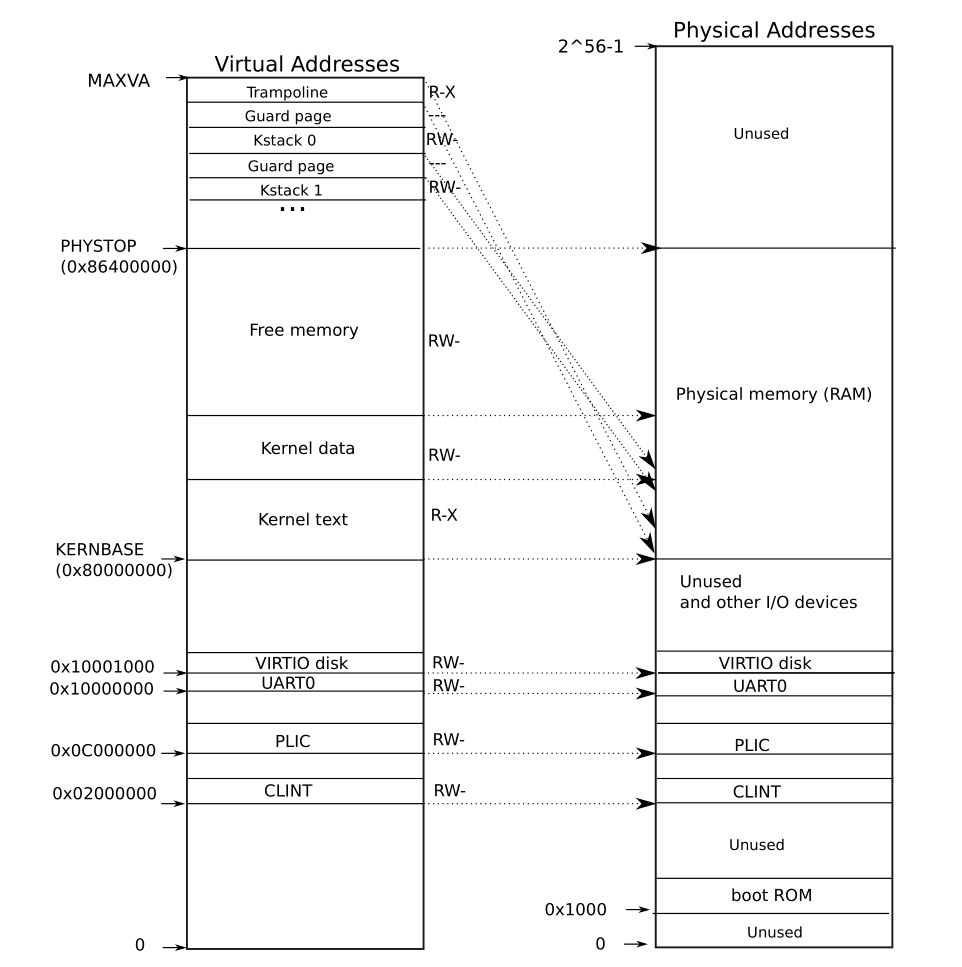

# Lab 3 - Page table

## 课程

这里试图对xv6的内核页表挂载流程进行梳理。

### pre

xv6在c代码中写明了具体的过程。在这之前，先看看用到的结构：

```c title="kernel/kalloc.c"
//链表结构
struct run {
  struct run *next;
};

//lock并发+freelist结构
struct {
  struct spinlock lock;
  struct run *freelist;
} kmem;//匿名结构：kmem管理内核页表
```

`main`函数中关于内核页表的内容有：

```c
kinit();         // physical page allocator
kvminit();       // create kernel page table
kvminithart();   // turn on paging
```

### kinit

首先看看`kinit`：初始化lock和内核页表，将内核页表挂载到物理内存中

```c title="kernel/kalloc.c"
void kinit()
{
  initlock(&kmem.lock, "kmem");
  freerange(end, (void*)PHYSTOP);
}
//end在kalloc.c声明为`extern char []`，实际上的end在kernel.ld出现，其代表内核后的第一个地址.
//PHYSTOP 为宏定义：
#define KERNBASE 0x80000000
#define PHYSTOP (KERNBASE + 128*1024*1024)
//其代表 内存空间为128M.
```

kernel的逻辑地址和物理地址如下所示：



内核挂载在逻辑地址`0x8000000`（`KERNBASE`）,内核空间到`PHYSTOP`。由于`kinit`的时候还未有页表结构，此时的逻辑地址是直接映射到物理空间的。

`freerange`如下：

```c title="kernel/kalloc.c"
#define PGSIZE 4096
#define PGROUNDUP(sz) (((sz)+PGSIZE-1) & ~(PGSIZE-1))

//这里的输入为物理地址
void
freerange(void *pa_start, void *pa_end)
{
  char *p;
  p = (char*)PGROUNDUP((uint64)pa_start);
  for(; p + PGSIZE <= (char*)pa_end; p += PGSIZE)
    kfree(p);
}
```

可以看到，以上过程中对`pa_start`到`pa_end`的所有空间进行`kfree`(初始化)。
xv6中每页长度固定为4096，`PGROUNDUP`操作的含义是页表首地址往上取整，例如输入（页表0）0000则返回（页表0）0000，若输入（页表0）0001则返回（页表1）0000。

`end`是kernel后的第一个地址，因此可能没有进行内存对齐。`PGROUNDUP`则将内核页表的每个页进行内存对齐，内核和内核页表间存在空闲空间。

`kfree`操作如下所示：

```c title="kernel/kalloc.c"
void kfree(void *pa)
{
  struct run *r;

  if(((uint64)pa % PGSIZE) != 0 || (char*)pa < end || (uint64)pa >= PHYSTOP)
    panic("kfree");

  // Fill with junk to catch dangling refs.
  memset(pa, 1, PGSIZE);

  r = (struct run*)pa;

  acquire(&kmem.lock);
  r->next = kmem.freelist;
  kmem.freelist = r;
  release(&kmem.lock);
}
```

`kfree` 对数据进行必要检查后，`memset`为1（若错误访问，`memset`为1期望能够更快地引发异常，终止过程），然后填充链表。

理解`kalloc`函数也更简单了。

```c title="kernel/kalloc.c"
void * kalloc(void)
{
  struct run *r;

  acquire(&kmem.lock);
  r = kmem.freelist;
  if(r)
    kmem.freelist = r->next;
  release(&kmem.lock);

  if(r)
    memset((char*)r, 5, PGSIZE); // fill with junk
  return (void*)r;
}
```

### kvminit

`kvminit`紧接着`kinit`的初始化，开始分配内核页表。

其内部为：

```c
// the kernel's page table.
pagetable_t kernel_pagetable;
void kvminit(void)
{
  kernel_pagetable = kvmmake();
}

pagetable_t kvmmake(void)
{
  pagetable_t kpgtbl;

  kpgtbl = (pagetable_t) kalloc();
  memset(kpgtbl, 0, PGSIZE);

  // uart registers
  kvmmap(kpgtbl, UART0, UART0, PGSIZE, PTE_R | PTE_W);

  // virtio mmio disk interface
  kvmmap(kpgtbl, VIRTIO0, VIRTIO0, PGSIZE, PTE_R | PTE_W);

  // PLIC
  kvmmap(kpgtbl, PLIC, PLIC, 0x400000, PTE_R | PTE_W);

  // map kernel text executable and read-only.
  kvmmap(kpgtbl, KERNBASE, KERNBASE, (uint64)etext-KERNBASE, PTE_R | PTE_X);

  // map kernel data and the physical RAM we'll make use of.
  kvmmap(kpgtbl, (uint64)etext, (uint64)etext, PHYSTOP-(uint64)etext, PTE_R | PTE_W);

  // map the trampoline for trap entry/exit to
  // the highest virtual address in the kernel.
  kvmmap(kpgtbl, TRAMPOLINE, (uint64)trampoline, PGSIZE, PTE_R | PTE_X);

  // map kernel stacks
  proc_mapstacks(kpgtbl);
  
  return kpgtbl;
}
```

`kvminit`调用`kvmmake`，而kvmmake对每一段进行具体的分配。为什么要这么分配？见前文图的xv6内存分配情况。

`kvmmake`:

```c
void kvmmap(pagetable_t kpgtbl, uint64 va, uint64 pa, uint64 sz, int perm)
{
  if(mappages(kpgtbl, va, sz, pa, perm) != 0)
    panic("kvmmap");
}
```

`kvmmap` 调用`mappages`来分配`va`到`pa`的满足`size=sz`的PTE页表项。

### mappages

`mappages`如下所示：

```c
#define PGROUNDDOWN(a) (((a)) & ~(PGSIZE-1))
// Create PTEs for virtual addresses starting at va that refer to
// physical addresses starting at pa. va and size might not
// be page-aligned. Returns 0 on success, -1 if walk() couldn't
// allocate a needed page-table page.
int mappages(pagetable_t pagetable, uint64 va, uint64 size, uint64 pa, int perm)
{
  uint64 a, last;
  pte_t *pte;

  if(size == 0)
    panic("mappages: size");
  
  a = PGROUNDDOWN(va);
  last = PGROUNDDOWN(va + size - 1);
  for(;;){
    if((pte = walk(pagetable, a, 1)) == 0)
      return -1;
    if(*pte & PTE_V)
      panic("mappages: remap");
    *pte = PA2PTE(pa) | perm | PTE_V;
    if(a == last)
      break;
    a += PGSIZE;
    pa += PGSIZE;
  }
  return 0;
}
```

`mappages`通过`walk`获得分配后的页表项地址，进行一系列检查后持续进行，直到满足`size`要求。`size`和`va`不必进行对齐，函数内部通过`PGROUNDDOWN`进行页表项地址向下对齐。

### walk

`walk`用到的宏比较多，这里列出：

```c
#define MAXVA (1L << (9 + 9 + 9 + 12 - 1))

#define PXMASK          0x1FF // 9 bits
#define PXSHIFT(level)  (PGSHIFT+(9*(level)))
#define PX(level, va) ((((uint64) (va)) >> PXSHIFT(level)) & PXMASK)

#define PTE2PA(pte) (((pte) >> 10) << 12)
#define PA2PTE(pa) ((((uint64)pa) >> 12) << 10)
```

1. `MAXVA`就是xv6的最高地址，这里分拆来写。
2. `PX`部分通过`level`和虚拟地址来获得第`level`级页表项的`index`。
3. `PTE2PA`的两个组是进行页表项和物理地址的互转。

`walk`代码如下：

```c
// Return the address of the PTE in page table pagetable
// that corresponds to virtual address va.  If alloc!=0,
// create any required page-table pages.
//
// The risc-v Sv39 scheme has three levels of page-table
// pages. A page-table page contains 512 64-bit PTEs.
// A 64-bit virtual address is split into five fields:
//   39..63 -- must be zero.
//   30..38 -- 9 bits of level-2 index.
//   21..29 -- 9 bits of level-1 index.
//   12..20 -- 9 bits of level-0 index.
//    0..11 -- 12 bits of byte offset within the page.
pte_t *
walk(pagetable_t pagetable, uint64 va, int alloc)
{
  if(va >= MAXVA)
    panic("walk");

  for(int level = 2; level > 0; level--) {
    pte_t *pte = &pagetable[PX(level, va)];
    if(*pte & PTE_V) {
      pagetable = (pagetable_t)PTE2PA(*pte);
    } else {
      if(!alloc || (pagetable = (pde_t*)kalloc()) == 0)
        return 0;
      memset(pagetable, 0, PGSIZE);
      *pte = PA2PTE(pagetable) | PTE_V;
    }
  }
  return &pagetable[PX(0, va)];
}
```

可以看到，以上过程中相当于模拟了页表的寻址过程。通过三级的页表方式来分配页表，并返回PTE的地址。

### proc_mapstacks

```c
// Allocate a page for each process's kernel stack.
// Map it high in memory, followed by an invalid
// guard page.
void
proc_mapstacks(pagetable_t kpgtbl) {
  struct proc *p;
  
  for(p = proc; p < &proc[NPROC]; p++) {
    char *pa = kalloc();
    if(pa == 0)
      panic("kalloc");
    uint64 va = KSTACK((int) (p - proc));
    kvmmap(kpgtbl, va, (uint64)pa, PGSIZE, PTE_R | PTE_W);
  }
}
```

为每一个`proc`（`proc`的内容都是事先分配的）分配一个`KSTACK`。
`KSTACK`如下所示：

```c
#define KSTACK(p) (TRAMPOLINE - (p)*2*PGSIZE - 3*PGSIZE)
```

分配`KSTACK`的时候需要在`trampoline`下（顶层），每个STACK都要有两个guard pages来保护，若访问了超出`KSTACK`的部分，有效位会引发异常。

### kvminitstart

```c
void
kvminithart(){
  w_satp(MAKE_SATP(kernel_pagetable));
  sfence_vma();
}
```

执行内存屏障，刷新TLB。

## Code

### Speed up system calls (easy)

本题需要将用户空间（VA）的`USYSCALL`处映射到内核中的某一处，这样用户便可以从`USYCALL`处获得必要信息（本题为`pid`）。

具体实现中：修改`proc`结构：

```c title="kernel/proc.h"
struct proc {
  struct spinlock lock;

  // p->lock must be held when using these:
  enum procstate state;        // Process state
  void *chan;                  // If non-zero, sleeping on chan
  int killed;                  // If non-zero, have been killed
  int xstate;                  // Exit status to be returned to parent's wait
  int pid;                     // Process ID

  // wait_lock must be held when using this:
  struct proc *parent;         // Parent process

  // these are private to the process, so p->lock need not be held.
  uint64 kstack;               // Virtual address of kernel stack
  uint64 sz;                   // Size of process memory (bytes)
  pagetable_t pagetable;       // User page table
  struct trapframe *trapframe; // data page for trampoline.S
  struct context context;      // swtch() here to run process
  struct file *ofile[NOFILE];  // Open files
  struct inode *cwd;           // Current directory
  char name[16];               // Process name (debugging)
  #ifdef LAB_PGTBL
  struct usyscall * usyscall;
  #endif
};
```

```c title="kernel/proc.c"
static struct proc*
allocproc(void)
{
  // ......
found:
  p->pid = allocpid();
  p->state = USED;

  // Allocate a trapframe page.
  if((p->trapframe = (struct trapframe *)kalloc()) == 0){
    freeproc(p);
    release(&p->lock);
    return 0;
  }

  #ifdef LAB_PGTBL
  if((p->usyscall = (struct usyscall*)kalloc()) == 0){
    freeproc(p);
    release(&p->lock);
    return 0;
  }
  p->usyscall->pid = p->pid;
  #endif

  // An empty user page table.
  p->pagetable = proc_pagetable(p);
  if(p->pagetable == 0){
    freeproc(p);
    release(&p->lock);
    return 0;
  }
  //.......
}

static void
freeproc(struct proc *p)
{
  if(p->trapframe)
    kfree((void*)p->trapframe);
  #ifdef LAB_PGTBL
  if(p->usyscall)
    kfree((void*)p->usyscall);
  p->usyscall = 0;
  #endif
  //.....
}

pagetable_t
proc_pagetable(struct proc *p)
{
  //....
  // map the trapframe just below TRAMPOLINE, for trampoline.S.
  if(mappages(pagetable, TRAPFRAME, PGSIZE,
              (uint64)(p->trapframe), PTE_R | PTE_W) < 0){
    uvmunmap(pagetable, TRAMPOLINE, 1, 0);
    uvmfree(pagetable, 0);
    return 0;
  }

#ifdef LAB_PGTBL
  if(mappages(pagetable, USYSCALL, PGSIZE,
              (uint64)(p->usyscall), PTE_R | PTE_U)<0){
    uvmunmap(pagetable, TRAMPOLINE, 1, 0);
    uvmunmap(pagetable, TRAPFRAME, 1, 0);
    uvmfree(pagetable, 0);
    return 0;
              }

#endif
  return pagetable;
}

// Free a process's page table, and free the
// physical memory it refers to.
void
proc_freepagetable(pagetable_t pagetable, uint64 sz)
{
  uvmunmap(pagetable, TRAMPOLINE, 1, 0);
  uvmunmap(pagetable, TRAPFRAME, 1, 0);
  #ifdef LAB_PGTBL
  uvmunmap(pagetable, USYSCALL, 1, 0);
  #endif
  uvmfree(pagetable, sz);
}
```

本题的坑在于`proc_freepagetable`这里。

其余部分的修改均有提示，但`proc_freepagetable`没有。若未修改`proc_freepagetable`，则`freewalk`函数会触发panic：

```c title="kernel/vm.c"
// Recursively free page-table pages.
// All leaf mappings must already have been removed.
void
freewalk(pagetable_t pagetable)
{
  // there are 2^9 = 512 PTEs in a page table.
  for(int i = 0; i < 512; i++){
    pte_t pte = pagetable[i];
    if((pte & PTE_V) && (pte & (PTE_R|PTE_W|PTE_X)) == 0){
      // this PTE points to a lower-level page table.
      uint64 child = PTE2PA(pte);
      freewalk((pagetable_t)child);
      pagetable[i] = 0;
    } else if(pte & PTE_V){
      panic("freewalk: leaf");
    }
  }
  kfree((void*)pagetable);
}
```

可以看到，若panic，则对应的pte的PTE_R,W,X均有效，即该pte没有释放。因此，需要在`proc_freepagetable`处`unmap`了。

发现方法：（呃呃，我搜了，确实不会gdb）
gdb设置`freewalk`断点，continue后通过backtrace找函数调用栈可以发现。

### Print a page table (easy)

没什么好说的，对着提示写递归就行。

```c
void _vmprint_level(pagetable_t pagetable, int level){
  if(level>2){
    return;
  }
  // there are 2^9 = 512 PTEs in a page table.
  for(int i = 0; i < 512; i++){
    
    pte_t pte = pagetable[i];
    if(pte & PTE_V){
      // this PTE points to a lower-level page table.
      for(int i = 0;i <= level;++i){
          printf(" ..");
      }
      uint64 child = PTE2PA(pte);
      
      printf("%d: pte %p pa %p\n", i, pte, child);
      _vmprint_level((pagetable_t)child, level+1);
    }
  }
}

void vmprint(pagetable_t pagetable){
  printf("page table %p\n", pagetable);
  _vmprint_level(pagetable, 0);
}
```

坑点在于不能先写这个再写speed up...

speed up会创建必要的内核页表映射，若没有写speed up部分，print会缺少一页，也就是speed up创建的USYSCALL映射页。

### Detecting which pages have been accessed (hard)

这题需要跨文件来使用`walk`函数，但`walk`函数已经被封装而不能直接使用，因此封装了一下写了`mywalk`函数：

```c title="kernel/vm.c"
pte_t *
my_walk(pagetable_t pagetable, uint64 va, int alloc){
  return walk(pagetable, va, alloc);
}
```

```c title="kernel/sysproc.c"
#ifdef LAB_PGTBL
void my_pgacess_walk(uint64 va, int num, int* buf){
  struct proc* p = myproc();
  vmprint(p->pagetable);
  for(int i =0;i<num;++i){
    pte_t* pte = my_walk(p->pagetable, va, 0);
    if(*pte & PTE_A){
      (*buf) |=(1<<i);
      (*pte) &= ~(PTE_A);
      printf("pte: %p\n", *pte);
    }
    va+=PGSIZE;
  }
}

int
sys_pgaccess(void)
{

  uint64 va, buf;
  int num;
  int tempbuf = 0;
  if(argaddr(0, &va) < 0 || argint(1, &num) <0 || argaddr(2, &buf) <0)
    return -1;
  struct proc* p = myproc();
  my_pgacess_walk(va, num, &tempbuf);
  printf("buf: %p\n", (uint64)tempbuf);
  if(copyout(p->pagetable, buf, (char*)&tempbuf, sizeof(tempbuf))<0){
    return -1;
  }
  
  return 0;
}
#endif
```
