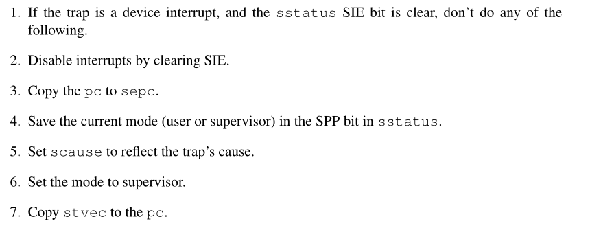
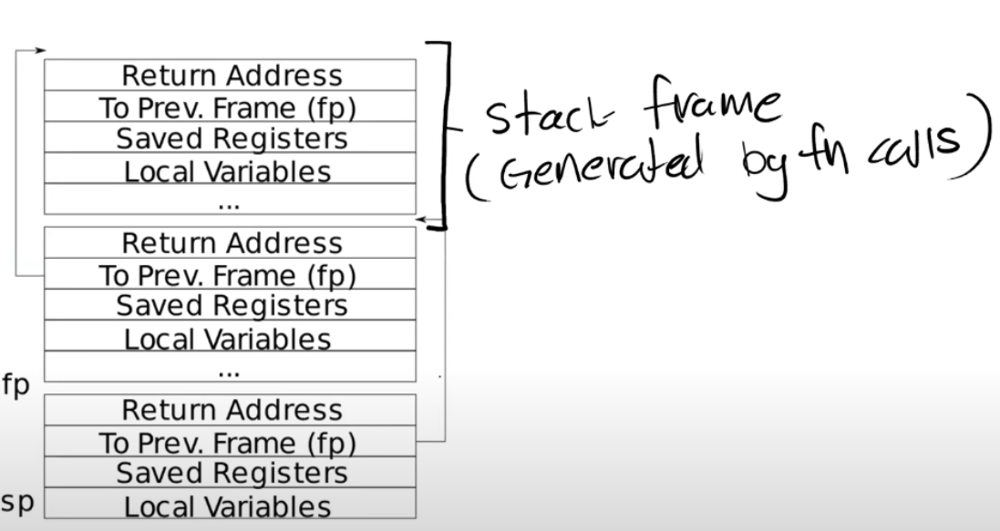

# Lab 4 - Trap

## 课程

### 基本概念

1. 用户态中，RISC-V有32个用户寄存器以及SATP寄存器（User page table），trap需要将这些寄存器保存，并切换SATP到kernel page table。
2. 内核态的切换中将会使用以下寄存器

- stvec：trap handler的位置
- sepc：保存用户的pc寄存器，sret等需要用到。
- scause：reason for the trap
- sstatus：其中，SIE bit表示device interrupts的enable；而SPP表示目前处于那个模式。

3. 基本的trap过程：
  
  \+ start executing at the new pc.
4. supervisor mode：实际上，supervisor mode可做的事很少。其相比于User mode，可以读写控制寄存器（也就是satp，stvec这些），以及使用PTE_U标志位为0的PTE，除此之外便无法进行，读取地址也只能依靠kernel page table。

### uservec以及之前

该trap为用户态系统调用等。
例如，用户态中通过shell调用write的时候会有：


其便会在a7寄存器寄存值，调用系统调用；且在其他寄存器配置write的基本参数，ecall进入uservec（trampoline）中。此时，ecall做了三件事：

1. user mode-> supervisor mode
2. pc-> sepc
3. jump to stvec（此处为trampoline的起始地址，也就是uservec）.

此时，需要uservec做以下事：
  
1. 保存32个用户寄存器
2. 切换kernel page table
3. 创建或找到kernel stack，改变sp。
4. jump to kernel C code（usertrap）

以上步骤均通过uservec的汇编代码执行。需要注意的是，trampoline和trapframe（用户寄存器以及kernel寄存器保存处）在user 和kernel page table中都是固定的，这防止了因ecall导致的可能的页表错误。

汇编代码中的sscratch用于移除a0，让接下来的保存寄存器等操作可以通过a0实现。

### usertrap

该函数如下所示：

```c
void
usertrap(void)
{
  int which_dev = 0;
  if((r_sstatus() & SSTATUS_SPP) != 0)
    panic("usertrap: not from user mode");

  // send interrupts and exceptions to kerneltrap(),
  // since we're now in the kernel.
  w_stvec((uint64)kernelvec);

  struct proc *p = myproc();
  
  // save user program counter.
  p->trapframe->epc = r_sepc();
  
  if(r_scause() == 8){
    // system call

    if(p->killed)
      exit(-1);

    // sepc points to the ecall instruction,
    // but we want to return to the next instruction.
    p->trapframe->epc += 4;

    // an interrupt will change sstatus &c registers,
    // so don't enable until done with those registers.
    intr_on();

    syscall();
  } else if((which_dev = devintr()) != 0){
    // ok
  } else {
    printf("usertrap(): unexpected scause %p pid=%d\n", r_scause(), p->pid);
    printf("            sepc=%p stval=%p\n", r_sepc(), r_stval());
    p->killed = 1;
  }

  if(p->killed)
    exit(-1);

  // give up the CPU if this is a timer interrupt.
  if(which_dev == 2)
    yield();

  usertrapret();
}
```

感觉还是很好理解的。其做了以下事情：

1. 检查SPP等。
2. 在内核进行任何操作之前，写入kernelvec，使得若发生kernel trap（一般而言就是exception）跳转到kernelvec。
3. 保存用户程序计数器（防止切换改变SEPC）
4. 根据不同情况，进行不同的处理。

### usertrapret

```c
void
usertrapret(void)
{
  struct proc *p = myproc();

  // we're about to switch the destination of traps from
  // kerneltrap() to usertrap(), so turn off interrupts until
  // we're back in user space, where usertrap() is correct.
  intr_off();

  // send syscalls, interrupts, and exceptions to trampoline.S
  w_stvec(TRAMPOLINE + (uservec - trampoline));

  // set up trapframe values that uservec will need when
  // the process next re-enters the kernel.
  p->trapframe->kernel_satp = r_satp();         // kernel page table
  p->trapframe->kernel_sp = p->kstack + PGSIZE; // process's kernel stack
  p->trapframe->kernel_trap = (uint64)usertrap;
  p->trapframe->kernel_hartid = r_tp();         // hartid for cpuid()

  // set up the registers that trampoline.S's sret will use
  // to get to user space.
  
  // set S Previous Privilege mode to User.
  unsigned long x = r_sstatus();
  x &= ~SSTATUS_SPP; // clear SPP to 0 for user mode
  x |= SSTATUS_SPIE; // enable interrupts in user mode
  w_sstatus(x);

  // set S Exception Program Counter to the saved user pc.
  w_sepc(p->trapframe->epc);

  // tell trampoline.S the user page table to switch to.
  uint64 satp = MAKE_SATP(p->pagetable);

  // jump to trampoline.S at the top of memory, which 
  // switches to the user page table, restores user registers,
  // and switches to user mode with sret.
  uint64 fn = TRAMPOLINE + (userret - trampoline);
  ((void (*)(uint64,uint64))fn)(TRAPFRAME, satp);
}
```

trampoline中的SEPC实际上可以不用在usertrap里保存，这里的保存顺序是没有必然联系的。

### userret

汇编代码，其做了以下事：

1. 切换 page table。
2. restore user register。
3. a0改为return的返回值（sscratch）
4. sret

sret执行以下部分：

1. 切换回user mode
2. SPEC保存至PC寄存器
3. 重新打开中断

----

以上过程中，xv6尽可能地使系统调用看上去像是函数，但实际上是需要一个层级的调用过程。

### kernel trap

该部分。。其实和user trap差不多，但简单一点。

kernelvec只在栈里保存和恢复寄存器，而kerneltrap处理interrupts（time）和exception。

## RISC-V assembly (easy)

这部分是简单的对着代码进行分析，让学生熟悉RISC-V的。但xv6的RISC-V并不用完整写一个程序，所以我这种完全不会RISC-V的也可以上手。

摆一张图：


~~用别人图床不也挺好吗~~

分析的代码部分：

```c
user/_call:     file format elf64-littleriscv

Disassembly of section .text:

0000000000000000 <g>:
#include "kernel/param.h"
#include "kernel/types.h"
#include "kernel/stat.h"
#include "user/user.h"

int g(int x) {
   0:	1141                	addi	sp,sp,-16
   2:	e422                	sd	s0,8(sp)
   4:	0800                	addi	s0,sp,16
  return x+3;
}
   6:	250d                	addiw	a0,a0,3
   8:	6422                	ld	s0,8(sp)
   a:	0141                	addi	sp,sp,16
   c:	8082                	ret

000000000000000e <f>:

int f(int x) {
   e:	1141                	addi	sp,sp,-16
  10:	e422                	sd	s0,8(sp)
  12:	0800                	addi	s0,sp,16
  return g(x);
}
  14:	250d                	addiw	a0,a0,3
  16:	6422                	ld	s0,8(sp)
  18:	0141                	addi	sp,sp,16
  1a:	8082                	ret

000000000000001c <main>:

void main(void) {
  1c:	1141                	addi	sp,sp,-16
  1e:	e406                	sd	ra,8(sp)
  20:	e022                	sd	s0,0(sp)
  22:	0800                	addi	s0,sp,16
  printf("%d %d\n", f(8)+1, 13);
  24:	4635                	li	a2,13
  26:	45b1                	li	a1,12
  28:	00000517          	auipc	a0,0x0
  2c:	7c050513          	addi	a0,a0,1984 # 7e8 <malloc+0xea>
  30:	00000097          	auipc	ra,0x0
  34:	610080e7          	jalr	1552(ra) # 640 <printf>
  exit(0);
  38:	4501                	li	a0,0
  3a:	00000097          	auipc	ra,0x0
  3e:	27e080e7          	jalr	638(ra) # 2b8 <exit>
```

这里是解答部分：

:::info Question 1
    Which registers contain arguments to functions? For example, which register holds 13 in main's call to printf?

a0------a7. 13 存储在a2.
:::

:::info Question 2
    Where is the call to function f in the assembly code for main? Where is the call to g? (Hint: the compiler may inline functions.)

编译器优化直接内联展开了。
:::

:::info Question 3
    At what address is the function printf located?

`0000000000000630 <printf>`。
:::

:::info Question 4
    What value is in the register ra just after the jalr to printf in main?

返回的地址ra是main里头的对应行数的地址。
:::

:::info Question 5
    Run the following code. What is the output?
    The output depends on that fact that the RISC-V is little-endian. If the RISC-V were instead big-endian what would you set i to in order to yield the same output? Would you need to change 57616 to a different value?

```c
unsigned int i = 0x00646c72;
printf("H%x Wo%s", 57616, &i);
```

大端小端的问题...计组都搞过了，不回答😤😤😤
:::

:::info Question 6
    In the following code, what is going to be printed after 'y='? (note: the answer is not a specific value.) Why does this happen?

```c
printf("x=%d y=%d", 3);
```

未定义行为，当前的a2寄存器不知道是什么值，因此输出也是未知的。
:::

## Backtrace (moderate)

实现一个回溯的Backtrace。

还是很简单的一道题，用指针就行了，我还在想用什么指令来访问物理内存。自己做这些题还是容易舍近求远。

本题目需要理解下图：



在每一层的堆栈中，`return address`位于`frame pointer`的offset(-8)位置，而上一个`frame pointer`在当前`frame pointer` offset(-16)位置，因此若要存取上一个堆栈信息，可以直接用指针的加减来获得。

首先在`kernel/defs.h`等地方加上必要的配置，例如函数声明等。

然后增加以下函数声明：

```c title="kernel/riscv.h"
static inline uint64
r_fp()
{
  uint64 x;
  asm volatile("mv %0, s0" : "=r" (x) );
  return x;
}
```

该函数可以获取当前帧指针`s0`的值。

```c title="kernel/printf.c"
void backtrace(){
  printf("backtrace:\n");
  uint64 fp = r_fp();
  uint64 start = PGROUNDUP(fp), end = PGROUNDDOWN(fp);
  while(end<=fp&&fp<=start){
    printf("%p\n", *(uint64*)(fp-8));
    fp = *(uint64*)(fp-16);
  }
}
```

其中的`start`和`end`变量是为了防止`fp`的无限回溯超出界限。xv6会将每一个stack都分配一个page，因此用`PGROUNDUP`等宏即可获取上下限。

### Alarm (hard)

按照他的步骤来就算简单。

本题要求增加两个系统调用：`sigalarm`和`sigreturn`。

除了增加系统调用所必要的修改外，其他修改如下：

由于跳转函数会破坏寄存器的值，因此需要在`proc`结构里保存寄存器的值。这里的实现是有些偷懒的，只根据`alarmtest.asm`里的所需值增加了所需要的寄存器：sp，pc，s0-s1, ra以及a0-a7，但实际上无从知道编译器会用哪些用户寄存器，因此在实际使用的时候应该将32个寄存器全部存储。

```c
struct proc {
  //...
  uint64 ticks; //时间间隔
  uint64 func; //执行的函数指针
  uint64 count; //经过多长时间
  uint64 alarm_epc; //保存的pc寄存器
  uint64 in_handler; //是否有return

  // 保存的寄存器
  uint64 sp;
  uint64 s0;
  uint64 s1;
  uint64 ra;
  uint64 a0;
  uint64 a1;
  uint64 a2;
  uint64 a3;
  uint64 a4;
  uint64 a5;
  uint64 a6;
  uint64 a7;
};
```

`allocproc`函数里也增加初始化内容：

```c title="kernel/proc.c"
static struct proc*
allocproc(void)
{

found:
    //.....
  p->count = 0;
  p->ticks = 0;
  p->func = 0;
  p->alarm_epc = 0;
  p->in_handler = 0;
  p->a0 = p->a1 = p->a2 = p->a3 = p->a4 = p->a5 = p->a6 = p->a7 =0;
  p->sp = p->ra = p->s0 = p->s1 = 0;
  return p;
}
```

两系统调用：

```c
uint64
sys_sigalarm(void){
  int ticks;
  uint64 func;
  if(argint(0, &ticks) < 0 && argaddr(1, &func)<0){
    return -1;
  }
  struct proc *p = myproc();
  func = p->trapframe->a1;
  printf("%p\n", func);
  if(ticks == 0 && func == 0){
    p->ticks = p->func = p->count = 0;
    return 0;
  }

  p->ticks = ticks;
  p->func = func;
  p->count = 0;

  return 0;
}
uint64
sys_sigreturn(void){
  struct proc *p = myproc();
  if (p->in_handler){
    p->trapframe->epc  = p->alarm_epc;
    p->count = 0;
    p->in_handler = 0;

    p->trapframe->a0 = p->a0;
    p->trapframe->a1 = p->a1;
    p->trapframe->a2 = p->a2;
    p->trapframe->a3 = p->a3;
    p->trapframe->a4 = p->a4;
    p->trapframe->a5 = p->a5;
    p->trapframe->a6 = p->a6;
    p->trapframe->a7 = p->a7;

    p->trapframe->sp = p->sp;
    p->trapframe->s0 = p->s0;
    p->trapframe->s1 = p->s1;
    p->trapframe->ra = p->ra;
  }
  return 0;
}
```

```c title="kernel/trap.c"
void
usertrap(void)
{   
  // ...
  // give up the CPU if this is a timer interrupt.
  if(which_dev == 2){
    if (p->func||p->ticks){
      p->count++;
      if (p->count==p->ticks){
        p->in_handler = 1;
        p->alarm_epc = p->trapframe->epc;
        p->trapframe->epc = p->func;

        p->a0 = p->trapframe->a0;
        p->a1 = p->trapframe->a1;
        p->a2 = p->trapframe->a2;
        p->a3 = p->trapframe->a3;
        p->a4 = p->trapframe->a4;
        p->a5 = p->trapframe->a5;
        p->a6 = p->trapframe->a6;
        p->a7 = p->trapframe->a7;
        p->sp = p->trapframe->sp;
        p->s0 = p->trapframe->s0;
        p->s1 = p->trapframe->s1;
        p->ra = p->trapframe->ra;
      }
    }
    yield();
  }
  usertrapret();
}
```
