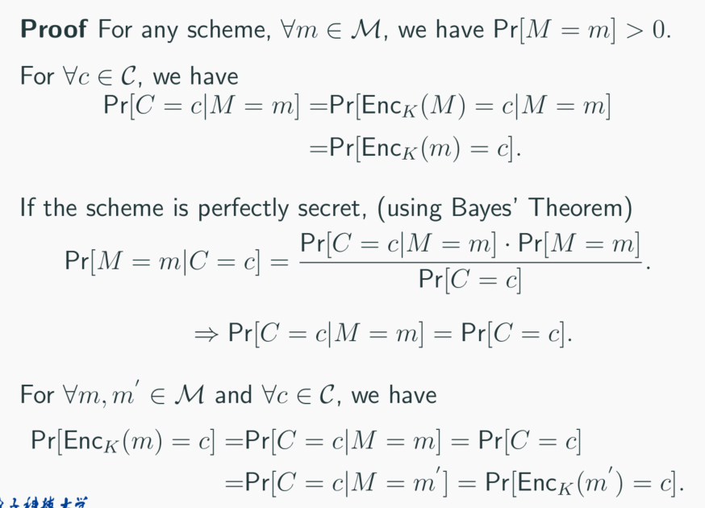
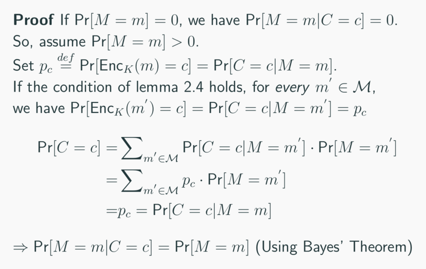

# Perfect Encryption

## random-number

密码学中，随机数的生成是很重要的，例如加密方案中生成密钥的$Gen$便需要以此保证随机性。然而，这里不讨论如何生成，以及怎么判定随机数，留在第四章进行

现在这里所进行的是一些概念的讨论：

首先假设：无论敌手还是信任方，都能获取无限量的独立、无偏的bits：

1. 收集高熵数据，这里的高熵是指高不确定性，但并不是密码学中我们所需要的随机。
2. 以数据为依据，生成一系列几乎独立的(independent),无偏的(unbiased)位序列。

可以看到，我们所需要的数据仍然是有要求的：`uniform`性质。而关于随机性，随机的概率性等等，不在这里讨论。这里只是说明，随机数或者伪随机数是可以生成的。

## 回顾知识

我们现在明白了：
$$
\begin{split}
\mathcal{K}:& keyspace  \\
\mathcal{M}:& plaintext\quad space \\
\mathcal{C}:& ciphertext\quad space \\
Gen:& \rightarrow \mathcal{K} \\
Enc:& \mathcal{K}\times \mathcal{M}\rightarrow C \\
Dec:& \mathcal{K}\times \mathcal{C}\rightarrow M
\end{split}
$$
其中，$Gen，Enc$是概率性的。$Gen$需要随机生成密钥来保证安全性，$Enc$我们允许随机，但$Dec$需要满足以下性质：

$$Correctness:\forall k \in \mathcal{K},m\in\mathcal{M}:Dec_k(Enc_k(m))=m$$
，即解密正确性。

在这里，可以用**概率**的方式来看待。设$K \in \mathcal{K},M \in \mathcal{M} ,C \in \mathcal{C}$,作为其取值空间的随机变量。那么$K$在之前的讨论中提过为随机生成，而在攻击者看来，$M$(随机变量)是在消息空间中的概率分布，而采集到的$m$信息是其的采样。也因此，$C$也是概率分布。这和我们平常认为$M$和$C$是确定内容的观念不同。

## 完美加密

理论上而言，明文应该和加密策略，也就是K无关，两者相互独立。

那么我们再回顾一下之前对安全目标的定义，假设现在通信双方正在通过对称密钥的方式进行通信，敌手能够观察到的就是通信的密文内容（Ciphertext-Only Attack）。并且，敌手还可以做到：

1. 可以知道所有可能的发送的消息，以及消息空间的概率分布
2. 同时攻击者也知道加密方案本身，但敌手不知道密钥 $k$。
那么，Perfect Secrecy便有两种表述方式：

:::info 攻击者无法通过观察密文来获得任何和明文相关的信息。
    $$\forall m\in\mathcal{M},c\in\mathcal{C},Pr[M=m|C=c]=Pr[M=m]\qquad(Pr[C=c]>0)$$
    即密文和明文的随机变量是相互独立的。
:::

:::info 密文的分布和明文相互独立。
    $$\forall m.m'\in\mathcal{M},c\in\mathcal{C},Pr[Enc_K(m)=c]=Pr[Enc_K(m')=c]$$
:::

这两种表达是相互等价的。

证明如下：

----

证明若为perfectly secret，则$Pr[Enc_K(m) = c] = Pr[Enc_K(m') = c]$.

反过来：

## Indistinguishability

可以对上述的过程进行另一种表述，这种表述是通过experiment实现的。攻击者试图被动的观察密文，并给定两条明文，判断该密文是哪一条明文加密的。

于是便引入了一个密码学上十分重要的模型：**预言机（oracle）**，目前可以把其理解为一个执行指定操作的黑箱。它总是能正确的给你所设定好的目标答案。

上述观察过程，可以表示为$Priv_{\mathcal{A}\prod}^{eav}$，表示在窃听者$eav$下的不可区分性experiment，敌手为A，该不可区分性experiment为block符号,类似加密方案。

1. $eav\quad generate\quad m_0,m_1\in \mathcal{M}$，敌手生成两条明文，传递给Oracle。
2. $Oracle：k\leftarrow Gen \\
    b\leftarrow \{0,1\}(random) \\
    c:=Enc_k(m_b)
    $，oracle生成密钥，随机选择明文进行加密，得到密文c。
3. $c->eav$，eav判断$b$为0还是1，也就是猜测是自己生成的哪一条明文，并将猜测结果$b'$返回oracle。
$Priv_{\mathcal{A}\prod}^{eav}=1\quad if b=b',else\quad Priv_{\mathcal{A}\prod}^{eav}=0$。

:::warning Definition
    $(Gen,Enc,Dec)$ is Perfectly indistinguishable if for every $\mathcal{A}$ it holds that
    $$Pr[Priv_{\mathcal{A}\prod}^{eav}=1]=\frac{1}{2}$$
:::

攻击者无法区分两者消息。这种perfectly indistinguishable的表述和前两个通过概率的描述是相同的。

## The One-Time pad

密码学是螺线上升的，很多刚开始的加密方案并没有完善的理论基础，例如这里要讲的**OTP**在1917年提出，而那时还没有可证明安全的概念。

加密过程：
设长度为$l\in N,\mathcal{M}=\mathcal{K}=\mathcal{C}=\{0,1\}^l$.
$Gen\rightarrow k\in\mathcal{K}$,uniformly at random
$Enc_k(m)=m\oplus k,Dec_k ( c ) =c\oplus k$
其为Perfect secret。证明过程：

$Pr[Enc_k(m)=c]=Pr[m\oplus k=c]=Pr[k=c\oplus m]=|\mathcal{K}|^{-1}=2^{-l}$

则$Pr[Enc_k(m)=c] = Pr[Enc_k(m')=c]=2^{-l}$

当然你也可以用群的方式写写。

需要特别指出的是，这里的密钥、明文、密文的长度都是等长的，因此生成密钥、加密过程以及泄露消息等都有一些缺点。OTP并不是好用的加密方案。
并且，OTP不能够复用密钥。一旦复用，攻击者可以通过

$$Enc_k(m)\oplus Enc_k(m')=m\oplus m'$$

去除密钥，使密钥丧失作用而暴露明文的相关信息，OTP便失去作用。

## Limitations

:::info Theorem
    若加密方案为完美加密，那么密钥空间大小必须大于明文空间大小。
:::

反证法稍微证一下就行了。

### Shannon's Theorm*

PPT无，这里补充下。

:::warning Shannon's Theorm
    若$(Gen,Enc,Dec)，and|\mathcal{M}|=|\mathcal{K}|=|\mathcal{C}|$
    1. $\forall k\in\mathcal{K},Pr(k~is~~chosen)=\frac{1}{|\mathcal{K}|}$
    2. $\forall m\in\mathcal{M},c\in\mathcal{C}，\exists k(unique)\in \mathcal{K},Enc_k(m)=c$
:::

那么这个加密方案为Perfect secret。这是充要条件。
